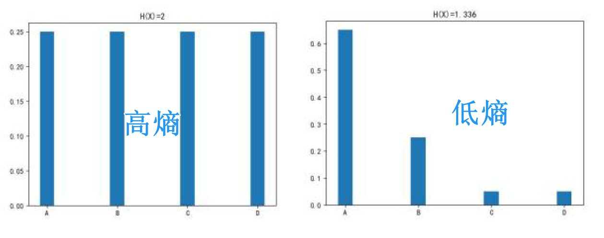
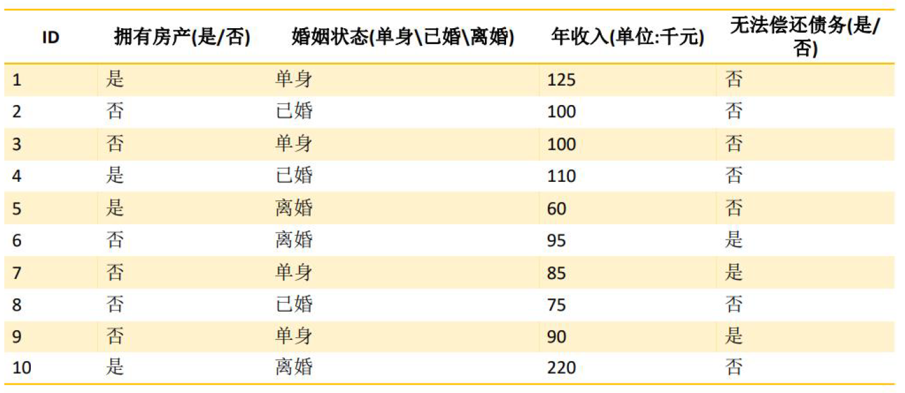
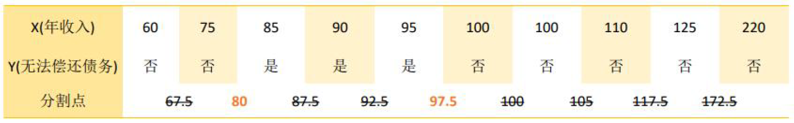
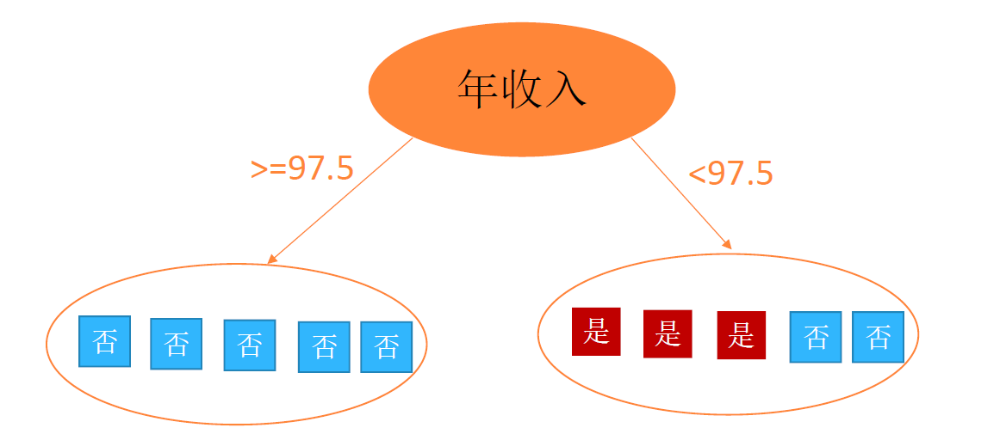
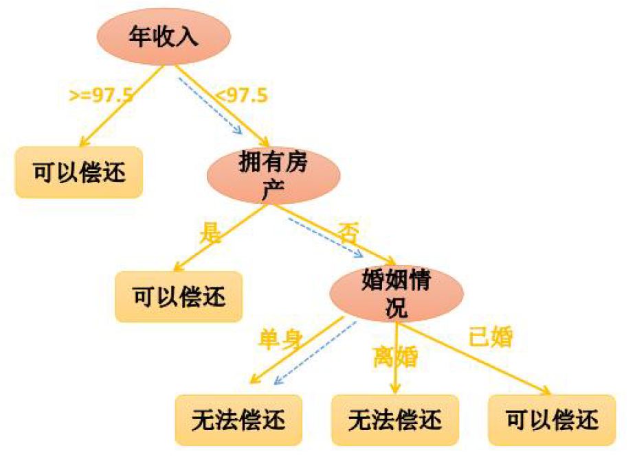
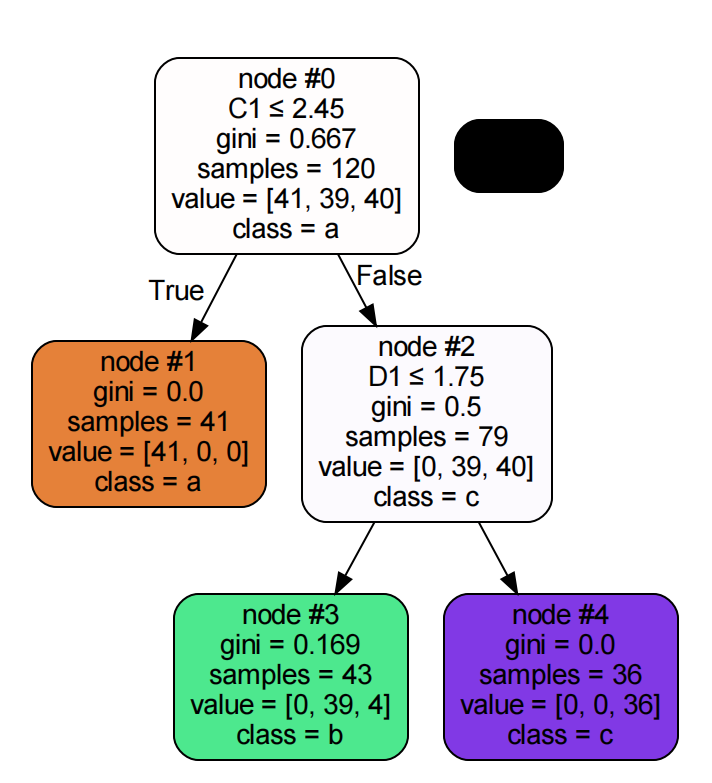

决策树算法可以用于分类和回归任务。它通过学习从数据中提取简单的决策规则来创建一个模型，这个模型代表数据的特征与输出变量之间的关系

决策树是一种树形结构，每个内部节点表示一个属性的测试，每个分支表示一个测试输出，每个叶节点代表一种决策类型

决策树的决策过程就是从根节点开始，测试待分类项中对应的特征属性，并按照其值选择输出分支，直到叶子节点，将叶子节点的存放的类别作为决策结果

在构建一个决策树时，不知道应该先用哪个特征进行判断，哪个特征作为根节点等问题，可以通过信息熵来解决


## 信息熵

信息量：指的是一个样本/事件所蕴含的信息，如果一个事件的概率越大， 那么就可以认为该事件所蕴含的信息越少。极端情况下，比如：“太阳从东方升起” ，因为是确定事件，所以不携带任何信息量。


信息熵：

- 由克劳德·香农在1948年提出，用来量化信息中的不确定性或随机性

- 一个系统的可能状态越多，状态发生的概率分布越均匀，则该系统的信息熵越高。

- 即一个系统越混乱，信息熵就越高

- 信息熵的数学定义为**随机变量不确定性的度量**

- 对于一个离散随机变量 $X$，其信息熵 $H(X)$ 为：
  $$
  H(X)=-\sum_{i=1}^np(x_i)\log_bp(x_i)
  $$
  其中 $p(x_i)$ 为随机变量 $X$ 第 $i$ 个元素出现的概率，$n$ 为 $X$ 的可能取值的数量，基数 $b$ 通常为 $2$（对应的单位是比特），也可以取自然对数的底 $e$ （对应的单位是纳特）或 $10$（对应的单位是哈特）


直观理解：

1. **低熵**：如果随机变量 $X$ 的某个值 $x_i$ 的概率非常高（接近$1$），则信息熵接近$0$。这表明系统非常确定，不确定性低
2. **高熵**：如果随机变量 $X$ 的所有可能值出现的概率相等，那么信息熵达到最大值。这表明系统完全不确定，信息量最大



## 决策树构建

前面我们知道了信息熵是什么，接下来还要知道什么是信息增益，根据信息增益的大小来构建决策树。


### 信息增益

信息增益 = 用划分之前系统的信息熵 - 划分之后系统的信息熵

比如一个样本集合 $D$ 中含有 $K$ 类样本，第 $k$ 类的样本所占比例为 $p_k(k=1,2,...K)$，则 $D$ 的信息熵为：
$$
H(D)=-\sum_{k=1}^Kp_klog_2(p_k)
$$
然后假设离散属性 $a$ 有 $V$ 个取值，使用 $a$ 来对 $D$ 进行划分时，就会产生 $V$ 个分支，其中第 $v$ 个分支包含的样本记为 $D^v$，则这次划分的信息增益为：
$$
Gain(D,a)=H(D)-\sum_{v=1}^V\frac{|D^v|}{|D|}H(D^v)
$$
划分的信息增益越大，表示该划分越有效，这就可以用于构建决策树


### 决策树构建过程

决策树的构造是决策树算法的核心

决策树的构造就是进行属性选择的度量，确定各个特征属性之间的拓扑结构（树结构）。其中的关键步骤就是分裂属性，即在某个节点按照某一类特征属性的不同划分构建不同的分支，让各个分裂自己尽可能的”纯“（让一个分裂子数据集 中待分类的项尽可能属于同一个类别，熵更低）


**构建过程**

1. 将所有特征看作一个一个的节点
2. 计算各个特征的每一种分割方式的信息增益，找出最好的分割点作为根节点
3. 计算划分后所有子节点的信息增益
4. 重复步骤2-3，找出最优的特征及最优的划分方式，作为子节点
5. 对各个子节点分别执行步骤2-4，直到每个子节点都足够”纯“


**特征属性类型**

- 离散值，不要求生成二叉决策树，一个属性就是一个分支
- 离散值，要求生成二叉决策树，使用属性划分的子集测试，按照”属于该子集“和”不属于该子集“分为两个分支
- 连续值，确定一个阈值作为分裂点（split point），按照”大于split point“和”小于split point“分为两个分支


**停止条件**

- 决策树构建是一个递归过程，需要给定停止条件
- 条件1
  - 当每个子节点只有一种类型的时候才停止构建
  - 会导致树节点过多，导致过拟合
- 条件2
  - 当前节点中样本数小于某个阈值，同时迭代次数达到给定值，停止构建
  - 使用 $max(p(i))$ 作为节点对应类型
  - 此时叶子节点中可能还没有达到最”纯“，这时对于离散值采用”投票“，连续值采用均值


**算法评估**

- 决策树算法评估跟一半分类算法一样，使用混淆矩阵计算准确率、召回率、精确率等
- 也可以使用叶子节点的不纯度值总和来评估
  - **总不纯度值越小**，表明树的分割更有效，每个叶子节点内的样本类别更加统一，从而模型的预测能力可能更强
  - **总不纯度值越大**，则意味着决策树在分割数据时效果不佳，可能存在过拟合或欠拟合的问题
- 决策树损失函数：$loss=\sum_{t=1}^{leaf}\frac{\left|D_t\right|}{\left|D\right|}\mathrm{H}(t)$


:::info[小知识]

节点的“纯度”通常通过特定的不纯度度量来评估，除了信息熵（Entropy），还有一种方法是基尼不纯度（Gini impurity）

基尼不纯度是衡量一个随机选中的元素被错误标记的概率。计算公式为：
$$
Gini=\sum_{i=1}^n\left(p_i\right.*\left(1-p_i\right))=1-\sum_{i=1}^np_i^2
$$
其中，$ p_i $ 是选择第 $ i $ 类的概率

:::


### 案例

有如下一份数据：



先计算未划分前系统的熵：$-\frac3{10}log_2(\frac3{10})-\frac7{10}log_2(\frac7{10})=0.88$

此时不确定应该用哪个特征（拥有房产、婚姻状态、年收入）作为根节点，需要计算以各个特征划分系统的信息增益

- 计算”拥有房产“特征的信息增益，划分后有两个节点

  - ”是“的熵：$-\frac04log_2(\frac04)-\frac44log_2(\frac44)=0.0$
  - ”否“的熵：$-\frac36log_2(\frac36)-\frac36log_2(\frac36)=1.0$
  - 系统的熵：$\frac4{10}*0.0+\frac6{10}*1.0=0.60$
  - 信息增益：$gain(HouseProperty)=0.88-0.60=0.28$

- 计算”婚姻状态“特征的信息增益，划分后有三个节点

  - ”单身“的熵：$-\frac24log_2(\frac24)-\frac24log_2(\frac24)=1.0$
  - ”已婚“的熵：$-\frac03log_2(\frac03)-\frac33log_2(\frac33)=0.0$
  - ”离婚“的熵：$-\frac13log_2(\frac13)-\frac23log_2(\frac23)=0.91830$
  - 系统的熵：$\frac4{10}*1.0+\frac3{10}*0.0+\frac3{10}*0.91830=0.68$
  - 信息增益：$gain(MarriedStatus)=0.88-0.68=0.20$

- 计算”年收入“特征的信息增益

  - 年收入是一个连续值，通常通过选择一个阈值来分割数据集

  - 可以用贪心算法来确定阈值

  - 对于这个案例，可以有更直接的方法，从数据可以得到规律

    

  - 可以得到两个信息增益
    $$
    gain(AnnualIncome=80)=0.116\\gain(AnnualIncome=97.5)=0.395
    $$

选择信息增益最大的划分（AnnualIncome=97.5）作为第一次划分，即作为决策树的根节点



左子节点的熵：$-\frac55log_2{(\frac55)}=0.0$

右子节点的熵：$-\frac35log_2(\frac35)-\frac25log_2(\frac25)=0.97$

左子节点熵为 $0$，不需要继续划分，右子节点继续划分，重复步骤即可完成决策树构建


## 决策树常用算法

决策树分为两大类：分类树和回归树，前者用于分类标签值，后者用于预测连续值，常用算法有ID3、C4.5、CART等

ID3、C4.5、CART算法特征：

- 只适合在小规模数据集使用
- 都是单变量决策树
- ID3、C4.5支持分类，CART支持分类和回归


### ID3

ID3（Iterative Dichotomiser 3）算法是一种用于构建决策树的经典算法，由Ross Quinlan在1986年开发。


ID3算法特性

- 特别适用于处理分类问题，它使用信息增益作为标准来选择每个分割属性
- ID3只支持离散特征属性，不支持连续特征属性（对连续值需要进行离散化处理）
- ID3构建的是多叉树


ID3算法核心步骤

1. 选择最佳属性
   - ID3算法开始于选择数据集中最佳的属性作为决策节点
   - 计算信息熵
   - 计算信息增益
4. 递归构造决策树
   - 使用具有最高信息增益的属性作为决策节点，然后对每个分支重复此过程。递归地为每个子集构造决策树，直到每个子集都完美地分类，或者没有更多的属性可以用于做决策
5. 生成决策树
   - 每个叶节点都标记为在该节点上数据最常见的分类


ID3算法限制

- 处理数值型数据：ID3原生不支持数值型属性（连续属性），必须先将数值型数据离散化
- 过拟合：ID3倾向于选择具有大量值的属性（如ID或日期等），这可能导致模型过于复杂，从而导致过拟合。此外，ID3没有内置的剪枝方法
- 缺失数据：ID3没有内置处理缺失数据的机制
- 二分问题：ID3生成的树可能非常偏斜（非平衡），特别是当某些属性具有大量唯一值时。


### C4.5

C4.5算法是决策树ID3算法的一个改进版本，由Ross Quinlan在1993年提出。

C4.5解决了ID3的一些主要限制，如支持连续属性、改进的剪枝技术、对缺失值的处理能力以及减少过拟合的倾向。

**C4.5算法生成的决策树经常被用作分类模型**


#### 信息增益率

信息增益作为衡量划分有效性的标准，并不都是适合有效的，比如前面的例子中，将特征年收入按照 $AnnualIncome=80$ 和 $AnnualIncome=97.5$ 划分为3个分支，则划分的3个部分信息熵都为 $0$，此时信息增益最大，按此方案划分，则可以只用一次分裂就建好决策树，但是在构建多叉树这样很容易导致过拟合。属性有10个不同的值，分割成10个子集，这显然不太合理。

因此，C4.5 算法使用信息增益率来选择最优属性


在构建决策树时，信息增益率（Gain Ratio）被引入作为一种改进的标准来选择最佳分割属性，特别是作为C4.5算法的一个核心部分，主要是为了解决纯信息增益（Gain）在处理具有许多值的属性时的固有缺陷。

信息增益率定义为信息增益和分割信息（Split Information）的比值：
$$
\text{Gain Ratio} = \frac{\text{Gain}(S, A)}{\text{SplitInfo}(S, A)}
$$
其中，分割信息量度的是用属性 $ A $ 来分割数据 $ S $ 时产生的潜在结果分布的广度和均匀性：
$$
\text{SplitInfo}(S, A) = -\sum_{i=1}^{m} \frac{|S_i|}{|S|} \log_2 \frac{|S_i|}{|S|}
$$
这里 $ S_i $ 是按属性 $ A $ 的第 $ i $ 个值分割出的子集，一般来说，属性 $A$ 的取值数目越多（即 $m$ 越大），则分割信息的值越大


#### 剪枝

决策树的剪枝是用来简化完全成长后可能过于复杂的决策树模型

剪枝可以帮助提高模型的泛化能力，防止过拟合

决策树剪枝的两种主要类型：

1. **预剪枝（Pre-pruning）**:
   - 预剪枝是在决策树完全发展之前就停止其生长的过程。预剪枝的方法可以包括设置树的最大深度、设定节点最小样本数、要求一个节点中数据的不纯度（如基尼不纯度或熵）达到一个阈值之后才进行分割等
   - 优点是可以显著减少训练时间和避免过拟合
   - 缺点是可能会过早停止树的生长，导致模型欠拟合

2. **后剪枝（Post-pruning）**:
   - 后剪枝是先从训练数据集生成一棵完整的决策树，然后自底向上检查决策节点的子节点，如果去除或替换这些子节点能提高交叉验证数据集的精度，则进行剪枝
   - 后剪枝方法通常包括成本复杂度剪枝（Cost complexity pruning），该方法引入了正则化参数（称为剪枝参数 $\alpha$），用于定义模型复杂度和数据拟合之间的权衡
   - 优点是通常会生成更优的模型，因为它考虑了更多的数据和结构
   - 缺点是计算成本更高，因为需要首先生成完整的树


C4.5算法的核心步骤

1. 处理连续和离散属性
   - 对于连续属性，C4.5使用阈值将其转换为二分属性。算法遍历所有排序后的属性值，以每两个相邻值的中点作为潜在阈值，计算每个潜在阈值的信息增益率，选取最佳阈值进行数据分割
   - 离散属性直接计算信息增益率，选择最优属性进行分割

2. 计算信息增益率
   
3. 剪枝处理
   - C4.5使用后剪枝（post-pruning）技术。构建完整的决策树后，从底部开始评估非叶节点，使用验证集来测试如果该节点被替换为叶节点（或进行子树简化）是否会提高整体的预测准确性。如果是，则进行剪枝

4. 处理缺失值
   - C4.5在节点分割时考虑缺失值，允许数据实例即使在某些属性上的值未知的情况下也参与分割属性的选择和树的构建

5. 构建决策树
   - 选择信息增益率最高的属性作为节点，递归地对每个子集应用相同的过程构建树，直到满足停止条件（所有实例属于同一类、没有剩余属性或达到预设的最小增益阈值）


### CART

CART（Classification and Regression Trees）算法可用于分类问题（分类树）和回归问题（回归树）

CART算法在构建决策树时使用“基尼不纯度”(Gini impurity)作为默认的质量衡量标准

CART算法特性：

- 二分递归分割
   - **CART决策树是一种二叉树**，它将每个节点分割成两个子节点，从而递归地二分每个问题。这种方法与ID3和C4.5的多路分割不同

- 分类树与回归树
   - **在分类任务中，CART使用基尼不纯度来选择最佳分割**，基尼不纯度是衡量节点中类标签混乱程度的一个指标
   - **在回归任务中，CART使用最小化均方误差（MSE）来选择最佳分割**

- 剪枝技术
   - CART算法使用后剪枝通过使用验证集来避免过拟合

- 处理缺失值
   - CART算法有一个内置的机制来处理缺失值。在属性的选择过程中，如果数据集中某些数据缺失，CART会使用剩余数据来选择一个最佳分割。在分配数据到分支时，如果分割属性的数据缺失，CART会根据数据在其他分支的分布来估计其路径


## 分类树和回归树

分类树和回归树是决策树的两种主要形式，虽然它们在结构上类似，都是由决策点和终端叶子节点组成的树形结构，但它们处理的数据类型、目标函数和最终的输出形式有所不同


### 分类树

目的：分类树用于解决分类问题，即预测离散的标签或类别输出。

输出：分类树的每个叶节点关联一个类别标签。当一个输入样本进入决策树后，根据其特征，它会被一系列规则导向到一个叶节点，这个叶节点定义了样本的类别。

衡量标准：
- 基尼不纯度
- 信息熵

决策规则：基于使得基尼不纯度或信息熵最小化的准则来选择分裂属性。


### 回归树

目的：回归树用于解决回归问题，即预测连续的数值型输出。

输出：回归树的每个叶节点关联一个数值。这个数值通常是到达该叶节点的训练样本的目标值的平均值。

衡量标准：
- 均方误差（MSE）：衡量每个节点内预测值与实际值差异的平方和的平均值，
  $$
  MSE=\frac1n\sum_{i=1}^n(y_i-\hat{y}_i)^2
  $$
   $ y_i $ 是样本的真实值，而 $ \hat{y} $ 是预测值（叶节点的平均值）

- 平均绝对误差（MAE）：衡量预测值与实际值之间差异的绝对值的平均值
  $$
  MAE=\frac1n\sum_{i=1}^n|y_i-\hat{y}_i|
  $$

决策规则：基于使得均方误差或平均绝对误差最小化的准则来选择分裂属性。


### 核心区别

- 输出类型：分类树输出的是类别，适用于分类问题；而回归树输出的是连续数值，适用于回归问题。
- 目标函数：分类树通常使用基尼不纯度或信息熵作为目标函数来优化；回归树则使用均方误差或平均绝对误差。
- 数据处理方式：分类树在内部处理数据时关注的是如何最有效地分离不同类别；回归树则关注的是如何减少预测值和真实值之间的偏差。


## 扩展

决策树可视化可以通过graphviz插件实现

1. 安装graphviz服务

2. 安装python插件graphviz、pydotplus

   ```bash
   pip install graphviz
   pip install pydotplus
   ```

3. 输出可视化

   ```python
   import pydotplus
   from sklearn import tree
   
   dot_data = tree.export_graphviz(decision_tree=algo, out_file=None,
                                   feature_names=['A1', 'B1', 'C1', 'D1'],
                                   class_names=['a', 'b', 'c'],
                                   filled=True, rounded=True,
                                   special_characters=True,
                                   node_ids=True
                                   )
   graph = pydotplus.graph_from_dot_data(dot_data)
   graph.write_png("iris.png")
   graph.write_pdf("iris.pdf")
   ```

   

