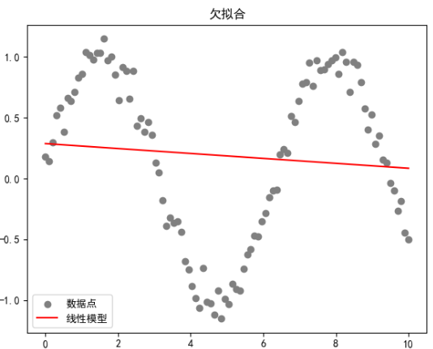
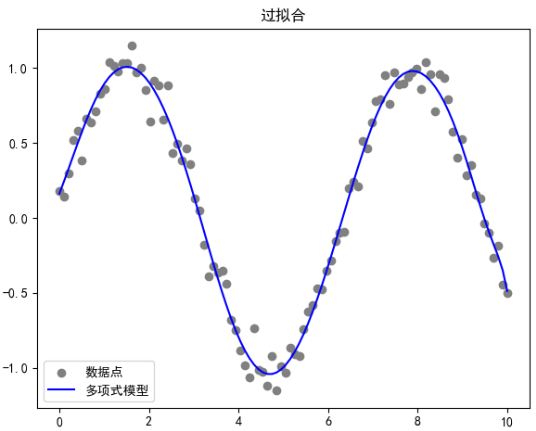

线性回归是机器学习中最基础的预测模型之一，主要用于预测连续的数值型目标变量。

跟中学的二元一次方程类似，假设输入变量（自变量）和输出变量（因变量）之间存在线性关系。

线性回归模型试图找到一条直线，最好地描述自变量 X 和因变量 Y 之间的关系。这条直线的数学表达式为：

$$
Y = \beta_0 + \beta_1X + \epsilon
$$

其中，$\beta_0$是截距，$\beta_1$是斜率，统称为模型参数；$ϵ$是误差项，代表模型未能解释的部分

## 回归问题解法

这里我们换一种更直观的方式来表示线性回归问题

假定每个样本有 $N$ 个特征 $x_1,x_2,...,x_N$ ，采集到 $M$ 个样本的这 $N$ 个特征的值并标注其结果 $y$：
$$
x_1^{(i)},x_2^{(i)},...,x_N^{(i)},y^{(i)}\quad(1\leq i\leq M)
$$
假定结果与这 $N$ 个特征之间都是线性关系：
$$
y=h_\theta\left(x\right)=\theta_0+\theta_1x_1+...+\theta_Nx_N=\sum_{i=0}^N\theta_ix_i
$$
换成矩阵形式：
$$
h_\theta\left(x\right)=\theta^TX，其中\theta=\begin{bmatrix}\theta_0\\\theta_1\\...\\\theta_N\end{bmatrix}\quad X=\begin{bmatrix}1\\x_1\\...\\x_N\end{bmatrix}
$$
对于每一个样本点，可以表示为：
$$
y^{(i)}=\theta^Tx^{(i)}+\epsilon^{(i)}
$$
假定误差 $\epsilon^{(i)}(1\leq i\leq M)$ 是独立同分布的，服从均值为 0，方差为某定值 $\sigma^{2}$ 的高斯分布

<details>
<summary>为什么使用高斯分布？</summary>
1. **中心极限定理**
   - 想象一下，你在做一件事情，这件事的结果受到很多小因素的影响，比如打篮球时的风向、手的角度、力量的大小等等。单独看一个因素，它可能对结果的影响不大，而且这种影响可能是随机的。但当这些小因素叠加起来时，它们共同创造最终的结果
   - 中心极限定理告诉我们，当有很多这样的小随机因素影响一个结果时，无论这些因素各自是什么分布（只要它们符合一些基本条件），它们的总和都会趋向于形成一个高斯分布。这就是为什么即使我们不知道误差的具体来源，我们仍然可以假设它们整体上呈正态分布
2. **统计分析的简化**：
   - 在构建统计模型时，希望模型简洁且有强大的预测能力。如果假设误差项遵循高斯分布，就可以使用一些非常有效的统计工具，比如最小二乘法和最大似然估计，来找到模型参数
   - 假设误差是高斯分布的，意味着误差是“公平”的——没有系统偏差，所有的偏差都是随机的。这使得模型的估计更加可靠，因为它不会系统地高估或低估真实值
   - 在经典线性回归分析中，常常假设误差项 $\epsilon^{(i)}$ 是独立同分布的，且服从均值为 0，方差为 $\sigma^2$ 的正态分布。这个假设（高斯白噪声假设）简化了模型的分析和参数的估计，特别是使用最小二乘法或最大似然估计时
</details>

根据高斯分布的概率密度函数：
$$
p(\epsilon^{(i)})=\frac1{\sqrt{2\pi}\sigma}exp(-\frac{(\epsilon^{(i)})^2}{2\sigma^2})
$$
可以得到：
$$
p(y^{(i)}|x^{(i)};\theta)=\frac1{\sqrt{2\pi}\:\sigma}exp(-\frac{(y^{(i)}-\theta^Tx^{(i)})^2}{2\sigma^2})
$$
因为样本的特征和结果已知，上述函数是关于 $\theta$ 的函数，则可以得到关于 $\theta$ 的似然函数：
$$
\begin{aligned}
L(\theta)& =\prod_{i=1}^mp(y^{(i)}|x^{(i)};\theta) \\
&=\prod_{i=1}^m\frac1{\sqrt{2\pi}\sigma}exp(-\frac{(y^{(i)}-\theta^Tx^{(i)})^2}{2\sigma^2})
\end{aligned}
$$
对其求对数似然：
$$
\begin{aligned}
l\left(\theta\right)& =logL(\theta) \\
&=log\prod_{i=1}^m\frac1{\sqrt{2\pi}\sigma}exp(-\frac{(y^{(i)}-\theta^Tx^{(i)})^2}{2\sigma^2}) \\
&=\sum_{i=1}^mlog\frac1{\sqrt{2\pi}\sigma}exp(-\frac{(y^{(i)}-\theta^Tx^{(i)})^2}{2\sigma^2}) \\
&=m*log\frac{1}{\sqrt{2\pi} \sigma} -\frac{1}{\sigma^{2}} *\frac{1}{2} \sum_{i=1}^{m}(y^{(i)}-\theta^{T}x^{(i)})^{2}
\end{aligned}
$$
极大似然估值是要求 $l(\theta)$ 的最大值，令：
$$
\begin{aligned}
J(\theta)& =\frac12\sum_{i=1}^m(y^{(i)}-\theta^Tx^{(i)})^2 \\
&=\frac12\sum_{i=1}^m(h_\theta(x^{(i)})-y^{(i)})^2
\end{aligned}
$$
:::info[小知识]

**为什么这里要用 $h_\theta(x^{(i)}) = \theta^T x^{(i)}$ 等价变化？**

- **概念清晰**：使用 $h_\theta(x)$ 使得模型的解释更加直观。可以更清楚地看到，损失函数是通过计算预测值 $h_\theta(x^{(i)})$ 与实际值 $y^{(i)}$ 之间的差的平方来定义

- **扩展性**：采用这种形式，可以更容易地将线性模型扩展到非线性模型，例如在 Logistic 回归或神经网络中，$h_\theta(x)$ 可能包括非线性变换

:::

求 $l(\theta)$ 的最大值等价于求$J(\theta)$ 的最小值，求$J(\theta)$ 最小值就是使用最小二乘法（$J(\theta)$ 即损失函数）


### 解析解

求$J(\theta)$ 的最小值就是一个求极值的问题，即求 $\frac{\partial J(\theta)}{\partial\theta}=0$ 时 $\theta$ 的值

将 $M$ 个 $N$ 维样本组成矩阵 $X$

-  $X$ 的每一行对应一个样本，共 $M$ 行
-  $X$ 的每一列对应样本的一个维度（特征），加上一个值恒为 1 的维度（截距），共 $N+1$ 列

将损失函数 $J(\theta)$ 转化为：
$$
\begin{aligned}
J(\theta)& =\frac12\sum_{i=1}^M(h_\theta(x^{(i)})-y^{(i)})^2 \\
&=\frac12\left(X\theta-y\right)^T(X\theta-y) \\
&=\frac12(\theta^TX^T-y^T)(X\theta-y) \\
&=\frac12\left(\theta^TX^TX\theta-\theta^TX^Ty-y^TX\theta+y^Ty\right)
\end{aligned}
$$
对上式求 $\theta$ 的偏导：
$$
\begin{aligned}
\frac{\partial J(\theta)}{\partial\theta}& =\frac12(2X^TX\theta-X^Ty-(y^TX)^T) \\
&=\frac12(2X^TX\theta-X^Ty-X^Ty) \\
&=X^TX\theta-X^Ty
\end{aligned}
$$
:::info[小知识]

导数规则

- 导数 $\frac{\partial}{\partial \theta} (\theta^T A \theta) = 2A \theta$ ，当 $A$ 是对称矩阵
- 导数 $\frac{\partial}{\partial \theta} (\theta^T b) = \frac{\partial}{\partial \theta} (b^T \theta) = b$ ，当 $b$ 是常数向量

:::

令上式为 0，得到最终解：
$$
\frac{\partial J(\theta)}{\partial\theta}=0 \Rightarrow X^TX\theta=X^Ty \Rightarrow \theta=(X^TX)^{-1}X^Ty
$$
这里 $X^TX$ 不一定可逆，可以加上 $\lambda$ 扰动（$\lambda$ 是一个略大于 0 的实数）
$$
\theta=(X^TX+\lambda I)^{-1}X^Ty
$$
$X^TX+\lambda I$ 是正定的，所以一定是可逆的
<details>
<summary>为什么加入扰动一定是正定？</summary>

首先来解释一下什么是正定矩阵：如果对于所有非零向量 $ v $，都有 $ v^T A v > 0 $，则这个对称矩阵 $A$ 被称为正定矩阵。

$X^T X$ 特性：

- **对称性**：$ X^T X $ 是一个对称矩阵，因为 $ (X^T X)^T = X^T (X^T)^T = X^T X $。
- **半正定**：$ X^T X $ 是半正定的，这是因为对于任何非零向量 $ v $，$ v^T (X^T X) v = (X v)^T (X v) = \|X v\|^2 \geq 0 $。这表明 $ X^T X $ 的所有特征值非负。

添加 $ \lambda I $之后

- 当我们在 $ X^T X $ 中添加一个正数 $ \lambda $ 乘以单位矩阵 $ I $，即 $ X^T X + \lambda I $，我们实际上是在 $ X^T X $ 的每个特征值上加上 $ \lambda $。因为 $ I $ 的特征值都是1，所以 $ \lambda I $ 的特征值都是 $ \lambda $。
- 即使 $ X^T X $ 是奇异的或者有零特征值，$ \lambda I $ 的加入使得每个原始特征值 $ \lambda_i $ 变为 $ \lambda_i + \lambda $。因为 $ \lambda > 0 $，这确保了所有新的特征值都是正的。

保证正定和可逆性

- **正定**：因为对于任意非零向量 $ v $，都有 $ v^T (X^T X + \lambda I) v = v^T X^T X v + \lambda v^T I v = \|X v\|^2 + \lambda \|v\|^2 > 0 $，所以 $ X^T X + \lambda I $ 是正定的。
- **可逆性**：矩阵是正定的，则它没有零特征值，这意味着它是非奇异的，即可逆的。

</details>


:::note[扩展知识]

加入扰动其实就是线性回归正则化的技术，特别是岭回归（Ridge Regression）的公式。这是一种处理特别是在存在多重共线性（自变量高度相关）时或为了防止过拟合而常用的技术

当 $ X^T X $ 的行列式接近或等于零（即矩阵接近奇异或完全奇异），直接计算其逆会有问题，这通常在特征数量多于样本数量或特征之间高度相关时发生。这会导致模型参数估计的不稳定性和大的方差。

为了克服这个问题，岭回归通过添加一个惩罚项 $ \lambda I $（其中 $ \lambda $ 是一个正的常数，$ I $ 是单位矩阵）到 $ X^T X $ 中

1. **惩罚项 $ \lambda I $**：
   - **惩罚系数 $ \lambda $**：这个系数控制了正则化的强度。$ \lambda $ 的值越大，对参数 $ \theta $ 的惩罚越大，使得模型参数的值变得更小，这通常会降低模型的复杂度，有助于防止过拟合。
   - **单位矩阵 $ I $**：添加到 $ X^T X $ 的单位矩阵确保了正则化项只影响参数的估计值，而不改变其它统计性质。这样的修改提高了 $ X^T X + \lambda I $ 的条件数，从而使得矩阵更容易求逆，增加了数值稳定性。

2. **统计意义**：
   - 通过引入惩罚项，岭回归有效控制了模型参数的大小，有助于处理共线性问题，降低模型在新数据上的预测误差，特别是当原始特征矩阵 $ X $ 不适合直接求逆时。

3. **实际应用**：
   - 在实际应用中，选择合适的 $ \lambda $ 是关键，通常通过交叉验证等方法进行选择。
   - 岭回归广泛用于包含大量预测变量的模型中，尤其是那些变量间存在复杂相关关系的情况。

:::


### 梯度下降

对于损失函数 $J(\theta)=\frac12\sum_{i=1}^m(h_\theta(x^{(i)})-y^{(i)})^2$ ，可以得出其为凸函数


<details>
<summary>为什么损失函数一定为凸函数？</summary>

在线性回归模型中，常用的损失函数是平方误差损失，其形式为：
$$
J(\theta) = \frac{1}{2} \sum_{i=1}^m (h_\theta(x^{(i)}) - y^{(i)})^2
$$
可以写成以下形式：
$$
J(\theta) = \frac{1}{2} (X\theta - y)^T (X\theta - y)
$$
展开后，得到：
$$
J(\theta) = \frac{1}{2} \theta^T X^T X \theta - \theta^T X^T y + \text{const}
$$
其中，const 是一个不依赖于 $ \theta $ 的常数项。

2. **矩阵 $ X^T X $ 的性质**：$ X^T X $ 是设计矩阵 $ X $ 的转置乘以 $ X $。这个矩阵是对称的，并且是半正定的。意味着对于任何非零向量 $ v $，都有 $ v^T (X^T X) v \geq 0 $。

3. **半正定矩阵和凸函数**：一个函数如果是形式为 $ f(\theta) = \theta^T A \theta + b^T \theta + c $ 的二次函数，其中 $ A $ 是半正定矩阵，则该函数是凸函数。在平方误差损失的情况下，矩阵 $ A $ 对应于 $ X^T X $。由于 $ X^T X $ 是半正定的，这保证了损失函数 $ J(\theta) $ 是关于 $ \theta $ 的凸函数。

</details>


<details>
<summary>为什么形式为 $f(\theta) = \theta^T A \theta + b^T \theta + c$ 的函数在 𝐴 为半正定矩阵时，是一个凸函数？</summary>


凸函数的定义：一个函数 $ f: \mathbb{R}^n \rightarrow \mathbb{R} $ 是凸的，则对于所有 $ \theta_1, \theta_2 \in \mathbb{R}^n $ 和所有 $ t \in [0, 1] $，都满足：
$ f(t \theta_1 + (1-t) \theta_2) \leq t f(\theta_1) + (1-t) f(\theta_2) $

**二次函数的凸性**

1. 函数的梯度（一阶导数）：
   $ \nabla f(\theta) = 2A\theta + b $

2. 函数的海森矩阵（二阶导数）：
   $ H = \nabla^2 f(\theta) = 2A $

   海森矩阵 $ H $ 是衡量函数曲率的关键。如果海森矩阵是半正定的，那么该函数是凸函数。

**半正定矩阵与凸性**

- 半正定矩阵的特性：
   半正定矩阵 $ A $ 的性质是：对于任何向量 $ v \neq 0 $，都有 $ v^T A v \geq 0 $，即函数 $ v^T A v $ 的值永远是非负的。

- 海森矩阵的半正定性：
   在上述二次函数中，海森矩阵 $ H = 2A $。因为 $ A $ 是半正定的，乘以正标量 2 不改变其半正定性。因此，$ H = 2A $ 也是半正定的。

- 凸函数的确定：
   如果海森矩阵 $ H $ 是半正定的，根据凸分析理论，函数 $ f(\theta) $ 是凸函数。这是因为函数的曲率（由海森矩阵确定）在整个定义域内都是非负的，满足凸函数的定义。

</details>

对于凸函数，可以用梯度下降算法来求机制，相当于不断重复下式：
$$
\theta_j=\theta_j-\alpha \star \frac{\partial J}{\partial\theta_j}
$$
损失函数：$J(\theta)=\frac{1}{2*m}\sum_{i=0}^{m} (h_\theta(X^{(i)})-y^{(i)})^2=\frac{1}{2*m} \sum_{i=1}^{m} (\hat{y}^{(i)}-y^{(i)})^2$

对每一个 $\theta_{i}(0\leq i\leq N)$ 求偏导：
$$
\left\{
\begin{aligned}&\frac{\partial J}{\partial\theta_0}=\frac{1}{m}((\hat{y}^{(1)}-y^{(1)})x_0^{(1)}+...+(\hat{y}^{(m)}-y^{(m)})x_0^{(m)})\\&\frac{\partial J}{\partial\theta_1}=\frac{1}{m}((\hat{y}^{(1)}-y^{(1)})x_1^{(1)}+...+(\hat{y}^{(m)}-y^{(m)})x_1^{(m)})\\&...\\&\frac{\partial J}{\partial\theta_N}=\frac{1}{m}((\hat{y}^{(1)}-y^{(1)})x_N^{(1)}+...+(\hat{y}^{(m)}-y^{(m)})x_N^{(m)})\end{aligned}
\right.
$$
其中 $x_{0}^{(i)}\equiv1$，换成矩阵形式：
$$
\frac{\partial J}{\partial\theta}=\frac1mX^T(\hat{y}-y)
$$
得出梯度下降公式就是：
$$
\theta'=\theta-\alpha\frac1mX^T(\hat{y}-y)
$$


## 多项式扩展

在训练模型时，原始数据不都是线性关系，对于非线性关系的数据，就可以采用多项式扩展的方式来实现。

多项式扩展其实就是给原有的数据添加一些新的特征，这些新特征是原始特征的高次方或者不同特征之间的组合。通过这种方式，可以让简单的线性模型能够学习到数据中的非线性关系，从而提高模型的预测精度。

多项式扩展是一种提升模型能力的简单而有效的方法，尤其适用于处理那些**原始特征与输出之间存在非线性关系**的情况。通过这种方式，即使是简单的线性回归模型也能进行复杂的非线性数据拟合，但需要注意避免过拟合。

假如现在有一个实验，试图通过测量热水壶的电力消耗来预测它煮沸水的时间。如果仅使用电力消耗（瓦特数）作为特征，你可能会发现难以精确预测煮沸时间，因为实际上煮沸时间与电力消耗之间的关系可能不完全是直线（即线性）关系。

这时，多项式扩展就派上用场了。除了电力消耗，可以引入电力消耗的平方、立方等作为新的特征。这样，模型不仅考虑了电力消耗本身，还考虑了电力消耗的高次效应，可能更好地捕捉到煮沸时间的变化。

假设我们有以下简单的数据集：

| 电力消耗（瓦特） | 煮沸时间（分钟） |
| ---------------- | ---------------- |
| 1500             | 4                |
| 1000             | 6                |
| 2000             | 3                |

如果直接用电力消耗来预测煮沸时间，可能得到不够准确的结果。但如果引入电力消耗的平方作为第二个特征，那么模型就有可能更好地理解数据：

1. **原始特征**：电力消耗 $ x $
2. **新特征**：电力消耗的平方 $ x^2 $

于是，特征就从单一的 $ x $ 扩展到了 $ x $ 和 $ x^2 $。在实际应用中，可以使用机器学习中的工具来自动完成这种扩展，并用这些特征来训练我们的模型。

使用Python进行建模，可以用`sklearn`库中的`PolynomialFeatures`自动进行多项式扩展：

```python
from sklearn.preprocessing import PolynomialFeatures
import numpy as np

# 创建数据：电力消耗
X = np.array([[1500], [1000], [2000]])

'''
用PolynomialFeatures来扩展特征
degree=2,扩展的阶数
interaction_only=False,是否只保留交互项
include_bias=True，是否需要偏置项
'''
poly = PolynomialFeatures(degree=2, interaction_only=True, include_bias=False)
X_poly = poly.fit_transform(X)

print(X_poly)
```

输出的 `X_poly` 将包含原始电力消耗及其平方值，可以直接用于模型训练。


## 过拟合与欠拟合

在机器学习中，过拟合和欠拟合是两种常见的模型表现问题，它们反映了模型对训练数据和未见数据（如测试数据）的泛化能力。


### 欠拟合（Underfitting）

当一个模型在训练数据上没有很好的表现，即模型过于简单，没有捕捉到数据的基本关系时，就会发生欠拟合。这通常是因为模型不够复杂，无法学习数据中的所有信号



**表现：**
- 模型在训练集和测试集上的表现都不好
- 模型过于简单，例如线性模型试图捕捉非线性关系

**原因：**
- 模型复杂度过低
- 特征量不足
- 过于简化的假设

**解决方法：**
- 增加更多特征
- 使用更复杂的模型
- 减少数据预处理中的简化


### 过拟合（Overfitting）

过拟合发生在模型在训练数据上表现得太好，以至于它学到了训练数据中的噪声而非潜在的数据分布。这种模型虽然在训练集上得分高，但是在新的或未见过的数据上表现差，因为它缺乏泛化能力



**表现：**

- 模型在训练集上表现出色，但在验证集或测试集上表现不佳
- 捕捉了数据中的随机噪声而非真正的输入与输出间的关系

**原因：**
- 模型复杂度过高
- 训练时间过长
- 训练数据量不足或包含噪声

**解决方法：**
- 简化模型，选择一个适当的模型复杂度
- 采用正则化技术（如L1、L2正则化）
- 使用更多的训练数据
- 采用交叉验证来调整模型参数
- 提前停止训练过程（例如，在验证误差开始增加时停止）


### 正则化

线性回归问题的损失函数后加上一项，称为正则化项：
$$
J\left(\theta_0,\theta_1,\cdots,\theta_n\right)=\frac{1}{2m}\sum_{i=1}^{m}\left(h_{\theta}\left(X^{\left(i\right)}\right)-y^{\left(i\right)}\right)^{2}+\lambda\Omega\left(\theta\right)
$$
通过添加正则化项来解决过拟合的问题就是正则化技术

L1正则化和L2正则化使用的优化算法是坐标下降（coordinate descent）


#### L1正则化

在L1正则化中，正则项通常形式如下：
$$
\Omega\left(\theta\right)=\sum_{j=1}^{n}\left|\theta_{j}\right|
$$
L1正则化的回归也称为Lasso（Least Absolute Shrinkage and Selection Operator，最小绝对收缩选择算子）回归

L1正则化倾向于产生稀疏的权重矩阵，即很多权重参数会变为零。这种特性使得L1正则化成为一种自然的特征选择方法，因为它可以帮助模型仅保留最重要的特征。

```python
import pandas as pd
from sklearn.linear_model import Lasso, LassoCV
from sklearn.model_selection import train_test_split
from sklearn.preprocessing import PolynomialFeatures

# 加载数据
data = pd.read_csv('boston_housing.data', sep='\s+', header=None)

# 提取特征属性X和目标属性Y
X = data.iloc[:, :-1]
Y = data.iloc[:, -1]

# 将数据集划分为训练集和测试集
x_train, x_test, y_train, y_test = train_test_split(X, Y, test_size=0.33, random_state=10)

# 多项式特征扩展
poly = PolynomialFeatures(degree=2, interaction_only=True, include_bias=False)
x_train_poly = poly.fit_transform(x_train)
x_test_poly = poly.transform(x_test)

# 构建Lasso回归模型，设置正则化强度alpha
lasso = Lasso(alpha=0.1)
# 使用训练数据拟合模型
lasso.fit(x_train_poly, y_train)

# # 构建LassoCV回归模型，使用交叉验证选择最佳alpha
# lassoCV = LassoCV(alphas=[0.0001, 0.001, 0.01, 0.1, 1, 10, 20, 30, 40], cv=10)
# # 使用训练数据拟合模型
# lassoCV.fit(x_train_poly, y_train)


# 对测试集进行预测
y_test_hat = lasso.predict(x_test_poly)
# 对训练集进行预测
y_train_hat = lasso.predict(x_train_poly)

# 打印模型的系数和截距
print("Lasso Regression:")
print(f"系数: {lasso.coef_}")
print(f"截距: {lasso.intercept_}")

# 打印模型在训练集和测试集上的评分
print(f"训练集评分: {lasso.score(x_train_poly, y_train)}")
print(f"测试集评分: {lasso.score(x_test_poly, y_test)}")
```


#### L2正则化

在L2正则化中，正则项通常形式如下：
$$
\Omega\left(\theta\right)=\sum_{j=1}^n\theta_j^2
$$
L2正则化的回归也称为岭回归（Ridge Regression）

L2正则化通过惩罚参数的平方和来工作，这导致参数值趋向于非常小的数，但通常不会完全为零。这有助于减少模型参数对训练数据中小波动的敏感性，从而提高模型的泛化能力。

```python
import pandas as pd
from sklearn.linear_model import Ridge, RidgeCV
from sklearn.model_selection import train_test_split
from sklearn.preprocessing import PolynomialFeatures

# 加载数据
data = pd.read_csv('./data/boston_housing.data', sep='\s+', header=None)

# 提取特征属性X和目标属性Y
X = data.iloc[:, :-1]
Y = data.iloc[:, -1]

# 将数据集划分为训练集和测试集
x_train, x_test, y_train, y_test = train_test_split(X, Y, test_size=0.33, random_state=10)

# 多项式特征扩展
poly = PolynomialFeatures(degree=2, interaction_only=True, include_bias=False)
x_train_poly = poly.fit_transform(x_train)
x_test_poly = poly.transform(x_test)

# 构建Ridge回归模型，设置正则化强度alpha
ridge = Ridge(alpha=100)
# 使用训练数据拟合模型
ridge.fit(x_train_poly, y_train)

# # 构建RidgeCV回归模型，使用交叉验证选择最佳alpha
# ridgeCV = RidgeCV(alphas=[0.001, 0.01, 0.1, 1.0, 10, 100, 1000, 10000, 100000, 1000000, 10000000], cv=10)
# # 使用训练数据拟合模型
# ridgeCV.fit(x_train_poly, y_train)

# 对测试集进行预测
y_test_hat = ridge.predict(x_test_poly)
# 对训练集进行预测
y_train_hat = ridge.predict(x_train_poly)

# 打印模型的系数和截距
print("Ridge Regression:")
print(f"系数: {ridge.coef_}")
print(f"截距: {ridge.intercept_}")

# 打印模型在训练集和测试集上的评分
print(f"训练集评分: {ridge.score(x_train_poly, y_train)}")
print(f"测试集评分: {ridge.score(x_test_poly, y_test)}")
```


### ElasticNet回归

ElasticNet 回归（弹性网络回归）是一种结合了L1正则化和L2正则化的线性回归模型。它在模型训练过程中同时考虑L1和L2两种类型的正则化，从而兼具Lasso回归（L1正则化）的特征选择能力和岭回归（L2正则化）的参数缩减特性。

ElasticNet回归的损失函数可以定义为：
$$
J(\theta)=\frac{1}{2m}\sum_{i=1}^{m}(h_{\theta}(x^{(i)})-y^{(i)})^{2}+\lambda_{1}\sum_{j=1}^{n}|\theta_{j}|+\lambda_{2}\sum_{j=1}^{n}\theta_{j}^{2}
$$
$\lambda_1$ 和 $\lambda_2$ 分别是L1和L2正则化的权重

ElasticNet 特别适用于那些**特征数量远多于样本数量或特征之间存在较高共线性**的情况。通过调整L1和L2正则化的比例，可以在特征选择和模型稳定性之间找到一个好的平衡点，以达到更好的预测性能和模型的解释性。

```python
import pandas as pd
from sklearn.linear_model import ElasticNet
from sklearn.model_selection import train_test_split
from sklearn.preprocessing import PolynomialFeatures

# 加载数据
data = pd.read_csv('boston_housing.data', sep='\s+', header=None)

# 提取特征属性X和目标属性Y
X = data.iloc[:, :-1]
Y = data.iloc[:, -1]

# 将数据集划分为训练集和测试集
x_train, x_test, y_train, y_test = train_test_split(X, Y, test_size=0.33, random_state=10)

# 多项式特征扩展
poly = PolynomialFeatures(degree=2, interaction_only=True, include_bias=False)
x_train_poly = poly.fit_transform(x_train)
x_test_poly = poly.transform(x_test)

# 构建ElasticNet回归模型，设置正则化强度alpha和L1比率l1_ratio
elastic_net = ElasticNet(alpha=1.0, l1_ratio=0.5)
# 使用训练数据拟合模型
elastic_net.fit(x_train_poly, y_train)

# 对测试集进行预测
y_test_hat = elastic_net.predict(x_test_poly)
# 对训练集进行预测
y_train_hat = elastic_net.predict(x_train_poly)

# 打印模型的系数和截距
print("ElasticNet Regression:")
print(f"系数: {elastic_net.coef_}")
print(f"截距: {elastic_net.intercept_}")

# 打印模型在训练集和测试集上的评分
print(f"训练集评分: {elastic_net.score(x_train_poly, y_train)}")
print(f"测试集评分: {elastic_net.score(x_test_poly, y_test)}")
```


## 超参数和交叉验证

### 超参数（Hyperparameters）

超参数是在开始学习过程之前设置的参数，不同于模型训练过程中由数据自动学习的参数（如权重和偏置）。超参数直接控制了训练算法的行为和模型的性能。

**常见的超参数包括：**
1. **学习率**：在梯度下降等优化算法中，学习率决定了参数更新的步长
2. **迭代次数**：即模型训练过程中迭代的轮数
3. **批大小**（Batch size）：在批量梯度下降中，批大小决定了每次更新参数时使用的样本数量
4. **正则化参数**：如L1或L2正则化中的λ
5. **树的深度**：在决策树和随机森林中，树的深度直接影响模型的复杂度
6. **隐藏层数量和神经元数量**：在神经网络中，这些参数决定了网络的结构和复杂度


### 交叉验证（Cross-validation）

交叉验证是一种统计方法，用于评估并比较机器学习模型的泛化能力。

**交叉验证的主要类型：**

1. **k-折交叉验证**（k-fold cross-validation）：
   - 数据集被划分为k个大小相等的子集
   - 每次留出一个子集作为测试集，剩下的k-1个子集作为训练集
   - 这个过程重复k次，每次选择不同的子集作为测试集
   - 最终结果通常是这k次评估结果的平均值
   - 10折交叉验证是最常用的

2. **留一交叉验证**（Leave-one-out cross-validation, LOOCV）：
   - 对于每一个样本，将该样本作为测试集，其余样本作为训练集
   - 这种方法在数据集较小的情况下特别有用，但计算成本较高

3. **随机划分交叉验证**（Shuffle & Split）：
   - 数据集在每次迭代前被随机打乱，然后划分为训练集和测试集
   - 这种方法可以多次重复，不固定划分方式
4. **Holdout交叉验证：**
   - 划分训练集、验证集、测试集
   - 暴力将所有可能的超参数在训练集上训练，得到多个模型
   - 将所有模型在验证集上做评估，找出性能最佳的模型（即得到最佳的超参数）
   - 用得到的超参数在训练集+验证集上训练，得到模型
   - 用这个新模型在测试集上测试，得到性能评估数据
   - 用确定的超参数在100%的数据集上重新训练，得到最终模型


参考文档：https://scikit-learn.org/stable/modules/linear_model.html
