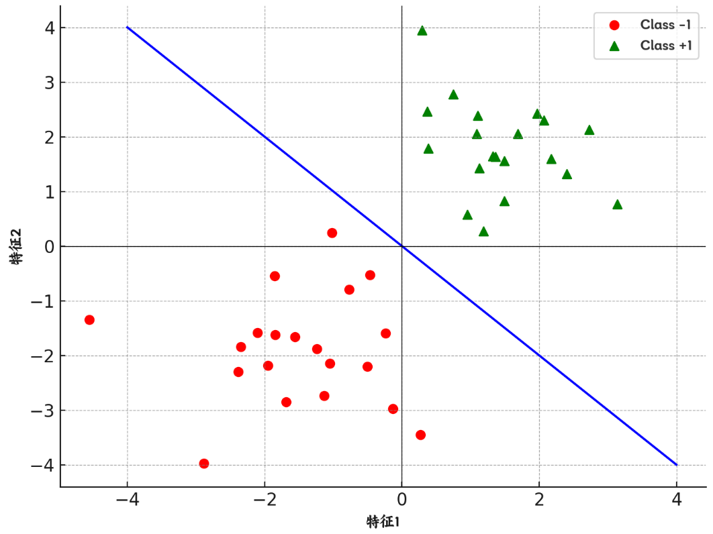
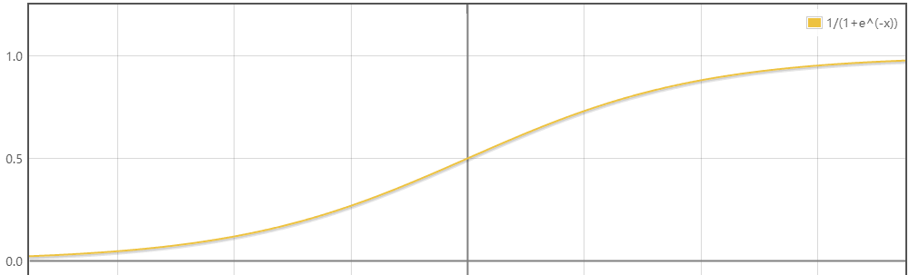

Logistic 回归是一种用于**分类问题**的统计模型，其主要思想是利用Logistic 函数将线性模型的输出映射到0到1的范围，从而实现分类。

对于一个二分类问题，假设我们已经找到了它的“决策边界”，如图中直线所示，根据这个决策边界，可以对新数据进行分类。

Logistic 回归进一步引入“概率的概念”，即数据如果正好落在决策边界上，则正样本和负样本的概率都是0.5，左下方离决策边界越远，则负样本概率越大；右上方离决策边界越远，则正样本概率越大。

如果已经得到样本点到决策边界的距离，换算成上述的概率值则是用的 Logistic 函数（也成为Sigmoid函数）：
$$
y=\frac{1}{1+\mathrm{e}^{-x}}
$$
从函数图像中可以看到正好满足上述需求。自变量的值为0，函数值为0.5；自变量趋于$\infin$，函数值趋于1；自变量趋于$-\infin$，函数值趋于0；




## 模型函数

逻辑回归的基本思想是将输入特征的线性组合通过一个 Logistic 函数（Sigmoid函数）进行非线性映射，以输出一个概率值，进而做出分类决策。公式如下：

$$
P(Y = 1 | X) = \sigma(\mathbf{w}^T \mathbf{x} + b)
$$
其中：

- $\mathbf{x}$ 是特征向量
- $\mathbf{w}$ 是权重向量
- $b$ 是偏置
- $\sigma(z)$ 是逻辑函数：
  $$
  \sigma(z) = \frac{1}{1 + e^{-z}}
  $$


上面的公式太逻辑化，下面用实际的例子来看看

对于二维空间中线性可分的问题，其决策边界是一个这样的函数：
$$
f(x)=\theta_0+\theta_1x_1+\theta_2x_2=\theta^\mathrm{T}X
$$
<details>
<summary>什么是线性可分？</summary>

如果二维空间中的样本点存在一条直线的决策边界；

三维空间中的样本点存在一个平面的决策边界；

更高维空间中的样本点存在一个超平面的决策边界

则我们称这些样本点是线性可分的。
</details>

前面我们知道 Logistic 回归是将距离换成概率，那么我们就可以得到这个二维空间问题的模型函数：
$$
h_\theta(x)=g\left(f(x)\right)=g\left(\theta_0+\theta_1x_1+\theta_2x_2\right)，其中g\left(x\right)=\frac{1}{1+\mathrm{e}^{-x}}
$$
:::info[小知识]

点到直线距离公式：
$$
\frac{|Ax_0+By_0-C|}{\sqrt{A^2+B^2}}
$$
在 Logistic 回归中，距离是有 $\pm$ 的，因此绝对值 $||$ 和 $\sqrt{A^2+B^2}$ 都可以丢弃，代入 Logistic 函数的仅仅需要 $Ax_0+By_0-C$ 即可，所以上述的模型函数直接将 $\theta_0+\theta_1x_1+\theta_2x_2$ 代入

:::


## 损失函数

由前面的模型函数可知：
$$
h_\theta\left(x\right)=\frac1{1+e^{-d\left(\theta\right)}}
$$
对于正样本，用 $h_{\theta}\left(x\right)$ 表示其属于正类的概率；对于负样本，用 $1-h_{\theta}\left(x\right)$ 表示其属于负类的概率

对于每一个样本，属于实际分类 $y$ 的概率可以表达为：
$$
P(y|x;\theta)=h_\theta(x)^y(1-h_\theta(x))^{(1-y)}
$$
则似然函数（联合概率）为：
$$
\begin{aligned}
L(\theta)& =P(\vec{y}|X;\theta) \\
&=\prod_{i=1}^Mh_\theta(x^{(i)})^{y^{(i)}}(1-h_\theta(x^{(i)}))^{1-y^{(i)}}
\end{aligned}
$$
求对数似然：
$$
\begin{aligned}
l\left(\theta\right)& =ln(L(\theta)) \\
&=\sum_{i=1}^M(y^{(i)}ln(h_\theta(x^{(i)}))+(1-y^{(i)})ln(1-h_\theta(x^{(i)})))
\end{aligned}
$$
因为要求似然函数的最大值，则可以定义损失函数：
$$
J(\theta)=-l(\theta)=\sum_{i=1}^M(-y^{(i)}ln(h_\theta\left(x^{(i)}\right))-(1-y^{(i)})ln(1-h_\theta\left(x^{(i)}\right)))
$$
这个损失函数就是**交叉熵（Cross Entropy）损失函数**，是一个凸函数，可以表示为：
$$
\left.Cost(h_\theta(x),y)=\left\{\begin{array}{ll}-ln(h_\theta(x))&\quad(y=1)\\-ln(1-h_\theta(x))&\quad(y=0)\end{array}\right.\right.
$$
其中：

- 对于正样本，当 $ h_\theta(x) $ 接近 1（模型对正样本的预测很有信心），$ -\ln(h_\theta(x)) $ 接近 0；当 $ h_\theta(x) $ 接近 0，$ -\ln(h_\theta(x)) $ 变得很大，损失增加。
- 对于负样本，当 $ h_\theta(x) $ 接近 0，$ -\ln(1 - h_\theta(x)) $ 接近 0，损失很小；当 $ h_\theta(x) $ 接近 1，损失增加。


## 求解模型参数

可以使用梯度下降来求解，损失函数梯度值：
$$
\frac{\partial J(\theta)}{\partial\theta_j}=\sum_{i=1}^M(h_\theta(x^{(i)})-y^{(i)})*x_j^{(i)}
$$
$ x_j^{(i)} $ 是第 $ i $ 个样本的第 $ j $ 个特征。

使用上述计算得到的梯度更新参数：

$$
\theta_j := \theta_j - \alpha \frac{\partial J(\theta)}{\partial \theta_j}
$$
$ \alpha $ 是学习率，

重复迭代直到损失函数收敛，即损失函数的值不再有显著变化或达到预设的迭代次数


## 扩展知识

### odds

在统计学和概率论中，**赔率**（odds）是一个非常重要的概念，特别是在逻辑回归模型中。赔率用于描述某一事件发生与不发生之间的比率。

对于一个事件，赔率被定义为该事件发生的概率与其不发生的概率之比。数学表达式为：
$$
 \text{Odds} = \frac{P(\text{event})}{1 - P(\text{event})} 
$$
其中 $ P(\text{event}) $ 是事件发生的概率。

在逻辑回归中，通常关注的是某个特定结果的发生概率，比如病人是否患病、用户是否点击广告等。逻辑回归模型通过预测给定自变量条件下的赔率来进行这种预测。

将逻辑回归模型中的线性组合 $ \theta^T x $ 视为对数赔率（log-odds），则可以将模型表达式重写为：

$$
\ln\left(\frac{P(Y=1 | X)}{1 - P(Y=1 | X)}\right) = \theta^T X
$$
这里，$ \frac{P(Y=1 | X)}{1 - P(Y=1 | X)} $ 是给定 $ X $ 条件下 $ Y = 1 $ 的赔率，而 $ \theta^T X $ 是这个赔率的对数形式

- **对数赔率**：逻辑回归模型的每一个系数（$ \theta_i $）的变化都与对数赔率的变化直接相关。这意味着每增加一个单位的第 $ i $ 个自变量 $ x_i $，对应的对数赔率将增加 $ \theta_i $ 单位。
- **变化解释**：如果 $ \theta_i $ 是正的，增加 $ x_i $ 将增加发生的赔率；如果 $ \theta_i $ 是负的，增加 $ x_i $ 将减少发生的赔率。

对于一个样本，它发生的几率odds的自然对数 $ln(odds)$ 与它的特征之间是线性关系，并且 $ln(odds)$ 就是样本点到决策边界的距离。


### 多分类问题

逻辑回归虽然最初是为二分类问题设计的，但可以通过某些技术扩展到处理多分类问题。


### 一对一（One-vs-One, OvO）

一对一策略涉及在每一对类别之间训练一个逻辑回归分类器。对于包含 $ K $ 个类的问题，需要训练 $ \frac{K(K-1)}{2} $ 个分类器。

- **训练**：对于类别集合中的每一对类别，训练一个逻辑回归模型。例如，如果有类别 A、B 和 C，则需要训练 A vs B、A vs C 和 B vs C 三个模型。
- **预测**：对于一个给定的输入样本，所有的分类器都被用来进行预测，每个分类器给出一个投票结果。最终，获得最多投票的类别被选作预测结果。


### 一对多（One-vs-Rest, OvR）

一对多方法是处理多分类问题的一种简单直接的方法。在这种策略中，对于类别集合中的每一个类别，都训练一个单独的逻辑回归分类器。每个分类器决定一个类别与其他所有类别的区分。

- **训练**：对于 $ k $ 个类别，训练 $ k $ 个独立的逻辑回归模型。每个模型 $ i $ 被训练为区分“属于类别 $ i $”和“不属于类别 $ i $”的情况。
- **预测**：对于一个新的输入样本，所有 $ k $ 个分类器都会被用来预测概率，分类器预测概率最高的类别作为最终的类别输出。


### 多项式逻辑回归（Softmax 回归）

多项式逻辑回归（Softmax回归）是一个更为自然的将逻辑回归推广到多类的直接方法，而不是分解成多个二分类问题。

与逻辑回归类似，Softmax 回归模型也是基于概率的监督学习算法。逻辑回归中使用的 Sigmoid 函数被 Softmax 函数替代，后者可以处理多个类别，并输出每个类别的概率估计。

Softmax 函数定义如下：
$$
\text{Softmax}(z)_j = \frac{e^{z_j}}{\sum_{k=1}^K e^{z_k}}
$$
其中，$z$ 是一个向量，包含了模型为每个类别预测的分数（通常是某种形式的线性函数），$ K $ 是类别的总数，$ j $ 是指定类别的索引。

在 Softmax 回归中，每个类别 $ j $ 都有一组参数 $ \theta_j $，通常用权重向量表示。对于一个给定的输入 $ x $，类别 $ j $ 的分数 $ z_j $ 计算为：
$$
z_j = \theta_j^T x
$$
将所有类的分数放入 Softmax 函数，可以得到每个类的预测概率：
$$
P(y = j \mid x) = \text{Softmax}(z)_j = \frac{e^{\theta_j^T x}}{\sum_{k=1}^K e^{\theta_k^T x}}
$$
Softmax 回归的损失函数是交叉熵损失，针对所有类别的预测概率定义。对于单个训练样本 $ (x, y) $，损失函数 $ L(\Theta) $ 是：
$$
L(\Theta) = -\sum_{j=1}^K y_j \ln(\hat{p}_j)
$$
其中，$ y_j $ 是一个指示向量，如果样本的真实类别是 $ j $，则 $ y_j = 1 $，否则为 $ 0 $；$ \hat{p}_j $ 是模型预测样本属于类别 $ j $ 的概率。

为了训练模型，需要最小化整个训练集上的损失。可以通过梯度下降完成。每个权重向量的更新规则基于它对应类别的损失梯度：
$$
\frac{\partial L}{\partial \theta_j} = \sum_{i=1}^m (P(y^{(i)} = j \mid x^{(i)}) - y_j^{(i)}) x^{(i)}
$$
类似  Logistic 回归梯度求解得到最优参数值


## 案例

乳腺癌数据的逻辑回归分类分析，并预测测试数据的结果

```python
import pandas as pd
import numpy as np
from sklearn.linear_model import LogisticRegression
from sklearn.model_selection import train_test_split
import matplotlib.pyplot as plt
import matplotlib as mpl
import sys

# 设置字符集，防止中文乱码
mpl.rcParams['font.sans-serif'] = [u'simHei']
mpl.rcParams['axes.unicode_minus'] = False

# 不用科学计数法
np.set_printoptions(suppress=True)

# 读取数据
a = pd.read_csv('data/breast-cancer-wisconsin.data', header=None)

# 查看数据前几行
# print(a.head())

# 查看数据摘要信息
# print(a.info())

# 查看最后一列（标签列）的值计数
# print(a.iloc[:,-1].value_counts())

# 退出程序
# sys.exit(0)

# 数据清洗
# 将所有'?'替换为NaN
a.replace('?', np.nan, inplace=True)

# 删除包含NaN的行
a = a.dropna(axis=0)

# 转换数据类型为整数
a = a.astype(np.int64)

# 查看数据摘要信息
# print(a.info())

# 退出程序
# sys.exit()

# 提取特征矩阵 X 和标签向量 Y
X = a.iloc[:, 1:-1]
Y = a.iloc[:, -1]

# 查看标签值计数
# print(Y.value_counts())

# 查看特征矩阵
# print(X)

# 退出程序
# sys.exit()

# 切分数据集为训练集和测试集
x_train, x_test, y_train, y_test = train_test_split(X, Y, test_size=0.25, random_state=5)

# 初始化逻辑回归模型
"""
penalty='l2', 过拟合解决参数，l1正则或者l2正则 {'l1', 'l2', 'elasticnet', 'none'}, default='l2'
dual=False, 
tol=1e-4, 梯度下降停止条件
C=1.0, 正则化强度的倒数；必须是正浮点数。较小的值指定更大的正则化
fit_intercept=True, 
intercept_scaling=1, 
class_weight=None, 类别权重，有助于解决数据类别不均衡的问题
random_state=None, 
solver='liblinear', 参数优化方式，当penalty为l1的时候，参数只能是：liblinear(坐标轴下降法)；当penalty为l2的时候，参数可以是：lbfgs(拟牛顿法)、newton-cg(牛顿法变种)，seg(minibatch)，维度<10000时，lbfgs法比较好，维度>10000时，cg法比较好，显卡计算的时候，lbfgs和cg都比seg快【nlbfgs和cg都是关于目标函数的二阶泰勒展开】
max_iter=100, 最多的迭代次数
multi_class='ovr', 分类方式参数；参数可选: ovr(默认)、multinomial；这两种方式在二元分类问题中，效果是一样的；在多元分类问题中，效果不一样；ovr: one-vs-rest， 对于多元分类的问题，先将其看做二元分类，分类完成后，再迭代对其中一类继续进行二元分类；multinomial: many-vs-many（MVM），即Softmax分类效果
verbose=0, 
warm_start=False, 
n_jobs=1
## Logistic回归是一种分类算法，不能应用于回归中(也即是说对于传入模型的y值来讲，不能是float类型，必须是int类型)
"""
logis = LogisticRegression(
    penalty='l2',              # 使用L2正则化，防止过拟合
    tol=1e-4,                  # 梯度下降的停止条件
    C=1.0,                     # 正则化强度的倒数
    fit_intercept=True,        # 是否计算截距
    solver='liblinear',        # 使用liblinear优化算法
    max_iter=100,              # 最大迭代次数
    multi_class='ovr',         # 使用one-vs-rest的多分类策略
    class_weight=None,         # 类别权重，None表示不调整类别权重
    verbose=0,                 # 不输出训练过程
    warm_start=False,          # 不使用上一次调用的结果作为初始值
    n_jobs=1                   # 使用单个CPU进行计算
)

logis.fit(x_train, y_train)

# 预测测试集结果
y_test_hat = logis.predict(x_test)

# 绘制真实值与预测值的对比图
plt.plot(range(len(x_test)), y_test, 'ro', markersize=4, zorder=3, label=u'真实值')
plt.plot(range(len(x_test)), y_test_hat, 'go', markersize=10, zorder=2, label=u'预测值')
plt.legend()
plt.show()
sys.exit()

# 查看预测概率
y_test_hat_prob = logis.predict_proba(x_test)
print(y_test_hat_prob)
```

