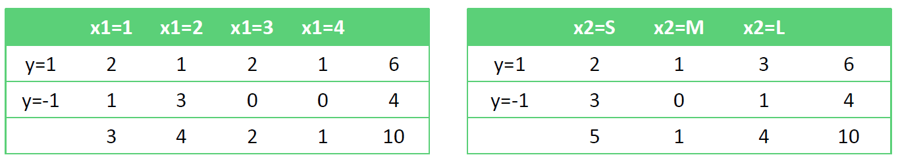

朴素贝叶斯（Naive Bayes）是一种基于贝叶斯定理的简单概率分类器，广泛用于机器学习和统计分类任务。

这种方法的“朴素”之处在于**它假设所有特征之间是相互独立的**，即每个特征独立地对分类结果产生影响，这一假设简化了计算过程，虽然现实中往往不是完全成立的。

:::info[小知识]

**贝叶斯定理**提供了一种计算条件概率的方法，即在已知某些信息的情况下，事件发生的概率：
$$
P(A|B) = \frac{P(B|A) \times P(A)}{P(B)}
$$
其中：

- $ P(A|B) $ 是在事件 B 发生的条件下事件 A 发生的概率
- $ P(B|A) $ 是在事件 A 发生的条件下事件 B 发生的概率
- $ P(A) $ 和 $ P(B) $ 分别是事件 A 和事件 B 发生的边缘概率

:::


## 算法推导

在分类任务中，朴素贝叶斯分类器利用贝叶斯定理来估计一个样本属于某个类的概率。

具体来说，**对于一个给定的样本，计算样本属于每个类的概率，并将样本分类到概率最高的类**。

在实践中，经常是若干事件同时发生条件下，某个事件发生的概率，即 $P(y\mid x_1,x_2,...x_m)$，在”朴素“条件下，可以得到：
$$
P(y\mid x_1,x_2,...x_m)=\frac{P(y)P(x_1,x_2,...x_m\mid y)}{P(x_1,x_2,...x_m)}=\frac{P(y)\prod_{i=1}^mP(x_i\mid y)}{P(x_1,x_2,...x_m)}
$$
在给定样本的条件下，$P(x_1,x_2,...x_m)$ 是常数，因此可以忽略，只需要关注分子的部分：
$$
P(y\mid x_1,x_2,...x_m)\propto P(y)\prod_{i=1}^mP(x_i\mid y)
$$
因此只要得到最大的概率，就可以预测数据的分类：
$$
\hat{y}=\underset{y}{\operatorname*{\operatorname*{\operatorname*{\arg\max}}}}P(y)\prod_{i=1}^{m}P(x_{i}|y)
$$
:::info[小知识]

$y$ 的取值可以有多个，即朴素贝叶斯天然可以做多分类，而不需要使用 OVR 或 OVO 的方法进行多分类

:::


综上所述，可以得到朴素贝叶斯的算法流程为：

1. 设 $x=\{x_{1},x_{2},...,x_{m}\}$ 为待分类数据，$x_i$ 为其中一个特征属性

2. 类别集合为 $C=\{y_{1},y_{2},...,y_{n}\}$

3. 分别计算 $P(y_1|x),P(y_2|x),....,P(y_n|x)$
   $$
   P(y\mid x_1,x_2,...x_m)=\frac{P(y)P(x_1,x_2,...x_m\mid y)}{P(x_1,x_2,...x_m)}\\P(y\mid x_1,x_2,...x_m)\propto P(y)\prod_{i=1}^mP(x_i\mid y)
   $$

4. 若 $P(y_k|x)=max\{P(y_1|x),P(y_2|x),......,P(y_n|x)\}$，则认为 $x$ 是 $y_k$ 类型


## 朴素贝叶斯类型

### 高斯朴素贝叶斯

在朴素贝叶斯分类器的标准形式中，经常处理的是离散特征。然而，很多实际问题中的特征是连续的，比如温度、身高、股价等。

要应用朴素贝叶斯方法处理这类数据，需要对这些连续变量进行一些处理，使其可以在朴素贝叶斯框架内使用。处理连续数据的常见方法包括**使用概率分布函数**来建模这些特征，最常见的就是**高斯朴素贝叶斯（Gaussian Naive Bayes）**

高斯朴素贝叶斯应用：

- 要求：特征属性为连续值，且服从高斯分布（正态分布）

- **对每一个类别和每一个特征计算均值和标准差**

- 高斯分布概率密度函数：
  $$
  \begin{aligned}P(x_i\mid y_k)=g(x_i,\eta_{i,y_k},\sigma_{i,y_k}) \qquad g(x,\eta,\sigma)=\frac{1}{\sqrt{2\pi}\sigma}e^{-\frac{(x-\eta)^2}{2\sigma^2}}\end{aligned}
  $$

  ```python
  from sklearn.datasets import load_iris
  from sklearn.model_selection import train_test_split
  from sklearn.naive_bayes import GaussianNB
  
  # 加载数据
  data = load_iris()
  X = data.data
  y = data.target
  
  # 划分训练集和测试集
  X_train, X_test, y_train, y_test = train_test_split(X, y, test_size=0.33, random_state=10)
  
  # 创建高斯朴素贝叶斯模型
  gnb = GaussianNB()
  
  # 训练模型
  gnb.fit(X_train, y_train)
  
  # 进行预测
  y_pred = gnb.predict(X_test)
  
  # 计算准确率
  accuracy = (y_test == y_pred).mean()
  print(f"Model accuracy: {accuracy:.2%}")
  ```

  


### 伯努利朴素贝叶斯

伯努利分布是一种离散分布，有两个可能的结果：1（成功或出现）和0（失败或不出现）

在伯努利朴素贝叶斯（Bernoulli Naive Bayes）中，**每一个特征都是一个0-1变量**（Bernoulli, boolean）。因此，这个算法要求样本集合以0-1特征向量的方式展现，若接收到其他类型数据作为参数，需要将输入数据二元化

伯努利朴素贝叶斯应用：

- 样本集合为二元特征向量

- 伯努利分布概率密度函数：
  $$
  P(x_k\mid y)=P(1|y)^{x_k}*(1-P(1|y))^{(1-x_k)}
  $$

  ```python
  from sklearn.naive_bayes import BernoulliNB
  from sklearn.feature_extraction.text import CountVectorizer
  from sklearn.metrics import accuracy_score
  
  # 假设texts是文本数据，labels是标签
  texts = ["free money", "free free", "money money", "free money money"]
  labels = [1, 1, 0, 0]
  
  # 将文本数据转换为特征向量
  vectorizer = CountVectorizer(binary=True)
  X = vectorizer.fit_transform(texts)
  
  # 创建伯努利朴素贝叶斯分类器
  model = BernoulliNB()
  
  # 训练模型
  model.fit(X, labels)
  
  # 预测
  predictions = model.predict(X)
  
  # 计算准确率
  accuracy = accuracy_score(labels, predictions)
  print(f"Model accuracy: {accuracy:.2%}")
  ```

  


### 多项式朴素贝叶斯

多项式朴素贝叶斯（Multinomial Naive Bayes）是朴素贝叶斯家族中的另一种变体，特别适用于处理带有计数数据的特征，这种数据类型常见于文本分类问题中。

多项式朴素贝叶斯是指当特征属性服从多项分布（特征是离散的形式时），直接计算类别数目的占比作为先验概率和条件概率
$$
P(y_k)=\frac{N_{y_k}+\alpha}{N+k^*\alpha}\qquad P(x_i|y_k)=\frac{N_{y_k,x_i}+\alpha}{N_{y_k}+n_i^*\alpha}
$$
其中

- $N$ 是总样本个数，$k$ 是总类别个数，$N_{y_k}$ 是类别为 $y_k$ 的样本个数，$\alpha$ 是平滑系数
- $n_i$ 为特征属性 $x_i$ 的不同的取值的个数，$N_{{y_k},{x_i}}$ 为类别 $y_k$ 中第 $i$ 维特征的值为 $x_i$ 的样本个数，$\alpha$ 是平滑系数
- $\alpha$ 平滑系数
  - 当 $\alpha=1$ 时，称为 Laplace（拉普拉斯）平滑；
  - 当 $0<\alpha<1$ 时，称为 Lidstone 平滑；
  - 当 $\alpha=0$ 时，不做平滑；
  - 平滑的主要作用是克服概率为 $0$ 的问题，比如某个词在训练集中的某类中未出现


举个例子，对于下列训练数据，使用多项式朴素贝叶斯预测测试样本（2, M, L）





这里直接讨论 $\alpha=1$ 的情况 ，可以得到先验概率：
$$
P(y=1)=\frac{6+1}{10+2*1}=\frac{7}{12}\qquad P(y=-1)=\frac{5}{12}
$$
条件概率：
$$
P\Big(x_{1}=1\Big|y=1\Big)=\frac{3}{10} \qquad P\Big(x_{1}=1\Big|y=-1\Big)=\frac{2}{8}
$$

$$
P\Big(x_{1}=2\Big|y=1\Big)=\frac{2}{10} \qquad P\Big(x_{1}=2\Big|y=-1\Big)=\frac{4}{8}
$$

$$
P\Big(x_{1}=3\Big|y=1\Big)=\frac{3}{10} \qquad P\Big(x_{1}=3\Big|y=-1\Big)=\frac{1}{8}
$$

$$
P\Big(x_{1}=4\Big|y=1\Big)=\frac{2}{10} \qquad P\Big(x_{1}=4\Big|y=-1\Big)=\frac{1}{8}
$$

$$
P\big(x_2=S\big|y=1\big)=\frac39 \qquad P\big(x_2=S\big|y=-1\big)=\frac47
$$

$$
P\big(x_2=M\big|y=1\big)=\frac29 \qquad P\big(x_2=M\big|y=-1\big)=\frac17
$$

$$
P\big(x_2=L\big|y=1\big)=\frac49 \qquad P\big(x_2=L\big|y=-1\big)=\frac27
$$

$$
P\big(x_3=L\big|y=1\big)=\frac29 \qquad P\big(x_3=L\big|y=-1\big)=\frac37
$$

$$
P\big(x_3=M\big|y=1\big)=\frac39 \qquad P\big(x_3=M\big|y=-1\big)=\frac27
$$

$$
P\big(x_3=H\big|y=1\big)=\frac49 \qquad P\big(x_3=H\big|y=-1\big)=\frac27
$$

对样本（2, M, L）的预测概率为：
$$
P\big(y=1\big|x\big)\propto P\big(y=1\big)P\big(x_1=2\big|y=1\big)P\big(x_2=M\big|y=1\big)P\big(x_3=L\big|y=1\big)=\frac7{12}*\frac2{10}*\frac29*\frac29=\frac7{1215}
$$

$$
P\big(y=-1\big|x\big)\propto P\big(y=-1\big)P\big(x_1=2\big|y=-1\big)P\big(x_2=M\big|y=-1\big)P\big(x_3=L\big|y=-1\big)=\frac5{12}*\frac48*\frac17*\frac37=\frac5{392}
$$

$$
\hat{y}=\arg\max_y\{P\big(y=1\big|x\big),P\big(y=-1\big|x\big)\}=-1
$$

所以最终得到该样本的预测结果为 $-1$


## 概率图模型

概率图模型（Probabilistic Graphical Models, PGMs）是一种复杂数据结构的统计模型，它通过图形表示方式表达变量间的条件依赖关系。

在机器学习中的分类任务中，并不都是对孤立数据进行分类，比如一个句子中的词性需要根据上下文来判断，而概率图模型就是一种用于学习这些带有依赖（dependency）的模型的强大框架。概率图模型主要有两种类型：

- 贝叶斯网络
- 马尔可夫网络


### 贝叶斯网络

当多个特征属性之间存在某种相关关系，贝叶斯网络就是一个非常好解决这类场景的算法。

贝叶斯网络（Bayesian Networks）也称为也称为**有向无环图模型**（Directed Acyclic Graphs, DAGs），根据概率图的拓扑结构，考察一组**随机变量** ${X_1,X_2,...,X_n}$ 及其 $N$ 组**条件概率分布**（Conditional Probabililty Distributions, CPD）的性质

贝叶斯网络的关键方法是**图模型**，构建一个图模型需要将具有因果关系的各个变量用有向边连接。


#### 常见的贝叶斯网络

- 简单的贝叶斯网络：$P(a,b,c)=P(c\mid a,b)P(b\mid a)P(a)$

  

- 全连接贝叶斯网络，每一对节点之间都有边连接：
  $$
  P(x_1,x_2,...,x_n)=P(x_n\mid x_1,x_2,...,x_{n-1})...P(x_2\mid x_1)P(x_1)=\prod_{i=2}^nP(x_i\mid x_1,x_2,...,x_{i-1})*P(x_1)
  $$
  

- 常规贝叶斯网络

  - $x_1,x_2,x_3$ 独立

  - $x_6$ 和 $x_7$ 在给定条件下独立

  - 联合分布为：
    $$
    p(x_1,x_2,x_3,x_4,x_5,x_6,x_7)=p(x_1)p(x_2)p(x_3)p(x_4\mid x_1,x_2,x_3)p(x_5\mid x_1,x_3)p(x_6\mid x_4)p(x_7\mid x_4,x_5)
    $$
    


#### 贝叶斯网络特性

- 有向无环图
- 通过有向边表示变量之间的依赖关系
- 每个节点对应一个概率函数，这个函数依赖于其父节点的状态
  - 节点可以表示随机变量、可观察变量、隐变量、未知参数等
- 适用于表达因果关系


#### 贝叶斯网络案例——学生网络

在这个图中，课程的难度（Difficulty）和学生的智力水平（Intelligence）决定学生的评级（Grade），学生的 Intelligence 不仅会影响他们的 Grade，还会影响他们的 SAT 分数。而 Grade又决定了学生能否从教授那里得到一份好的 Letter。


### 马尔可夫网络

马尔可夫网络（Markov Networks），也称为马尔可夫随机场（Markov Random Fields, MRFs），是一种用于描述变量间依赖关系的无向图模型。在马尔可夫网络中，每个节点代表一个或多个变量，节点间的无向边表示变量之间的潜在依赖。


#### 马尔可夫过程

假设随机过程中某一时刻的状态的概率分布满足以下条件
$$
P(S_t\mid S_{t-1},S_{t-2},\cdotp\cdotp\cdotp,S_{t-n})=P(S_t\mid S_{t-1})
$$
即随机过程中某一状态 $S_t$ 发生的概率仅仅与它的前一个状态有关，而与更前面的所有状态无关，这就是**马尔可夫性质**或称为无记忆性。

如果某一随机过程满足马尔可夫性质，则将这一过程称为**马尔可夫过程**，或**马尔科夫链**


马尔科夫链类型

1. **离散时间马尔科夫链（DTMC）**：在离散时间步长中，状态变化遵循一定的概率规则
2. **连续时间马尔科夫链（CTMC）**：状态变化可以在任何时刻发生，且状态转移的概率是连续时间函数


马尔科夫链参数

- **状态空间**：系统可能所处的所有状态的集合
- **转移概率**：从一个状态转移到另一个状态的概率。对于离散时间马尔科夫链，通常由一个转移概率矩阵表示


下图就是一个马尔科夫链，该图中每一个圆圈代表相应时刻的状态，有向边代表了可能的状态转移，权值表示状态转移概率


#### 隐马尔可夫模型

隐马尔可夫模型（Hidden Markov Model, HMM）是一种特殊的序列模型，在其中每个时间点的状态**不是直接可观察的（即隐状态）**，而是通过某些可观察的输出间接表现出来。

HMM 假设系统可以用一个马尔可夫过程（具有离散时间和状态的随机过程）建模，但每个状态的实际值不能直接观测，只能通过与状态相关的概率分布的输出来观测，这个过程就是**隐马尔可夫过程**

如下图所示，隐马尔可夫模型中马尔科夫链指的是隐状态 $S_0,S_1,...,S_t$ 序列


