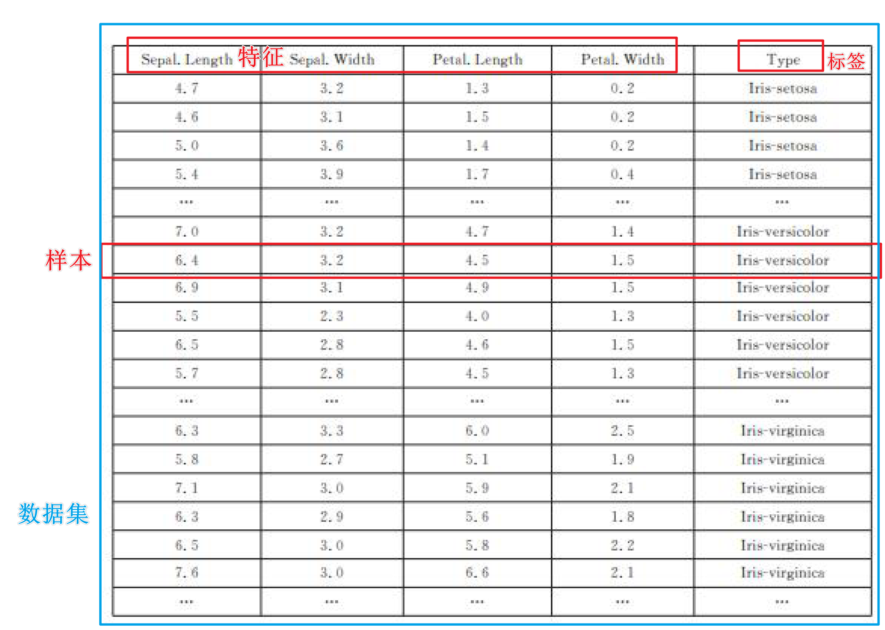

机器学习：当代人工智能的主流方法

深度学习和强化学习是机器学习的进一步发展

## 基本概念

机器学习主要是**通过数据学习得到一个规律或者模型，然后对新的数据根据模型进行判断**

### 机器学习类型

#### 1. 监督学习

在监督学习中，我们给计算机一大堆例子（都是已经标好类别的），这就像是在告诉计算机：“看，这些是猫，那些是狗”。计算机通过这些标记好的数据学习，然后用它学到的知识去识别新的图片是猫还是狗。

优点：

- 高效准确：如果有足够的标记数据，监督学习通常能学得很好，做出很准确的预测。
- 易于理解和检验：输出结果容易被人理解，我们可以直接检查预测是否正确。

缺点：

- 需要大量标记数据：它依赖大量的已标记数据。标记数据是费时且成本高的，所以标注师是很累的。
- 泛化能力有限：模型有时只对看过的数据表现良好，对于全新的、未见过的情况可能无法做出正确的判断。

#### 2. 无监督学习

无监督学习不需要任何标记数据，就像把一堆动物的照片给计算机看，但不告诉它哪些是猫，哪些是狗。计算机需要自己找出哪些照片看起来是类似的，它会自己分出一组是猫，一组是狗。

优点：

- 无需标记数据：不需要事先给数据打标签，可以处理未标记的数据。
- 发现隐藏的模式：可以帮助我们发现数据中的隐藏结构和模式。

缺点：

- 解释性差：分组结果有时候难以解释，我们不总是能知道计算机为什么这样分组。
- 目标不明确：没有明确的学习目标，难以衡量学习的效果。

#### 3. 半监督学习

半监督学习是监督学习和无监督学习的结合。如果我们有一些标记好的数据（比如一些猫和狗的照片），但还有更多未标记的数据，半监督学习可以同时使用这两种数据来进行学习。

优点：

- 减少标记需求：减少了对大量标记数据的需求，同时也能利用未标记的数据。
- 提高准确性：结合两种数据的优势，可以提高模型的准确性和鲁棒性。

缺点：

- 算法复杂：方法和技术通常比纯监督学习或无监督学习更为复杂。
- 平衡难度：需要找到标记数据和未标记数据使用的最佳平衡点。

### 数据集、样本和特征

在机器学习中，我们经常听到“数据集”、“样本”和“特征”这几个词

#### 1. 数据集 (Dataset)
数据集就是一个包含很多数据的集合，这些数据是我们用来让计算机学习的材料。可以把它想象成一个巨大的信息库，里面有很多关于某个主题的数据。比如，一个关于动物的数据集可能包括许多不同动物的照片。

#### 2. 样本 (Sample)
样本是数据集中的单个数据项。如果数据集是一本书的话，那么一个样本就像是书中的一个段落。例如，在一个包含猫和狗图片的数据集中，每一张猫或狗的图片都是一个样本。

#### 3. 特征 (Feature)
特征是描述样本的属性。这可以是样本的任何方面，只要是可以量化的。如果我们以人的信息作为数据集，一个人的特征可以是身高、体重、年龄等。在图像处理中，特征可能是图片中的颜色、形状、纹理等。

这里以鸢尾花数据集为例

- **数据集**：这个项目的数据集包含鸢尾花的记录。

- **样本**：数据集中的每一条记录是一个样本。例如，花瓣的长宽、花萼的长宽、类型就是一个样本。

- **特征**：每个样本都会有多个特征，这些特征用来描述并量化样本的特定方面。在鸢尾花数据集中，特征包括花瓣的长宽，花萼的长宽。

- **标签**：无监督学习不需要标签，标签是用于告诉计算机答案的

在机器学习中，选取正确的特征对于构建一个好的模型至关重要。好的特征可以帮助模型更准确地学习和预测，而不合适的特征可能导致模型表现不佳。**特征选择和处理**是机器学习工作流程中非常关键的一步。

### 分类和回归

在机器学习中，分类和回归是两种最常见的任务类型，它们都是监督学习的一部分，意味着使用带有标签的数据来训练模型。不过，它们在目标和应用上有着明显的区别。

#### 分类 (Classification)

分类是用来预测**离散标签**的任务。在分类问题中，模型被训练来将输入数据归入预定义的类别中。比如，一个简单的分类问题是判断一封电子邮件是不是垃圾邮件。

**特点：**
- **输出是类别**：分类的输出是离散的，不是连续的数值。例如，猫、狗、鸟等。
- **用途广泛**：应用于医学诊断、图像识别、情感分析等领域。
- **二分类与多分类**：二分类问题只有两个类别（如正常邮件与垃圾邮件），多分类问题则有两个以上的类别（如识别图片中的动物种类）。

#### 回归 (Regression)

回归是用来预测**连续数值**的任务。例如，一个房地产模型可能根据地理位置、房屋大小和建造年份等特征来预测房屋价格。

**特点：**

- **输出是连续数值**：回归问题的输出是一个连续的数值，而不是类别。例如，温度、价格、长度等。
- **评估标准不同**：通常使用均方误差、绝对误差等统计量来评估回归模型的性能。
- **应用范围**：应用于股票价格预测、房地产估值、天气预测等领域。

#### 分类和回归的对比

**应用区别：**

- 分类用于预测不连续的结果，而回归用于预测连续的数值。
- 分类输出的是类别标签，回归输出的是实际值。

**算法选择：**
- 分类问题可以使用逻辑回归、决策树、随机森林、支持向量机等算法。
- 回归问题可以使用线性回归、岭回归、Lasso回归等算法。

**评估方法：**

- 分类模型的性能常用的评估指标包括准确率、召回率、F1分数和混淆矩阵。
- 回归模型的性能通常通过均方误差（MSE）、均方根误差（RMSE）或平均绝对误差（MAE）来评估。

### 训练集、验证集和测试集

在机器学习中，数据通常被分为三个部分：训练集、验证集和测试集。

将数据分为训练集、验证集和测试集的做法，是为了在不同阶段对模型进行有效的训练和评估，确保模型不仅能够学习数据，还能在未见过的新数据上表现良好。

正确使用这三种数据集有助于防止模型过拟合，并确保模型具有好的泛化能力。

这种数据分割方法是任何机器学习项目成功的关键步骤之一。

#### 训练集 (Training Set)

训练集是用来构建和训练机器学习模型的数据集。这部分数据用于训练，即模型会尝试学习这些数据的特征和模式，从而能够对未知数据做出预测。

**用途：**
- **模型学习**：通过训练集，模型可以识别数据中的模式和关联。
- **参数调整**：在训练过程中，模型的各种参数（如权重）会被调整以最佳拟合数据。

#### 验证集 (Validation Set)

验证集用来在训练过程中评估模型的表现，帮助开发者调整模型的架构（如网络结构或算法参数）。

验证集提供了一种检测模型在新数据上表现如何的途径，而不会影响测试集的独立性。

**用途：**
- **模型选择**：通过比较不同模型或同一模型不同参数设置下的性能，帮助选择最佳模型。
- **防止过拟合**：如果模型在训练集上表现很好，但在验证集上表现不佳，这可能是过拟合的标志。开发者可以据此调整模型，以提高其泛化能力。
- **评估模型泛化能力**：特别是在数据量不是很大的情况下，可以使用交叉验证方法。将训练集分割成多个小的子集，然后将这些子集轮流作为验证集来评估模型。这样可以更全面地利用有限的数据，减少验证集选择对模型评估的偏差。

#### 测试集 (Test Set)

测试集是在整个训练过程结束后，用来评估模型最终性能的数据集。它提供了一个公正的评估环境，因为模型在开发过程中未曾见过这些数据。

**用途：**
- **性能评估**：测试集帮助评估模型在处理未知数据时的效果，提供模型泛化能力的一个真实指标。
- **最终验证**：使用测试集的结果可以作为报告模型性能的标准，常用于学术研究或实际应用前的最后确认。

:::info[小知识]

**为什么同一个数据集不能同时作为训练集和测试集**？

1. 防止过拟合
   - 过拟合：模型过度学习训练数据中的特定特征和噪声，而没有从数据中学习到更一般、更普遍的规律
   - 使用相同的数据进行训练和测试，无法知道模型是否只是简单地记住数据，而没有从中学到任何可泛化的模式。就像是给学生同一份试卷来学习和考试，然后希望他们能在不同的试卷上也能做得很好
2. 评估模型的泛化能力
   - 泛化能力：指模型对未知数据的处理能力
   - 通过保留一个未参与模型训练的数据集作为测试集，可以更准确地评估模型对新数据的响应能力
3. 可信的性能评估
   - 如果训练集和测试集不独立的，模型的性能评估可能会被高估。因为模型已经见过所有的数据，在这些数据上的表现可能只是模型对特定数据集的记忆能力的反映

:::

### 数据特征归一化

在机器学习中，数据的特征归一化（也称为特征标准化或规范化，Feature Scaling）是一种常用的数据预处理方法。

它的目的是将数据的特征调整到相似的尺度，这样一个特征的数值范围就不会对模型的训练产生不成比例的影响。

#### 特征归一化的好处

1. **加快训练速度**：不同的特征往往具有不同的量级（例如，一个特征的范围是0到1，另一个特征的范围是100到1000）。如果数据特征的量级差异很大，会使得机器学习算法尤其是基于梯度的优化算法**难以收敛**，导致训练过程非常慢。
2. **提高模型精度**：在许多算法中，特别是那些计算距离的算法（如K-近邻、支持向量机和K-均值聚类），如果一个特征的数值范围远大于其他特征，可能会对最终结果产生过大的影响，从而降低模型的性能。
3. **避免数值不稳定性和提高精度**：一些机器学习算法，如神经网络，对输入数据的规模非常敏感。不同的特征量级可能导致模型训练不稳定，甚至无法收敛。

#### 常用的特征归一化方法

**1. 最小-最大归一化 (Min-Max Scaling)**

这种方法将所有特征缩放到0和1之间。这种方法简单且易于理解，计算方式为：

$$
X_{\text{norm}} = \frac{X - X_{\text{min}}}{X_{\text{max}} - X_{\text{min}}}
$$
其中 $X_{\text{min}} $ 和 $X_{\text{max}}$ 分别是该特征中的最小值和最大值。

##### 2. Z得分归一化 (Standardization, Z-score Normalization)
这种方法将数据的特征值转换为均值为0，标准差为1的形式，适用于特征的最大和最小值未知或者数据包含异常值的情况。计算方式为：
$$
X_{\text{standardized}} = \frac{X - \mu}{\sigma}
$$
其中 $\mu$ 和 $\sigma$ 分别是该特征的均值和标准差。

##### 3. 鲁棒缩放 (Robust Scaling)
这种方法对异常值具有较好的鲁棒性。它使用数据的四分位数而不是最大值和最小值来缩放数据。计算方式为：
$$
X_{\text{robust}} = \frac{X - Q_1}{Q_3 - Q_1}
$$
其中 $Q_1$ 和 $Q_3$ 分别是该特征的第一四分位数和第三四分位数

使用归一化时，需要注意以下两点：

- **保持一致性**：在训练集上学习到的归一化参数（如最小值、最大值、均值、标准差）应该直接用于测试集和新数据，而不是从测试集或新数据中重新计算这些参数。
- **根据模型选择合适的方法**：并非所有的机器学习模型都需要特征归一化。例如，决策树和随机森林等基于树的方法不会受到特征尺度的影响。

### 损失函数

损失函数用来衡量模型的预测值与真实值之间的差异。即损失函数计算了一个模型预测错误的程度，其值越小，表示模型的预测结果与实际情况越接近，模型的性能越好

选择损失函数时需要考虑模型的具体应用场景：

- 对于回归问题，如果异常值较少且希望损失对这些异常值比较敏感，可以选择均方误差 (MSE)。如果数据中异常值较多，可能更适合使用平均绝对误差 (MAE)。
- 对于分类问题，如果是二分类问题，通常使用二元交叉熵损失；多分类问题则使用多类别的交叉熵损失。

### 性能评估

模型性能评估涉及到使用不同的指标和方法来量化一个模型的效果，以及它在预测新数据时的准确性和可靠性

#### 分类模型

当训练和测试分类模型时，会使用以下的指标来评估模型的性能

**1. 准确率 (Accuracy)**

准确率是最直观的性能评估指标，它是正确预测的数量占总样本数的比例。公式如下：
$$
\text{Accuracy} = \frac{\text{Number of correct predictions}}{\text{Total number of predictions}}
$$
例子：假设我们有一个二分类问题，模型对100个样本进行预测，其中90个预测正确，那么准确率是：
$$
\text{Accuracy} = \frac{90}{100} = 90\%
$$
**2. 精确率 (Precision)**

精确率是对正类预测的准确性衡量。它是正确预测为正的样本数占所有预测为正的样本数的比例。公式如下：
$$
\text{Precision} = \frac{\text{True Positives (TP)}}{\text{True Positives (TP) + False Positives (FP)}}
$$
例子：假设在预测中，模型预测100个样本为正，其中80个实际上为正（真正例），20个实际上为负（假正例），那么精确率是：
$$
\text{Precision} = \frac{80}{100} = 80\%
$$
**3. 召回率 (Recall) 或 灵敏度 (Sensitivity)**

召回率是对模型捕捉正类样本能力的衡量。它是正确预测为正的样本数占所有实际为正的样本数的比例。公式如下：
$$
\text{Recall} = \frac{\text{True Positives (TP)}}{\text{True Positives (TP) + False Negatives (FN)}}
$$
例子：假设实际有120个正样本，模型正确预测了80个正样本，遗漏了40个正样本，那么召回率是：
$$
\text{Recall} = \frac{80}{120} \approx 67\%
$$
**4. F1 分数**

F1 分数是精确率和召回率的调和平均数，是这两者的平衡指标。它特别有用于那些对精确率和召回率同等重视的情况，最大值是1，最小值是0。公式如下：
$$
\text{F1 Score} = 2 \cdot \frac{\text{Precision} \times \text{Recall}}{\text{Precision} + \text{Recall}}
$$
F1 Score还有一种泛化形式：
$$
F_{\text{Score}} = (1 + \beta^2) \frac{\text{Precision} \times \text{Recall}}{(\beta^2 \times \text{Precision}) + \text{Recall}}
$$
其中，$\beta$ 是一个权重因子，它决定在精确率和召回率之间的权衡：
- 当 $\beta = 1$ 时，得到的是标准的 F1 Score，此时精确率和召回率被赋予相同的重要性。
- 当 $\beta < 1$ 时，给予精确率更高的重要性。
- 当 $\beta > 1$ 时，给予召回率更高的重要性。

F-score 特别有用于那些错误的分类代价很高的场景，例如医疗诊断、信用卡欺诈检测等。在这些场合，你可能更倾向于确保高召回率（比如捕捉所有可能的疾病症状或欺诈行为），即使这意味着精确率可能略有下降（即错误地标记一些健康的病例或合法交易为问题病例或欺诈）。

例子：使用前面的精确率和召回率，假设精确率和召回率相同重要：
$$
\text{F1 Score} = 2 \cdot \frac{0.8 \times 0.67}{0.8 + 0.67} \approx 0.73
$$
以召回率作为横坐标轴，精确率作为纵坐标轴，可以画出PR-曲线。

AP值就是PR曲线与X轴围成的图形面积，AP值为1时模型性能最好

**5. ROC 曲线和 AUC 分数**

ROC 曲线（Receiver Operating Characteristic curve）用于展示分类模型在所有分类阈值上的性能

- **X轴**：假正率（False Positive Rate, FPR），计算为： 
  $$
  \text{FPR} = \frac{\text{FP}}{\text{FP} + \text{TN}}
  $$
  其中 $FP$ 是假正例的数量，$TN$ 是真负例的数量

- **Y轴**：真正率（True Positive Rate, TPR），也称为召回率（Recall）或灵敏度（Sensitivity），计算为： 
  $$
  \text{TPR} = \frac{\text{TP}}{\text{TP} + \text{FN}}
  $$
  其中 $TP$ 是真正例的数量，$FN$ 是假负例的数量

AUC（Area Under the Curve）是ROC曲线下的面积，可以量化总体性能。AUC 越高，模型的性能越好

- **AUC = 1**：表示模型完美分类，所有正类和负类都被完美区分
- **AUC = 0.5**：表示模型的效果无 better than random guessing，相当于随机猜测
- **AUC < 0.5**：表示模型的表现比随机猜测还差，通常这表明模型有严重问题

例子：一个完美的分类器的AUC为1.0，而一个随机分类器的AUC为0.5。如果我们的模型AUC为0.85，这表示它具有良好的分类能力

**混淆矩阵**：

[混淆矩阵]: https://en.wikipedia.org/wiki/Precision_and_recall	"混淆矩阵"

#### 回归模型

当训练和测试回归模型时，会使用以下的指标来评估模型的性能

**1. 均方误差（Mean Squared Error, MSE）**

MSE 是衡量模型预测值与实际值差异平方的平均值。它是评估回归模型常用的指标之一，公式为：
$$
\text{MSE} = \frac{1}{n} \sum_{i=1}^n (y_i - \hat{y}_i)^2
$$

其中 $ y_i $ 是实际值，$ \hat{y}_i $ 是预测值，$ n $ 是样本数。MSE 的值越小，表明模型的预测准确性越高。

**2. 均方根误差（Root Mean Squared Error, RMSE）**

RMSE 是 MSE 的平方根，提供与原数据相同单位的误差大小，使得解释更直观。公式为：
$$
\text{RMSE} = \sqrt{\frac{1}{n} \sum_{i=1}^n (y_i - \hat{y}_i)^2}
$$
RMSE 对于较大的误差赋予了更高的权重，因此它非常敏感于异常值。

**3. 平均绝对误差（Mean Absolute Error, MAE）**

MAE 是衡量模型预测值与实际值差异绝对值的平均。与 MSE 相比，MAE 对异常值的敏感度较低。公式为：
$$
\text{MAE} = \frac{1}{n} \sum_{i=1}^n |y_i - \hat{y}_i|
$$
MAE 提供了误差的平均水平，但不像 MSE 那样放大较大的误差。

**4. 决定系数（R² or Coefficient of Determination）**

R² 是衡量模型解释变量变异性的比例，是反映模型拟合优度的一个重要指标。R² 越接近1，表明模型解释的变异性越高，拟合效果越好。公式为：
$$
R^2 = 1 - \frac{\sum_{i=1}^n (y_i - \hat{y}_i)^2}{\sum_{i=1}^n (y_i - \bar{y})^2}
$$
其中 $ \bar{y} $ 是 $ y $ 的平均值。

**5. 调整后的决定系数（Adjusted R²）**

对于包含多个预测变量的模型，调整后的 R² 进一步考虑了模型中变量的数量，以防止无关变量的增加人为提高 R² 值。它通过惩罚过多的预测变量提供了更为严格的性能评价。

:::info[小知识]

**$ R^2 $ 的不同取值范围**

假设玩一个猜数游戏，在这个游戏中，有一个神奇的工具可以帮助你猜测，这个工具就像是你的回归模型。$ R^2 $ 告诉你这个工具（模型）有多好：

- $ R^2 = 1 $：Perfect！每次都能准确猜中数字，没有一次错误。这就像是你的模型预测完美无缺，完全把握了所有的变化
- $ R^2 = 0 $：这就像你放弃自己猜测，而是每次都只是说出所有人最常猜的那个数字（平均数）。这样做没有利用任何具体信息，只是简单重复同一数字
- $ R^2 < 0 $：甚至不如你每次只说平均数那么有效。你的猜测不仅没有帮助，反而比随机猜还糟糕。这说明你的模型可能完全弄错了数据的模式，或者模型被一些不正常的数据误导了

**如何理解和使用 $ R^2 $**

- $ R^2 $ 是一个反映模型解释能力的指标，但它并不总是完美的衡量标准。特别是在**非线性关系或异常值多**的数据中，单纯依赖 $ R^2 $ 可能会导致误导性的结论
- 在模型评估时，考虑使用多个指标（如 MAE, RMSE）来综合评价模型的性能，而不是单独依赖 $ R^2 $
- 调整后的 $ R^2 $（Adjusted R-squared）通常是一个更可靠的选择，因为它会考虑模型中变量的数量，避免因增加无关变量而人为提高 $ R^2 $ 值

:::

## 梯度下降

梯度下降是一种用于优化机器学习算法中参数的非常流行的方法，特别是在训练深度学习模型时。

其基本思想是通过迭代地调整参数来最小化损失函数，从而找到使损失函数达到最小值的参数集。

### 工作原理

1. **梯度**：在数学中，梯度是一个函数在给定点的最陡峭方向。在机器学习中，梯度是损失函数相对于其参数的导数或偏导数。梯度指向的方向是函数增长最快的方向，因此梯度的反方向就是最快减少的方向。

2. **更新规则**：在梯度下降算法中，模型参数在每一步都沿着梯度的反方向更新，以减少损失函数的值。更新规则可以表示为：
   $$
   \theta = \theta - \eta \nabla_\theta J(\theta)
   $$
   其中 $\theta$ 表示模型参数，$\eta$ 是学习率（步长），$\nabla_\theta J(\theta)$ 是损失函数 $J$ 关于参数 $\theta$ 的梯度。

   - 学习率 $\eta$ 对梯度下降的性能影响很大。如果学习率过大，可能导致更新过程中越过最小值点，使得算法发散；如果学习率过小，会导致收敛速度缓慢，训练时间过长。
   - 在实践中，通常会尝试多种学习率，或使用诸如学习率衰减等技术，以动态调整学习率。
   - 梯度下降算法的停止条件可以是梯度的大小接近零（表示接近极小值点），或者达到预设的最大迭代次数。

在实际应用中，还需考虑诸如初始化、避免陷入局部最小值等问题，以及可能的改进方法如动量法、AdaGrad、RMSprop和Adam等更高级的优化算法。

### 梯度下降的类型

1. **批量梯度下降（BGD）**：
   - 在每一步使用整个训练集来计算梯度。
   - 优点：每次更新都朝向全局最优方向。
   - 缺点：计算开销大，不适用于大数据集。

2. **随机梯度下降（SGD）**：
   - 每次更新只使用一个训练样本来计算梯度。
   - 优点：计算速度快，可以快速收敛，可以在线更新。
   - 缺点：更新过程中有较多噪声，收敛过程不稳定。

3. **小批量梯度下降（Mini-batch GD）**：
   - 每次更新使用一小批样本（例如32个或64个）来计算梯度。
   - 结合了BGD和SGD的优点，是实际应用中最常用的形式。

### 扩展

梯度下降算法最理想的使用场景是当损失函数是凸函数时。

然而，在实际应用中，尤其是在深度学习领域，经常使用梯度下降来优化非凸函数

当**损失函数是凸函数**时，梯度下降算法特别有效，因为：

1. **全局最小值保证**：凸函数保证所有的局部最小值也是全局最小值。这意味着梯度下降无论从何处开始，都有可能找到全局最优解。
2. **无局部陷阱**：由于凸函数的结构，不存在会使梯度下降陷入的局部最小点或鞍点，这使得收敛到最小值变得相对简单。

在**非凸函数**，特别是在深度学习中，损失函数通常是高度非线性且复杂的，存在多个局部最小值和鞍点，这使得梯度下降的应用更麻烦：

1. **局部最小值**：在非凸函数中，梯度下降可能会停在局部最小值，而非全局最小值，尤其是如果学习率设置不当的情况下。
2. **鞍点**：在高维空间中，鞍点（梯度为零，但不是最小点）可能比局部最小值更常见。梯度下降在鞍点处可能会停滞不前。
3. 解决方案：
   - **调整学习率**：使用自适应学习率（如 Adam, RMSprop）可以帮助梯度下降在遇到鞍点时继续前进
   - **多次初始化**：从不同的初始点多次运行梯度下降，可能会找到更好的局部最小值
   - **使用动量**：加入动量可以帮助梯度下降跨越低的局部最小值，增加其找到更好全局最小值的机会。

### 人话讲解

想象站在一个山顶上，目标是以最快的速度下山到山谷的最低点。

这里的山形代表一个损失函数——这个函数告诉我们，我们的预测有多糟糕。

山谷的最低点就是我们想要的目标：损失最小的地方，也就是我们的预测和实际结果差距最小的地方。

**步骤1: 看看脚下**

你会查看脚下的坡度，决定下一步往哪走。在梯度下降中，这个“看”的过程就是计算“梯度”，梯度告诉我们损失函数（山形）在当前位置最陡峭的下降方向。

**步骤2: 小心迈步**

一旦知道了下山的方向，你需要决定迈出多大的一步。这在梯度下降中称为“学习率”。学习率决定了你在梯度指示的方向上前进多远。如果步子迈得太大，你可能会错过山谷的最低点；如果步子迈得太小，你下山的速度会很慢。

**步骤3: 重复直到到达谷底**

从山顶到山谷的每一步，你都重复这个过程：计算梯度，确定前进方向，然后根据学习率迈步。每走一步，你都会重新评估你的位置（重新计算梯度），确保你仍然朝着正确的方向前进。

有时候，山坡可能有多个低点（局部最低点和全局最低点，也就是非凸函数的情况下）。这意味着算法有可能没有找到可能的最低点，而是停在了“不那么低”的地方。因为可能有多个低点，你在下山时可能需要尝试不同的路径来确保不会错过真正的最低点。

#### 对非凸函数解决方法的讲解

**调整学习率：选择合适的鞋子**

想象一下，你下山时穿的是可以调节松紧的鞋子。在开始下山时，你可能选择较松的设置，让你可以大步向前走，快速下降。这就像在梯度下降中使用较大的学习率，帮助你快速接近目标。但是，当你感觉自己接近村庄（最低点）时，你可能会将鞋子调得更紧，以小心翼翼地调整每一步，确保不会一不小心走过头。这就是减小学习率，帮助你精细调整位置，以确保精确地达到目标。

**多次初始化：从不同的路径开始**

假设你不确定哪条路径最快能到达山脚下的村庄。一种方法是，你可以尝试从山上不同的起点开始下山，这样就能探索更多可能的路径。在梯度下降中，这就相当于从不同的初始参数值开始优化过程。这样做可以增加找到全局最低点（而不是某个局部最低点）的机会，特别是当山形复杂，有许多小山丘和低洼时。

**使用动量：带着过去的经验冲下坡**

想象你在下山时不仅仅依赖于你当前的坡度感觉，还能利用之前下山的速度和方向。这就像你背上了一个带有风帆的背包，当你开始下山时，即使遇到平缓或稍微上坡的地方，之前的动力也能帮助你继续前进。在梯度下降中，动量帮助算法“记住”之前的更新方向，从而在参数更新时考虑之前的梯度，使得你不仅仅是单纯地依赖当前梯度，而是带有一定惯性地移动。这样可以帮助你越过那些小坑坑，避免被它们阻碍，同时在下降过程中保持更稳定和快速。

