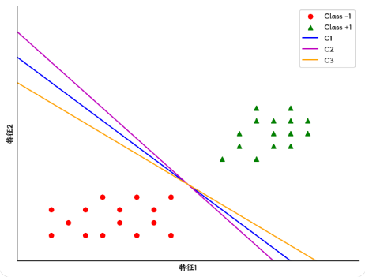
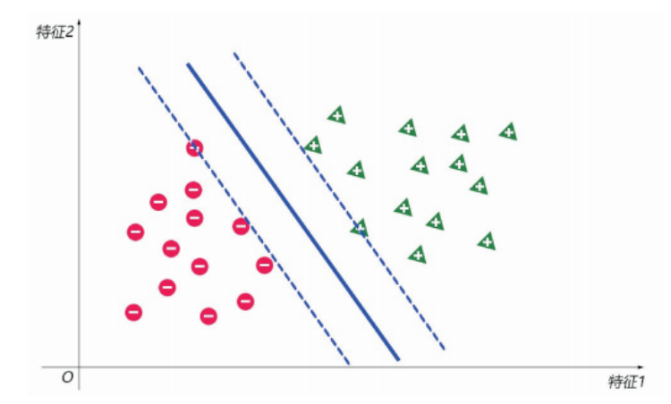
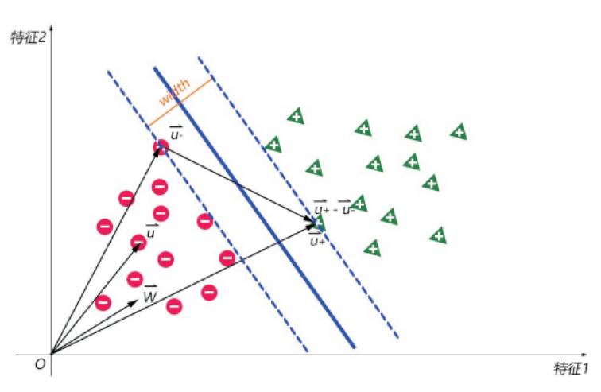
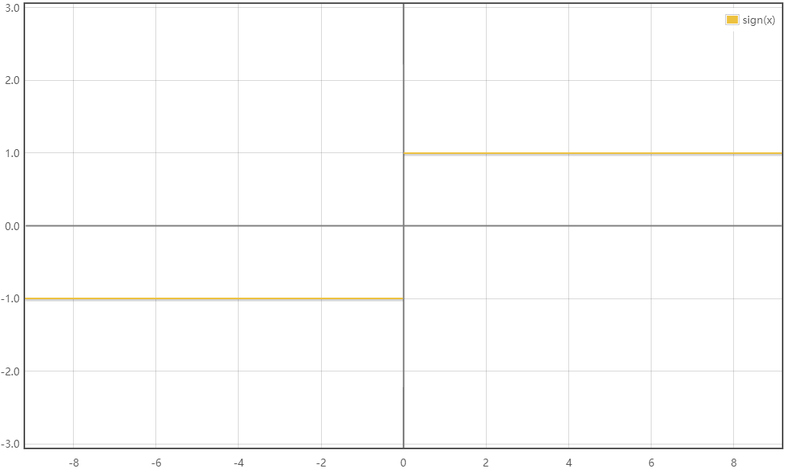
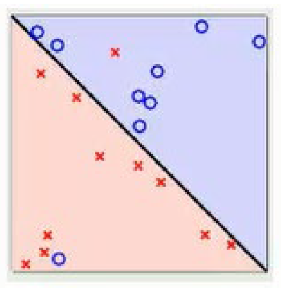
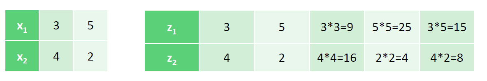

Logistic 回归中，只要判定边界可以正确地分类所有训练样本，则优化过程就会停止，因为这时损失函数已经达到最低。

SVM 算法对于这类线性可分问题，不仅要正确的划分，还要找到所有的正确划分里最优的那个。

何为最优？

能**最大化两个类别之间的间隔**就是最优。换句话说，以一条决策边界为中心线，对其两边做平行线，使得这两条平行线分别经过两边最近的样本点，则这两条平行线会形成一条”街道“，最优的决策边界就是使得这条”接到“最宽的那个决策边界

SVM 通过最大化决策边界和最近训练样本之间的距离来增强模型的泛化能力。

## 算法推导

前面我们知道存在一条最宽的”街道“使得模型最优，接下来就是要求出这个最优的决策边界

假设如下街中心线为要求的决策边界，街宽为 $width$，作街中心线的法向量 $\vec{w}$

总是可以取法向量 $\vec{w}$ 的一个合适的长度，以及一个合适的常量 $b$，使得在训练集中：
$$
\begin{cases}\vec{w}\cdot\vec{u}_++b\geqslant1\\\vec{w}\cdot\vec{u}_-+b\leqslant-1\end{cases}
$$
其中，$\vec{u}_+$ 是正样本，，$\vec{u}_-$ 是负样本，若正样本的 $y_i$ 为 $1$，负样本的 $y_i$ 为 $-1$，则上式可以合并为：
$$
y_i(\vec{w}\cdot\vec{u}_i+b)\geqslant1 ,\forall i
$$
街边的点则满足：
$$
y_i(\vec{w}\cdot\vec{u}_i+b)=1
$$
:::info[小知识]

对于直线 $l:Ax+By+C=0$，法向量为 $(A, B)$

:::

:::info[小知识]

街边的点对于决定决策边界起决定作用，也被称为支持向量（Support Vector）

:::

由向量减法的几何意义可得：
$$
\begin{aligned}
\text{width}& =(\vec{u}_{+}-\vec{u}_{-})\cdot\frac{\vec{w}}{\parallel w\parallel} \\
& =\frac{\vec{u}_{+}\bullet\vec{w}}{\parallel\vec{w}\parallel}-\frac{\vec{u}_{-}\bullet\vec{w}}{\parallel\vec{w}\parallel} \\
&=\frac{1-b}{\parallel\vec{w}\parallel}-\frac{-1-b}{\parallel\vec{w}\parallel} \\
&=\frac{2}{\parallel\vec{w}\parallel}
\end{aligned}
$$
因为要求最大街宽，则优化目标是：
$$
max\left(\frac{2}{\parallel\vec{w}\parallel}\right) \Rightarrow min(\parallel\vec{w}\parallel) \Rightarrow 
min\left(\frac12\parallel\vec{w}\parallel^2\right)
$$
根据前面的条件，最终得到问题是：
$$
\left.\left\{\begin{array}{l}min(\frac12||\vec{w}||^2)\\s.t.\quad y_i\left(\vec{x}\cdot\vec{w}+b\right)-1\geq0,\forall i\end{array}\right.\right.
$$
可以看出这是一个很典型的条件极值问题，可以用拉格朗日乘数法来求解，假设有 $m$ 个样本，拉格朗日函数为：
$$
L=\frac{1}{2}\left|\left|\vec{w}^{2}\right|\right|-\sum_{i=1}^{m}\beta_{i}\left[y_{i}\left(\vec{x}\cdot\vec{w}+b\right)-1\right]\quad(\beta_{i}\geq0)
$$
根据KKT条件，上述的拉格朗日函数求解问题变为：
$$
\max_{\beta\geq0}\min_{w,b}L(w,b,\beta)
$$

什么是 KKT 条件？

在优化理论中，特别是涉及约束优化问题时，Karush-Kuhn-Tucker (KKT) 条件是非常关键的一组必要条件，用于确定一个问题的最优解

KKT条件由以下几个部分组成：

1. **Stationarity**（稳定性）：
   - 拉格朗日函数 $ L(\mathbf{w}, b, \beta) $ 对决策变量 $ \mathbf{w} $ 和 $ b $ 的偏导数应等于零。
   $
   \nabla_{\mathbf{w}} L = 0, \quad \frac{\partial L}{\partial b} = 0
   $

2. **Primal feasibility**（原始可行性）：
   - 原始问题的所有约束必须被满足。
   $
   y_i (\mathbf{w}^T \mathbf{x}_i + b) \geq 1, \quad \forall i
   $

3. **Dual feasibility**（对偶可行性）：
   - 所有拉格朗日乘数 $ \beta_i $ 必须非负。
   $
   \beta_i \geq 0, \quad \forall i
   $

4. **Complementary slackness**（互补松弛性）：
   - 每个约束的拉格朗日乘数和该约束的等式部分的乘积必须为零。
   $
   \beta_i [y_i (\mathbf{w}^T \mathbf{x}_i + b) - 1] = 0, \quad \forall i
   $

对 $w,b$ 的偏导数为0，可以得到以下两个条件：
$$
\frac{\partial L}{\partial w}=0\Longrightarrow w-\sum_{i=1}^m\beta_iy^{(i)}x^{(i)}=0\Longrightarrow w=\sum_{i=1}^m\beta_iy^{(i)}x^{(i)}\\\frac{\partial L}{\partial b}=0\Longrightarrow-\sum_{i=1}^m\beta_iy^{(i)}=0\Longrightarrow\sum_{i=1}^m\beta_iy^{(i)}=0
$$
带入优化函数 $L$ 中，得：
$$
\left.\left\{\begin{array}{l}\ell\left(\beta\right)=\sum_{i=1}^m\beta_i-\frac12\sum_{i=1,j=1}^m\beta_i\beta_jy^{(i)}y^{(j)}x^{(i)^T}x^{(j)}\\s.t.\sum_{i=1}^m\beta_iy^{(i)}=0, \beta_i\geq0,i=1,2,...,m\end{array}\right.\right.
$$

其中，$\beta_i>0$ 对应的 $x_i$ 是支持向量，因为如果 $\beta_i=0$ 表示该样本对于求极值没有约束，则不是支持向量。

$\ell\left(\beta\right)$ 具体计算公式

$$
\begin{aligned}
\ell(\beta)& =\frac12{\left\|w\right\|}_2^2+\sum_{i=1}^m\beta_i{\left[1-y^{(i)}{\left(w^Tx^{(i)}+b\right)}\right]} \\
&=\frac12{\left\|w\right\|}_2^2-\sum_{i=1}^m\beta_i{\left[y^{(i)}{\left(w^Tx^{(i)}+b\right)}-1\right]} \\
&=\frac12w^Tw-\sum_{i=1}^m\beta_iy^{(i)}w^Tx^{(i)}-\sum_{i=1}^m\beta_iy^{(i)}b+\sum_{i=1}^m\beta_i \\
&=\frac12w^T\sum_{i=1}^m\beta_iy^{(i)}x^{(i)}-w^T\sum_{i=1}^m\beta_iy^{(i)}x^{(i)}-b\sum_{i=1}^m\beta_iy^{(i)}+\sum_{i=1}^m\beta_i \\
&=-\frac12w^T\sum_{i=1}^m\beta_iy^{(i)}x^{(i)}+\sum_{i=1}^m\beta_i \\
&=-\frac12\Bigg(\sum_{j=1}^m\beta_jy^{(j)}x^{(j)}\Bigg)^T\Bigg(\sum_{i=1}^m\beta_iy^{(i)}x^{(i)}\Bigg)+\sum_{i=1}^m\beta_i \\
&=-\frac12\sum_{j=1}^m\beta_jy^{(j)}x^{(j)^T}\sum_{i=1}^m\beta_iy^{(i)}x^{(i)}+\sum_{i=1}^m\beta_i \\
&=\sum_{i=1}^m\beta_i-\frac12\sum_{i=1}^m\sum_{j=1}^m\beta_i\beta_jy^{(i)}y^{(j)}x^{(j)^T}x^{(i)}
\end{aligned}
$$

通过对 $w,b$ 极小化后，得到的最终函数只跟 $\beta$ 相关，此时直接极大化优化函数，得到 $\beta$ 的值（使用SMO算法求解），即可得到最终的 w,b 值

对以上的步骤进行总结，即对于线性可分的 $m$ 个样本数据 $\{(x^{(1)},y^{(1)}),(x^{(2)},y^{(2)}),...,(x^{(m)},y^{(m)})\}$，其中 $x$ 为 $n$ 维的特征向量，$y$ 是二元输出，取值为 $1$ 或者 $-1$ ，**使用 SVM 算法流程如下：**

1. 构造约束优化条件
   $$
   \begin{cases}\min_{\beta\geq0}\frac12\sum_{i=1,j=1}^m\beta_i\beta_jy^{(i)}y^{(j)}x^{(i)^T}x^{(j)}-\sum_{i=1}^m\beta_i\\s.t:\sum_{i=1}^m\beta_iy^{(i)}=0\end{cases}
   $$

2. 使用 SMO 算法求出上式优化中对应的最优解 $\beta^*$

3. 找出所有的支持向量集合 $S$：
   $$
   S=\left\{\left(x^{(i)},y^{(i)}\right)|\beta_i>0,i=1,2,...,m\right\}
   $$

4. 更新参数 $w^*,b^*$ 的值：
   $$
   w^*=\sum_{i=1}^m\beta_i^*y^{(i)}x^{(i)}\quad b^*=\frac1S\sum_{s=1}^S\left(y^s-\sum_{i=1}^m\beta_i^*y^{(i)}x^{(i)^T}x^s\right)
   $$

5. 构建最终的分类器：
   $$
   f\left(x\right)=sign\left(w^*\bullet x+b^*\right)
   $$
   $sign()$ 函数图像如下

   

## 线性可分

前面的模型推导都是基于数据集是**线性可分**的。这里来补充几个概念：

- 线性可分(Linearly Separable)：在数据集中，如果可以找出一个超平面，将两组数据分开，那么这个数据集叫做线性可分数据
- 线性不可分(Linear Inseparable)：在数据集中，没法找出一个超平面，能够将两组数据分开，那么这个数据集就叫做线性不可分数据
- 分割超平面(Separating Hyperplane)：将数据集分割开来的直线/平面叫做分割超平面
- 支持向量(Support Vector)：离分割超平面最近的那些点叫做支持向量
- 间隔(Margin)：支持向量数据点到分割超平面的距离称为间隔

线性可分 SVM 要求数据必须是线性可分的，但是数据可不是我们想如何就如何，往往会存在个别异常点，而这些异常点则会导致数据不可分。

如下面这张图，大部分数据都是线性可分，存在两个异常点导致不能直接分类，这样子是很亏的，这时可以通过引入软间隔来解决

### 硬间隔

在讲软间隔之前，先来讲讲硬间隔

- 线性划分 SVM 中的距离度量就是硬间隔

- 线性划分 SVM 中，要求函数距离必须大于1

- 最大化硬间隔条件为
  $$
  \begin{cases} \min_{w,b}\frac12{\left\|w\right\|}_2^2;\quad \\s.ty^{(i)}{\left(w^Tx^{(i)}+b\right)}\geq1,i=1,2,...,m\end{cases}
  $$

硬间隔就是前面推导的那一堆。

### 软间隔

再来讲讲软间隔：

- 对训练集中的每个样本引入一个松弛因子（$\xi$），使得函数距离加入松弛因子后的值大于等于1

- 条件约束为：
  $$
  y^{(i)}\left(w^Tx^{(i)}+b\right)\geq1-\xi_i,i=1,2,...,m,\xi_i\geq0
  $$

- 对比硬间隔，相当于对样本到超平面距离的要求放松了

松弛因子（$\xi$）越大，表示样本点离超平面越近，如果松弛因子大于1，表示允许该样本点分错，所以说加入松弛因子是有成本的，过大的松弛因子可能会导致模型分类错误，所以最终的目标函数就转换成为：
$$
\begin{aligned}&\min_{w,b}\frac12\|w\|_2^2+C\sum_{i=1}^m\xi_i\\&s.t:y^{(i)}\Big(w^Tx^{(i)}+b\Big)\geq1-\xi_i,i=1,2,...,m\xi_i\geq0,i=1,2,...,m\end{aligned}
$$

- 函数中的 $C>0$ 是惩罚参数，是一个超参数，类似 L1/L2 norm 参数

- $C$ 越大表示对误分类的惩罚越大，也就是越不允许存在分错的样本
- $C$ 越小表示对误分类的惩罚越小，也就是表示允许更多的分错样本存在
- $C$值的给定需要调参

**软间隔模型算法流程：**

1. 选择一个惩罚系数 $C>0$，构造约束优化问题
   $$
   \begin{aligned}&\min\frac12\sum_{i=1,j=1}^m\beta_i\beta_jy^{(i)}y^{(j)}x^{(i)^T}x^{(j)}-\sum_{i=1}^m\beta_i\\&s.t:\sum_{i=1}^m\beta_iy^{(i)}=0,0\leq\beta_i\leq C,i=1,2,...,m\end{aligned}
   $$

2. 使用 SMO 算法求出上式优化中对应的最优解 $\beta^*$

3. 找出所有的支持向量集合 $S$：
   $$
   S=\left\{\left(x^{(i)},y^{(i)}\right)|0<\beta_i<C,i=1,2,...,m\right\}
   $$
   

4. 更新参数 $w^*,b^*$ 的值：
   $$
   w^*=\sum_{i=1}^m\beta_i^*y^{(i)}x^{(i)}\quad b^*=\frac1S\sum_{s=1}^S\left(y^s-\sum_{i=1}^m\beta_i^*y^{(i)}x^{(i)^T}x^s\right)
   $$
   

5. 构建最终的分类器：

$$
f\left(x\right)=sign\left(w^*\bullet x+b^*\right)
$$

软间隔模型优点：

- 提供一种处理现实世界数据中常见的杂乱无章或异常情况的方式
- 引入惩罚项系数(松弛因子)，增加模型的泛化能力，即鲁棒性；

## 非线性可分

对于非线性可分的数据，可以**将低纬度的数据映射到高纬度**，从而可以使用线性可分的方法来解决问题。

比如使用多项式扩展，将二维空间中不是线性可分的数据，映射到高维空间中线性可分的数据。

如一个二维线性模型：
$$
h_\theta(x_1,x_2)=\theta_0+\theta_1x_1+\theta_2x_2\\
\left(x_1,x_2\right)\xrightarrow{\text{多项式扩展}}\left(x_1,x_2,x_1^2,x_2^2,x_1x_2\right)
$$
扩展后变为五维线性模型：
$$
h_\theta(x_1,x_2)=\theta_0+\theta_1x_1+\theta_2x_2+\theta_3x_1^2+\theta_4x_2^2+\theta_5x_1x_2\\\xrightarrow{\text{等价}}h_\theta(x_1,x_2)=\theta_0+\theta_1z_1+\theta_2z_2+\theta_3z_3+\theta_4z_4+\theta_5z_5
$$
映射到高维空间后，数据就变为线性可分，可以使用线性可分 SVM 模型或者软间隔来处理

定义一个从低维特征空间到高维特征空间的映射函数 $\phi$，则非线性可分 SVM 的优化目标函数为：
$$
\left.\left\{\begin{aligned}\min\frac12\sum_{i=1,j=1}^m\beta_i\beta_jy^{(i)}y^{(j)}\phi{\left(x^{(i)}\right)}\bullet\phi{\left(x^{(j)}\right)}-\sum_{i=1}^m\beta_i
\\s.t:\sum_{i=1}^m\beta_iy^{(i)}=0,0\leq\beta_i\leq C,i=1,2,...,m\end{aligned}\right.\right.
$$
与前面的目标函数相比，只需要将低维空间中的两个向量点积转为高维向量两个向量点积即可

但是这样有个问题，高纬度的计算呈现爆炸增长，如果原始空间是 $n$ 维，仅仅二阶多项式的扩展就会得到 $\frac{n(n+3)}{2}$ 的新空间，计算量太大，这时就有了一个好东西——**核函数**

### 核函数

假设函数 $\phi$ 是一个从低维特征空间到高维特征空间的一个映射，那么如果存在函数 $K(x,z)$，对于任意的低维特征向量 $x$ 和 $z$，都有：
$$
\mathrm{K}\left(x,z\right)=\phi\left(x\right)\bullet\phi\left(z\right)
$$
则函数 $K(x,z)$ 称为**核函数（Kernal Function）**

核函数允许我们在**不实际计算映射后的新特征空间中的点的坐标的情况下，计算数据点在高维空间中的点积**。这种方法被称为“核技巧”（kernel trick），它极大地简化了计算过程，因为直接在高维空间中操作通常是不切实际的，尤其是当映射空间的维数非常高甚至是无限的时候。

#### 案例

举个例子，有如下数据，并进行二阶多项式扩展：

计算内积，可以看出

- 高维的计算量为：11次乘法+4次加法；
- 近似计算的计算量为：3次乘法+2次加法；
- 加系数后的近似计算的计算量为：4次乘法+2次加法；

$$
\begin{aligned}&\phi(x_1)\bullet\phi(x_2)=z_1\bullet z_2=3*4+2*5+9*16+4*25+8*15=386\\&\left(x_1\bullet x_2+1\right)^2=\left(3*4+2*5+1\right)^2=23*23=529\\&\left(0.8476x_1\bullet x_2+1\right)^2=\left(0.8476*\left(3*4+2*5\right)+1\right)^2=18.6472*18.6472\approx386.01\end{aligned}
$$

因此使用核函数可以大大降低计算量

#### **常见的核函数：**

- **线性核**（Linear kernel）: $ K(x, x') = x^T x' $
- **多项式核**（Polynomial kernel）: $ K(x, x') = (\gamma x^T x' + r)^d $，其中 $ \gamma $, $ r $，和 $ d $ 是多项式核的参数。
- **径向基函数核**（Radial Basis Function kernel or Gaussian kernel）: $ \mathrm{K}\left(x,x'\right)=e^{-\gamma\left\|x-x'\right\|_2^2} $，其中 $ \gamma $ 是RBF核的参数，控制了函数的宽度。
- **Sigmoid核**: $ K(x, x') = \tanh(\gamma x^T x' + r) $

#### 总结

1. 核函数不仅仅是上述列出的常见几种，也可以自定义，满足正定，即 $Gram$ 矩阵是半正定矩阵即可

   - 根据 Mercer 定理：任何半正定的函数都可以作为核函数
     $$
     Gram=\begin{bmatrix}\mathrm{K}(x_1,x_1)&\mathrm{K}(x_1,x_2)&...&\mathrm{K}(x_1,x_m)\\\mathrm{K}(x_2,x_1)&\mathrm{K}(x_2,x_2)&...&\mathrm{K}(x_2,x_m)\\...&...&...&...\\\mathrm{K}(x_m,x_1)&\mathrm{K}(x_m,x_2)&...&\mathrm{K}(x_m,x_m)\end{bmatrix}
     $$

2. 核函数的核心价值在于事先在低维上进行计算，将实质上的分类效果表现在了高维上，也就如上文所说的避免了直接在高维空间中的复杂计算；

## SVR

前面讲的都是应用在分类问题中，即讨论的是SVC（Support Vector Classification，支持向量分类），但是SVM也可以直接应用在回归问题中，即SVR（Support Vector Regression，支持向量回归）

SVR的核心思想与SVM相似，即在特定的误差范围内找到能够描述数据的最优平面。然而，与分类的SVM寻找最大间隔不同，SVR需要找到一个函数，这个函数可以在预定的容忍度（epsilon，ε）内尽可能地拟合所有的训练数据。

#### 损失函数和epsilon-不敏感带
SVR使用的损失函数是epsilon-不敏感损失（epsilon-insensitive loss），它的特点是只有当预测错误超过epsilon时才计算损失。这意味着，如果预测值与真实值之间的差距在 $ε$ 内，则不会有任何损失。这种设置形成了一个“ε-tube”（epsilon管），只有当数据点落在这个管外时，才会产生损失。

### 模型公式

在线性SVR的情况下，加入松弛因子，模型可以表示为：
$$
\left.\left\{\begin{gathered}
\min_{w,b}\frac{1}{2}\left\|w\right\|_2^2+C\sum_{i=1}^m\left(\xi_i^\vee+\xi_i^\wedge\right) \\
s.t:-\boldsymbol{\varepsilon}+\xi_i^\vee\leq y^{(i)}-w^Tx^{(i)}-b\leq\boldsymbol{\varepsilon}+\xi_i^\wedge,&i=1,2,...,m &
\xi_i^\wedge\geq0,\xi_i^\vee\geq0,i=1,2,...,m 
\end{gathered}\right.\right.
$$
求解方式同SVM，用拉格朗日乘数法构造拉格朗日函数，求极值，用SMO算法求解算子，再求解最优值。
