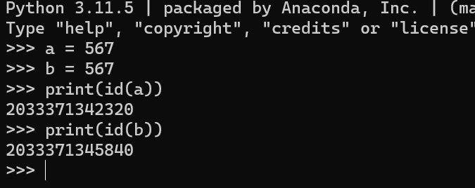
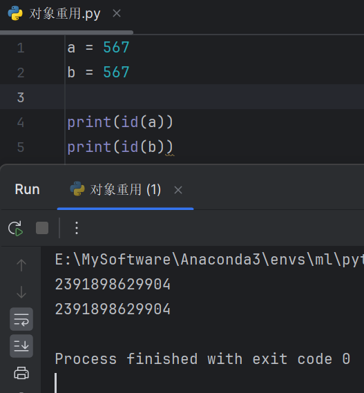

赋值和拷贝是最常见的操作之一

## 赋值

Python中，变量定义和赋值必须是同时进行的

如当执行程序 `a = 123` 时，解释器先在内存中开辟一块空间来存放数据123，然后定义变量名`a`指向这块空间的内存地址，来方便使用变量值，所以变量名和值其实是一种**引用的关联关系**

严格来说，变量名本身没有类型，通常我们所说的变量类型指的是值的数据类型

使用内置函数`id()`可以获取变量地址，实际是返回值的地址

:::note

`id(object)`：返回 `object` 的唯一标识符（内存地址）

:::


### 驻留（interning）

在Python中，对于小的整数和短字符串这样的不可变对象，解释器会执行一种称为“对象重用”或“驻留（interning）”的优化。这意味着相同值的不可变对象可能会引用同一个对象内存地址，以节省空间和提高速度。

例如，对于小的整数和某些字符串，在整个Python会话中这些对象是单例的：

```python
a = 123
b = 123
print(a is b)  # 通常会输出 True，因为小整数对象被重用
```

同样的，对于短字符串：

```python
x = "hello"
y = "hello"
print(x is y)  # 通常会输出 True，因为字符串字面量也可能被重用
```

在这些情况下，`a` 和 `b` 实际上指向相同的内存地址，`x` 和 `y` 也是如此。

然而，这种行为在某些情况下可能会有所不同。在交互式解释器（如Python命令行或IPython）中，可能会看到不同的行为，特别是对于更复杂或更大的对象。此外，如果整数或字符串的值不在“驻留”的范围内（对于整数，这通常是 -5 到 256），Python可能不会自动重用对象：

```python
a = 257
b = 257
print(a is b)  # 可能会输出 False，因为这个整数超出了驻留范围
```

交互式环境和脚本执行环境在处理对象驻留方面的行为可能会有所不同，因为解释器可能会采用不同的优化策略

#### 交互式环境：

在交互式环境中，每次输入都会立即被解释器执行，解释器对于对象的驻留有更保守的策略。例如，对于大整数或较长的字符串，解释器可能不会自动执行驻留，因为它不会假设你会重复使用相同的值



#### 脚本执行环境：

当Python脚本作为文件运行时，编译器有机会在编译字节码之前分析整个代码。在这个过程中，它可以确定哪些字面量可以驻留。对于某些小的整数和短字符串，Python会自动进行驻留，这意味着同一文件中所有出现的相同字面量都指向相同的内存地址



:::note

`is` 操作符用于比较两个对象的身份（即它们是否是同一对象），而 `==` 用于比较两个对象的值是否相等。驻留优化仅适用于对象身份的比较，不影响值的比较。因此，即使 `a is b` 为 `False`，`a == b` 也可能为 `True`。通常情况下，关心的是值的比较，而不是对象的身份比较

:::


### 引用计数

一个值可以被多个变量名引用，当**变量值的引用计数（即值被关联的次数）为0时**，可认定为该值不可用，那么Python的垃圾回收机制**会收回所占用的内存空间**

当一个**可变类型**的数据被多个变量名引用时，如果对该原数据进行修改，那么它**所有引用**都会改变


## 拷贝

Python 中的赋值语句不复制对象，只是建立引用关联，对于可变数据，有时不希望直接对它进行修改，因为这可能会导致一些意外的情况发生，所以需要拷贝一份，对它的副本进行操作
拷贝分为浅拷贝和深拷贝在copy模块中，提供了通用的浅层和深层copy操作

:::note

对象方法的拷贝都是浅拷贝，如`list.copy()、dict.copy()、set.copy()`

:::

拷贝的选择

- 当不需要完全独立的对象副本，或者仅需要复制顶层对象时，浅拷贝是一个更快且内存效率更高的选择
- 当需要创建一个完全独立的对象副本，包括所有嵌套的子对象时，深拷贝是必要的

### 浅拷贝

- 不是所有的数据都会发生拷贝，判断拷贝可以用`id()`判断
- 浅层拷贝只考虑最外层的数据类型
- 如果最外层的数据类型是可变的，则（最外层）发生拷贝
- 如果最外层的数据类型是不可变的，则不发生拷贝
- 浅拷贝的方式
  1. 使用copy模块
  2. 使用切片操作
  3. 使用自带的copy方法

```python
import copy

# 使用copy模块
original_list = [1, 2, [3, 4]]
shallow_copied_list = copy.copy(original_list)

# 使用切片操作
shallow_copied_list2 = original_list[:]

# 使用列表自带的copy方法
shallow_copied_list3 = original_list.copy()
```


### 深拷贝

- 如果判断的该数据本身不可变且包含的所有数据都不可变，则该数据不发生拷贝
- 如果判断的该数据本身可变或者包含的数据存在可变, 则该数据发生拷贝

```python
import copy

original_list = [1, 2, [3, 4]]
deep_copied_list = copy.deepcopy(original_list)
```

```python
# 自定义深拷贝
def deep_copy(obj, _memo=None):
    """深拷贝函数，手动实现，支持列表和字典的深拷贝。"""
    if _memo is None:
        _memo = {}
    
    # 检查对象是否已经拷贝过，防止循环引用
    obj_id = id(obj)
    if obj_id in _memo:
        return _memo[obj_id]
    
    # 处理列表
    if isinstance(obj, list):
        copy_obj = []
        _memo[obj_id] = copy_obj  # 先占位，防止循环引用
        for item in obj:
            copy_obj.append(deep_copy(item, _memo))
        return copy_obj
    
    # 处理字典
    if isinstance(obj, dict):
        copy_obj = {}
        _memo[obj_id] = copy_obj  # 先占位，防止循环引用
        for key, value in obj.items():
            copy_key = deep_copy(key, _memo)
            copy_value = deep_copy(value, _memo)
            copy_obj[copy_key] = copy_value
        return copy_obj
    
    # 如果不是列表或字典，认为是不可变类型，直接返回
    return obj

# 使用示例
original = [1, [2, 3], {'a': 4, 'b': [5, 6]}]
copied = deep_copy(original)
print(copied)  # 输出拷贝的对象
print(copied is original)  # False, 表明确实是新对象
print(copied[1] is original[1])  # False, 深拷贝
print(copied[2] is original[2])  # False, 深拷贝
```

