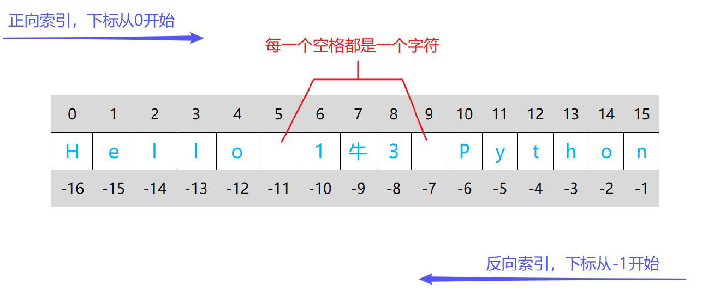

通过索引和切片的方式可以访问序列中的元素

:::note

序列：字符串（String）、列表（List）、元组（Tuple）

:::

## 索引

通过索引可以准确访问相应的元素




## 切片

`sequence[start:stop:step]`

- `start` ：切片开始的位置的索引。如果省略，默认从序列的开始处（索引为0）
- `stop` ：切片结束的位置的索引。切片会在此索引之前结束，但不包括这个索引的元素。如果省略，默认到序列的结束
- `step` ：切片的步长。每隔多少个元素取一个元素，默认为1，即取每个元素。步长可以是负数，这时会逆向取元素


## 维度变化

索引操作返回序列中的单个元素，可能会降低数据结构的维度；而切片操作返回序列的一个部分，保持原有的数据结构不变，即**索引会降维，切片不会降维**

```python
# 字符串索引
s = "Hello World"
print(s[6])   # 输出: 'W'，这是一个字符，不是子字符串

# 列表索引
my_list = [[1, 2], [3, 4], [5, 6]]
print(my_list[1])  # 输出: [3, 4]，这是一个子列表，不是二维列表
```

```python
# 字符串切片
s = "Hello World"
print(s[6:11])  # 输出: 'World'，这是一个字符串

# 列表切片
my_list = [[1, 2], [3, 4], [5, 6]]
print(my_list[1:3])  # 输出: [[3, 4], [5, 6]]，这还是一个二维列表
```

对于一维结构，索引返回一个元素；对于多维结构，索引返回的是一个低一维的结构


## len(s)和del

### len(s)

- 返回对象的长度（元素个数）
- `s` 可以是序列（如 string、tuple、list 或 range 等）或集合（如 dictionary、set 或frozenset 等）

```python
s = "Hello World"
print(len(s))  # 输出: 11，因为字符串 s 包含 11 个字符
```


### del

del 语句在删除变量时，不是直接删除数据，而是解除变量对数据的引用，当数据引用计数为0时，数据就变为了一个可回收的对象，然后内存会被不定期回收

```python
x = 10
print(x)  # 输出: 10
del x
# print(x)  # 这会抛出一个错误，因为变量 x 已被删除
```

```python
a = 123 # 对象 123 被变量 a 引用
b = a # 对象 123 被变量 b 引用
c = a # 对象 123 被变量 c 引用
del a # 删除变量a，解除a对123的引用
del b # 删除变量b，解除b对123的引用
print(c) # 123 最终变量c仍然引用123
```

