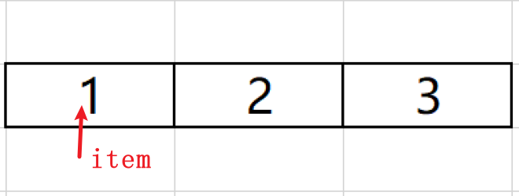
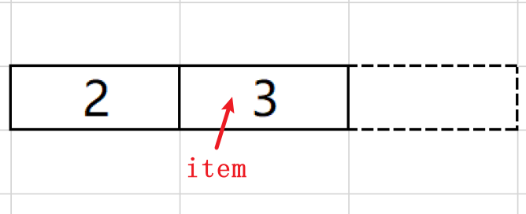

在迭代过程中，列表、字典和集合会出现一些问题，主要是因为列表内存自动管理和修改字典或集合原数据的大小


## 列表内存自动管理

### 内存分配机制

Python 列表是动态数组，它们在内部通过自动管理内存来支持动态调整大小。

这意味着你可以在运行时添加或删除元素，而无需担心底层的内存分配问题，Python解释器会自动为列表分配和释放内存，以适应列表的当前大小

### 增长策略

Python列表的增长策略是为了在增加元素和占用内存之间取得平衡。

当列表增长时，它并不是为每个新元素分配内存，而是预先分配一些额外的空间，以便未来的元素可以快速添加。

这种**预分配策略**有助于减少因频繁内存分配和复制操作而导致的性能开销

### 内存回收

当列表中的元素被删除或整个列表不再被使用时，Python的垃圾回收机制会自动释放不再需要的内存。

这意味着你不需要手动管理列表使用的内存

### 问题场景

```python
lis = [1, 2, 3]
for item in lis:
  lis.remove(item)
print(lis) # [2]
```

在这个代码示例中，列表`lis`在迭代过程中被修改了。

由于迭代是基于索引进行的，每次迭代后列表的大小都会减少，导致迭代器跳过了一些元素

假设原列表在内存中存储结构为线性的

1. 在第一次迭代时，`item`是1，`lis.remove(item)`会移除1，此时`lis`变为`[2, 3]`

   

2. 在第二次迭代时，`item`是2，但由于列表已经缩短，迭代器会跳过元素2，直接移动到元素3。`lis.remove(item)`此时会移除3，此时`lis`变为`[2]`

   

3. 迭代结束，因为没有更多的元素了

所以，最终的列表`lis`是`[2]`，而不是空列表。

这种情况下，避免在迭代过程中直接修改列表是一个好习惯。如果需要在迭代时修改列表，可以考虑**创建列表的副本**或使用其他迭代方式


## 字典、集合遍历问题

在Python中，遍历字典或集合时，如果尝试改变原数据的大小（即添加或删除元素），会造成运行时报错。

这是因为迭代器在遍历时需要保持数据结构的稳定性，而改变数据大小会破坏这种稳定性

```python
d = {'a': 1, 'b': 2, 'c': 3}

for key in d:
    if key == 'b':
        del d[key]  # 这将导致运行时错误
```

如果需要在遍历过程中修改字典或集合，一个常见的做法是先创建原数据的副本，然后在副本上进行操作：

```python
d = {'a': 1, 'b': 2, 'c': 3}
d_copy = d.copy()

for key in d_copy:
    if key == 'b':
        del d[key]  # 在原字典上进行修改

print(d)  # 输出: {'a': 1, 'c': 3}
```

