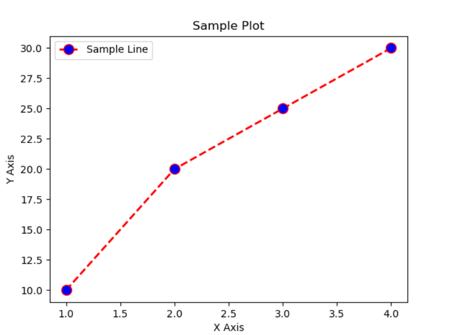

Matplotlib 是 Python 常用的第三方 2D 绘图库，是 Python 中最受欢迎的数据可视化软件包之一


`plt.plot(x, y, color, linestyle, linewidth, marker, markerfacecolor, markersize, label)`

- 用于创建二维折线图

- `x`：x 轴数据，数组或列表

- `y`：y 轴数据，数组或列表

- `color`：线条颜色，示例：`'r'`、`'b'`、`'g'` 等

- `linestyle`：线条样式，示例：`'-'`（实线）、`'--'`（虚线）、`'-.'`（点划线）、`':'`（点线）

- `linewidth`：线条宽度，示例：`2`、`4` 等

- `marker`：标记样式，示例：`'o'`、`'^'`、`'s'`（方块）等

- `markerfacecolor`：标记的填充颜色

- `markersize`：标记的大小

- `label`：标签，用于图例

  ```py
  import matplotlib.pyplot as plt
  
  # 创建数据
  x = [1, 2, 3, 4]
  y = [10, 20, 25, 30]
  
  # 绘制折线图
  plt.plot(
      x, y, 
      color='r',          # 线条颜色
      linestyle='--',     # 线条样式
      linewidth=2,        # 线条宽度
      marker='o',         # 标记样式
      markerfacecolor='b',# 标记填充颜色
      markersize=10,      # 标记大小
      label='Sample Line' # 标签
  )
  
  # 添加标题和标签
  plt.title('Sample Plot')
  plt.xlabel('X Axis')
  plt.ylabel('Y Axis')
  
  # 显示图例
  plt.legend()
  
  # 显示图形
  plt.show()
  ```




## 创建画布

`plt.figure(num=None, figsize=None, dpi=None, facecolor=None)`

- 创建一个新图形窗口
- 隐式创建
  - 在 Matplotlib 中，直接使用 `plt.plot()` 或其他绘图函数，而没有显式调用 `plt.figure()`，Matplotlib 会隐式创建一个默认的图形窗口。这种方式适合快速绘图
- 显示创建
  - 通过 `plt.figure()` 显式创建一个图形窗口，这样可以更灵活地设置图形的属性和管理多个图形
  - 在 `plt.figure()` 下面的 `plt.xxx()` 画图代码都会画在对应的画布上面
- `num`：图形编号或名称，默认为 `None`
- `figsize`：图形大小，指定宽度和高度（以英寸为单位），如 `(8, 6)`
- `dpi`：分辨率，每英寸点数，默认值为 100
- `facecolor`：图形背景色，默认值为 `white`
- `edgecolor`：图形边框颜色，默认值为 `white`
- `frameon`：是否绘制图形框架，布尔值，默认值为 `True`


##  中文/负号显示问题

在使用 Matplotlib 绘图时，如果需要显示中文和负号，可能会遇到一些问题。


### 显示中文

为了在 Matplotlib 图形中显示中文，需要设置字体。


#### 方法一：使用系统字体

```python
import matplotlib.pyplot as plt
import matplotlib.font_manager as fm

# 查找系统中的中文字体
zh_font = fm.FontProperties(fname='/path/to/your/font.ttf')

# 创建图形
plt.plot([1, 2, 3, 4], [10, 20, 25, 30])
plt.title('示例图形', fontproperties=zh_font)
plt.xlabel('X轴', fontproperties=zh_font)
plt.ylabel('Y轴', fontproperties=zh_font)
plt.show()
```

将 `/path/to/your/font.ttf` 替换为系统中中文字体的路径，如 `SimHei.ttf`。

#### 方法二：全局设置字体

```python
import matplotlib.pyplot as plt

# 设置全局字体为 SimHei
plt.rcParams['font.sans-serif'] = ['SimHei']  # 用黑体显示中文
plt.rcParams['axes.unicode_minus'] = False   # 解决负号显示问题

# 创建图形
plt.plot([1, 2, 3, 4], [10, 20, 25, 30])
plt.title('示例图形')
plt.xlabel('X轴')
plt.ylabel('Y轴')
plt.show()
```


### 解决负号显示问题

有时候负号会显示为方块，这是因为默认字体不支持负号。通过全局设置 `axes.unicode_minus` 为 `False` 可以解决这个问题。

```python
import matplotlib.pyplot as plt

# 解决负号显示问题
plt.rcParams['axes.unicode_minus'] = False

# 创建图形
plt.plot([-3, -2, -1, 0, 1, 2, 3], [-10, -20, -30, 0, 10, 20, 30])
plt.title('示例图形')
plt.xlabel('X轴')
plt.ylabel('Y轴')
plt.show()
```


### 综合示例

```python
import matplotlib.pyplot as plt

# 设置字体和解决负号显示问题
plt.rcParams['font.sans-serif'] = ['SimHei']
plt.rcParams['axes.unicode_minus'] = False

# 创建图形
plt.plot([-3, -2, -1, 0, 1, 2, 3], [-10, -20, -30, 0, 10, 20, 30])
plt.title('示例图形')
plt.xlabel('X轴')
plt.ylabel('Y轴')
plt.show()
```


## 设置坐标轴

### 限制显示区域

- `plt.xlim(min, max)`：设置 X 轴的显示范围

- `plt.ylim(min, max)`：设置 Y 轴的显示范围。

- `plt.axis([xmin, xmax, ymin, ymax])`：同时设置 X 轴和 Y 轴的显示范围

  ```py
  import matplotlib.pyplot as plt
  
  # 创建数据
  x = [-10, -5, 0, 5, 10]
  y = [-100, -25, 0, 25, 100]
  
  # 创建图形
  plt.plot(x, y)
  
  # 设置 X 轴显示区域
  plt.xlim(-8, 8)
  
  # 设置 Y 轴显示区域
  plt.ylim(-50, 50)
  
  # 使用 axis 设置 X 轴和 Y 轴显示区域
  # plt.axis([-8, 8, -50, 50])
  
  # 添加标题和标签
  plt.title('限制显示区域的示例')
  plt.xlabel('X轴')
  plt.ylabel('Y轴')
  
  # 显示图形
  plt.show()
  ```

  

### 设置坐标轴标签

- `plt.xlabel(label)`：设置 X 轴的标签
- `plt.ylabel(label)`：设置 Y 轴的标签
- `ax.set_xlabel(label)`：使用 `Axes` 对象设置 X 轴的标签
- `ax.set_ylabel(label)`：使用 `Axes` 对象设置 Y 轴的标签

:::info

使用 `plt.subplots()` 可以同时创建 `Figure` 和 `Axes` 对象

`Axes` 对象是一个绘图区域

`Axes` 对象方法：

- `set_xlabel(label)`：设置 X 轴标签

- `set_ylabel(label)`：设置 Y 轴标签

- `set_title(label)`：设置图形标题

- `set_xlim([min, max])`：设置 X 轴显示范围

- `set_ylim([min, max])`：设置 Y 轴显示范围

- `legend()`：显示图例

  ```py
  import matplotlib.pyplot as plt
  
  # 创建图形和轴对象
  fig, ax = plt.subplots()
  
  # 绘制数据
  x = [1, 2, 3, 4, 5]
  y = [10, 20, 25, 30, 35]
  ax.plot(x, y, label='样例数据')
  
  # 设置 X 轴标签
  ax.set_xlabel('X轴标签')
  
  # 设置 Y 轴标签
  ax.set_ylabel('Y轴标签')
  
  # 设置标题
  ax.set_title('综合示例')
  
  # 设置坐标轴显示范围
  ax.set_xlim([0, 6])
  ax.set_ylim([0, 40])
  
  # 显示图例
  ax.legend()
  
  # 显示图形
  plt.show()
  ```

:::


### 设置坐标轴刻度

`plt.xticks(ticks=None, labels=None) / plt.yticks(ticks=None, labels=None)`

- `ticks`：刻度点的位置组成的列表（可以指定为空列表，则去掉刻度，但轴还在）

- `labels`：刻度点的位置上的标签组成的列表（`labels`不指定，则标签显示`ticks`值）

- 当不指定参数时，返回对应轴当前刻度点的位置和标签

  ```py
  import matplotlib.pyplot as plt
  import numpy as np
  
  x = np.linspace(-3, 3, 50)
  y = np.sin(x)
  plt.figure()  # 画布1
  plt.plot(x, y)
  # ticks的值作为刻度点的位置, labels的值作为刻度点的位置上的标签
  plt.yticks(ticks=[-1, -0.8, -0.5, -0.1, 1], labels=["a", "b", "c",
                                                      "d", "e"])
  plt.figure()  # 画布2
  plt.plot(x, y)
  # ticks指定为空列表, 去掉刻度, 但轴还在
  plt.xticks(ticks=[])
  plt.figure()  # 画布3
  plt.plot(x, y)
  
  plt.axis("off")  # 把轴去掉，刻度一起没了
  plt.figure()  # 画布4
  plt.plot(x, y)
  new_xticks = np.linspace(-4, 4, 9)
  # 因为没有指定labels参数，所以ticks的值既作为刻度点的位置又作为刻度的标签
  plt.xticks(ticks=new_xticks)
  plt.yticks(ticks=[-1, -0.8, -0.5, -0.1, 1])
  plt.show()
  ```

  

### 设置坐标边框

1. 用 `plt.gca()` 获取到坐标体系（矩形坐标框）/ `fig, ax = plt.subplots()` 获取 `axes` 对象
2. 使用 `spines` 属性来设置坐标边框的颜色。`spines` 是一个字典，包含四个边框（上下左右）的 `Spine` 对象
3. 通过对象的 `set_color` 方法来设置边框颜色
   - `ax.spines['top']`：表示上边框
   - `ax.spines['bottom']`：表示下边框
   - `ax.spines['left']`：表示左边框
   - `ax.spines['right']`：表示右边框
   - `set_color(color)`：设置边框的颜色，可以使用颜色名、缩写或十六进制颜色代码
4. 结合 `set_position()` 方法来指定边框位置

```python
import matplotlib.pyplot as plt

# 创建数据
x = [1, 2, 3, 4, 5]
y = [10, 20, 25, 30, 35]

# 创建图形和轴对象
fig, ax = plt.subplots()

# 绘制数据
ax.plot(x, y)


# 设置坐标边框颜色
ax.spines['top'].set_color('red')
ax.spines['bottom'].set_color('blue')
ax.spines['left'].set_color('green')
ax.spines['right'].set_color('purple')

# 添加标题和标签
ax.set_title('设置坐标边框颜色的示例')
ax.set_xlabel('X轴标签')
ax.set_ylabel('Y轴标签')

# 选择坐标体系的左边框, 设置位置到数据为0的地方(即x轴原点)
ax.spines['left'].set_position(('data', 0))
# 选择坐标体系的底边框, 设置位置到数据为-0.1的地方(即y轴的'd'点)
ax.spines['bottom'].set_position(('data', -0.1))

# 显示图形
plt.show()
```


## 创建图例

`plt.legend(handles, labels, loc, fontsize, edgecolor, facecolor)`

- 添加图例。可以通过多种参数自定义图例的外观和位置


- `handles`：图例中显示的图形元素列表，如 `Line2D` 或 `Patch` 对象

- `labels`：与 `handles` 对应的标签列表

- `loc`：图例的位置，可以是字符串（如 `'upper right'`、`'lower left'`）或整数（如 0 表示 `'best'`，默认是`loc=“best”`，代表自动找最好的位置）

- `fontsize`：图例文本的字体大小，可以是整数或字符串（如 `'small'`、`'medium'`、`'large'`）

- `edgecolor`：图例边框颜色

- `facecolor`：图例背景颜色

  ```py
  import matplotlib.pyplot as plt
  
  # 创建数据
  x = [1, 2, 3, 4, 5]
  y1 = [10, 20, 25, 30, 35]
  y2 = [15, 25, 30, 35, 40]
  
  # 绘制数据
  line1, = plt.plot(x, y1, label='数据1')
  line2, = plt.plot(x, y2, label='数据2')
  
  # 创建图例
  plt.legend(handles=[line1, line2], labels=['第一条线', '第二条线'], loc='upper left', fontsize='medium', edgecolor='black', facecolor='lightgrey')
  
  # 添加标题和标签
  plt.title('图例示例')
  plt.xlabel('X轴标签')
  plt.ylabel('Y轴标签')
  
  # 显示图形
  plt.show()
  ```

  

## 文字说明

`plt.text(x, y, s, size, color, ha, va)`

- 在指定的坐标位置添加文本


- `x`：文本的 x 坐标

- `y`：文本的 y 坐标

- `s`：要显示的文本字符串

- `size`：文本的字体大小，可以是整数或字符串（如 `'small'`、`'medium'`、`'large'`）

- `color`：文本的颜色

- `ha`：水平对齐方式，选项包括 `'center'`、`'left'`、`'right'`

- `va`：垂直对齐方式，选项包括 `'center'`、`'top'`、`'bottom'`

  ```py
  import matplotlib.pyplot as plt
  
  # 创建数据
  x = [1, 2, 3, 4, 5]
  y = [10, 20, 25, 30, 35]
  
  # 创建图形
  plt.plot(x, y)
  
  # 添加文本
  plt.text(2, 25, '示例文本', size=12, color='red', ha='center', va='bottom')
  
  # 添加标题和标签
  plt.title('文本示例')
  plt.xlabel('X轴标签')
  plt.ylabel('Y轴标签')
  
  # 显示图形
  plt.show()
  ```

  

## 散点图

`plt.scatter(x, y, s, c, marker, alpha, linewidths, edgecolors)`

- 创建散点图


- `x`：x 坐标的数组或列表

- `y`：y 坐坐标的数组或列表

- `s`：点的大小（可选），可以是单个数值或数值的数组/列表

- `c`：点的颜色（可选），可以是单个数值、数值的数组/列表、颜色名或颜色码

- `marker`：点的形状（可选），如 `'o'`、`'^'`、`'s'` 等

- `alpha`：点的透明度（可选），从 0（完全透明）到 1（完全不透明）

- `linewidths`：点的边缘宽度（可选），可以是单个数值或数值的数组/列表

- `edgecolors`：点的边缘颜色（可选），可以是颜色名、颜色码或 `'none'`

  ```py
  import matplotlib.pyplot as plt
  
  # 创建数据
  x = [1, 2, 3, 4, 5]
  y = [10, 20, 25, 30, 35]
  sizes = [20, 50, 100, 200, 300]  # 点的大小
  colors = ['red', 'blue', 'green', 'yellow', 'purple']  # 点的颜色
  
  # 创建散点图
  plt.scatter(x, y, s=sizes, c=colors, marker='o', alpha=0.6, linewidths=2, edgecolors='black')
  
  # 添加标题和标签
  plt.title('散点图示例')
  plt.xlabel('X轴标签')
  plt.ylabel('Y轴标签')
  
  # 显示图形
  plt.show()
  ```


## 条形图

`plt.bar(x, height, width, color, edgecolor, alpha, linewidth, bottom, align)`

- 用于创建条形图


- `x`：条形位置的数组或列表

- `height`：条形高度的数组或列表

- `width`：条形的宽度（可选），默认值为 0.8

- `color`：条形的填充颜色

- `edgecolor`：条形边缘颜色

- `alpha`：条形的透明度

- `linewidth`：条形边缘的宽度

- `bottom`：条形底部的排列方式（可选），指定条形底部的位置

- `align`：条形的对齐方式（可选），可以是 `'center'` 或 `'edge'`

  ```py
  import matplotlib.pyplot as plt
  
  # 创建数据
  x = [1, 2, 3, 4, 5]
  heights = [10, 20, 25, 30, 35]
  
  # 创建条形图
  plt.bar(x, heights, width=0.5, color='blue', edgecolor='black', alpha=0.7, linewidth=1.5, bottom=0, align='center')
  
  # 添加标题和标签
  plt.title('条形图示例')
  plt.xlabel('X轴标签')
  plt.ylabel('Y轴标签')
  
  # 显示图形
  plt.show()
  ```


## 数据转图像

`plt.imshow(X, cmap, alpha)`

- 用于显示图像的函数。通过该函数，可以将数组表示的图像显示在坐标系上，


- `X`：要显示的图像数据，通常是一个二维（灰度图）或三维（彩色图）的数组。

- `cmap`：颜色映射（可选），指定用于映射图像数据的颜色映射对象或名称。

- `alpha`：图像的透明度

  ```py
  import matplotlib.pyplot as plt
  import numpy as aysing numpy.random.rand to generate a 10x10 random image array
  import numpy as np
  
  # 生成随机图像数据
  X = np.random.rand(10, 10)
  
  # 显示图像
  plt.imshow(X, cmap='viridis', alpha=0.8)
  
  # 添加标题和标签
  plt.title('图像显示示例')
  plt.xlabel('X轴标签')
  plt.ylabel('Y轴标签')
  
  # 显示图形
  plt.colorbar()  # 添加颜色条
  plt.show()
  ```


## 创建子图

`plt.subplot(nrows, ncols, index)`

- 用于创建子图，可以在同一个图形窗口中创建多个子图，并且可以指定子图的排列方式和位置


- `nrows`：子图的行数

- `ncols`：子图的列数

- `index`：子图的编号（从1开始），表示子图在网格中的位置

  ```py
  import matplotlib.pyplot as plt
  
  # 创建第一个子图（1行2列中的第1个）
  plt.subplot(1, 2, 1)
  plt.plot([1, 2, 3, 4], [10, 20, 25, 30])
  plt.title('子图1')
  
  # 创建第二个子图（1行2列中的第2个）
  plt.subplot(1, 2, 2)
  plt.plot([1, 2, 3, 4], [30, 25, 20, 10])
  plt.title('子图2')
  
  # 显示图形
  plt.suptitle('多个子图示例')
  plt.show()
  ```

- 创建多个子图

  ```py
  import matplotlib.pyplot as plt
  
  # 创建3行1列的子图，并依次填充子图
  plt.subplot(3, 1, 1)
  plt.plot([1, 2, 3, 4], [10, 20, 25, 30])
  plt.title('子图1')
  
  plt.subplot(3, 1, 2)
  plt.plot([1, 2, 3, 4], [30, 25, 20, 10])
  plt.title('子图2')
  
  plt.subplot(3, 1, 3)
  plt.plot([1, 2, 3, 4], [5, 15, 20, 30])
  plt.title('子图3')
  
  # 显示图形
  plt.suptitle('3个子图示例')
  plt.show()
  ```


## 画图中图

`plt.axes()`

- 用于创建一个新的坐标轴对象（Axes）的函数

- `rect`：表示坐标轴位置和大小的列表或元组，格式为 `[left, bottom, width, height]`，值的范围是 0 到 1，表示相对于图形窗口的比例

- `kwargs`：其他可选参数，用于自定义坐标轴的外观和行为

- 创建默认的坐标轴

  ```py
  import matplotlib.pyplot as plt
  
  # 创建默认的坐标轴
  ax = plt.axes()
  
  # 绘制数据
  x = [1, 2, 3, 4, 5]
  y = [10, 20, 25, 30, 35]
  ax.plot(x, y)
  
  # 添加标题和标签
  ax.set_title('默认坐标轴示例')
  ax.set_xlabel('X轴标签')
  ax.set_ylabel('Y轴标签')
  
  # 显示图形
  plt.show()
  ```

- 创建自定义位置和大小的坐标轴

  ```py
  import matplotlib.pyplot as plt
  
  # 创建自定义位置和大小的坐标轴
  ax = plt.axes([0.1, 0.1, 0.8, 0.8])
  
  # 绹u数据
  x = [1, 2, 3, 4, 5]
  y = [10, 20, 25, 30, 35]
  ax.plot(x, y)
  
  # 添加标题和标签
  ax.set_title('自定义坐标轴示例')
  ax.set_xlabel('X轴标签')
  ax.set_ylabel('Y轴标签')
  
  # 显示图形
  plt.show()
  ```

  

## 保存图像

`plt.savefig()`

- 保存图形的函数，可以将绘制的图形保存到文件中


- `fname`：保存的文件名或文件对象。文件名的扩展名决定了文件格式（如 `png`、`pdf`、`svg`、`eps` 等）

- `dpi`：图像的分辨率（每英寸点数），默认值为 100

- `quality`：图像质量（仅适用于 jpeg 格式），范围为 1 到 100

- `format`：文件格式，如果省略，默认根据文件名的扩展名推断

- `bbox_inches`：表示要保存的部分，`None` 表示全部内容，`'tight'` 表示紧凑布局，会去掉多余的空白边距

- `pad_inches`：添加到边界的填充量（以英寸为单位）

- `transparent`：布尔值，是否将背景设为透明

- `facecolor`：图像背景色

- `edgecolor`：图像边框颜色

  ```py
  import matplotlib.pyplot as plt
  
  # 创建数据
  x = [1, 2, 3, 4, 5]
  y = [10, 20, 25, 30, 35]
  
  # 绘制图形
  plt.plot(x, y)
  
  # 添加标题和标签
  plt.title('保存图像示例')
  plt.xlabel('X轴标签')
  plt.ylabel('Y轴标签')
  
  # 保存图像
  plt.savefig('example.png', dpi=300, bbox_inches='tight')
  
  # 显示图形
  plt.show()
  ```
