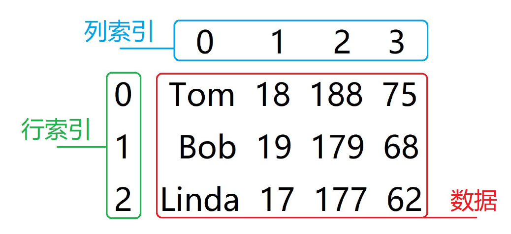

Pandas 是基于 NumPy 的 Python 扩展库，用于数据分析。它可以快速从不同格式的文件（如 CSV、Excel 文件）中加载数据，并将其转换为可处理的对象

Pandas 在 ndarray 的基础上构建了两种更适用于数据分析的存储结构：

- Series（一维数据结构）
- DataFrame（二维数据结构）
- 操作 Series 和 DataFrame 时，基本上可以看作是操作 NumPy 中的一维和二维数组。数组的绝大多数操作同样适用于它们


## Pandas Series

`Series` 是一种一维数据结构，每个元素都带有一个索引，与 NumPy 中的一维数组类似。

可以保存任何数据类型，比如整数、字符串、浮点数、Python 对象等。默认情况下，`Series` 的索引是从 0 开始依次递增的

Pandas Series 示例：

```py
import pandas as pd

# 创建一个 Series
data = pd.Series([1, 2, 3, 4, 5])
print(data)
```

输出：

```py
0    1
1    2
2    3
3    4
4    5
dtype: int64
```

Pandas Series 结构图：


### 创建 Series 对象

`pd.Series(data=None, index=None, dtype=None, name=None)`

- `data`：要存入 Series 的数据，`array-like`，可以是列表、字典、标量值等。

- `index`：索引标签，必须是唯一且不可变的，可以是标量或数组。如果未提供，则默认从 0 开始的整数索引。

- `dtype`：数据类型，可以指定数据类型，如果未指定则根据数据自动推断。

- `name`：为 Series 指定一个名称

  ```py
  import pandas as pd
  
  # 创建一个包含整数的 Series
  data = pd.Series([10, 20, 30, 40, 50])
  print(data)
  
  # 创建一个带有自定义索引的 Series
  data = pd.Series([10, 20, 30, 40, 50], index=['a', 'b', 'c', 'd', 'e'])
  print(data)
  
  # 创建一个带有自定义数据类型和名称的 Series
  data = pd.Series([10, 20, 30, 40, 50], index=['a', 'b', 'c', 'd', 'e'], dtype='float64', name='sample_data')
  print(data)
  
  # 使用字典创建 Series，字典的键将作为索引，值将作为数据
  data_dict = {'a': 10, 'b': 20, 'c': 30, 'd': 40}
  series = pd.Series(data_dict)
  print(series)
  
  # 指定的索引包含字典中不存在的键，则在指定索引位置上会返回 NaN
  index = ['a', 'b', 'e', 'f']
  
  # 创建 Series
  series = pd.Series(data_dict, index=index)
  print(series)
  ```

  输出：

  ```py
  # 简单 Series
  0    10
  1    20
  2    30
  3    40
  4    50
  dtype: int64
  
  # 带有自定义索引的 Series
  a    10
  b    20
  c    30
  d    40
  e    50
  dtype: int64
  
  # 带有自定义数据类型和名称的 Series
  a    10.0
  b    20.0
  c    30.0
  d    40.0
  e    50.0
  Name: sample_data, dtype: float64
  
  # 使用字典创建 Series
  a    10
  b    20
  c    30
  d    40
  dtype: int64
  
  # 指定的索引包含字典中不存在的键
  a    10.0
  b    20.0
  e     NaN
  f     NaN
  dtype: float64
  ```


### 访问 Series 数据

在 Pandas 的 Series 中，可以通过两种方式访问数据：位置索引访问和索引标签访问

#### 位置索引访问

- 类似于 NumPy 数组的访问方式，通过整数位置进行访问

- 可以使用正索引或负索引

  ```py
  import pandas as pd
  
  # 创建一个 Series
  data = pd.Series([10, 20, 30, 40, 50], index=['a', 'b', 'c', 'd', 'e'])
  
  # 通过位置索引访问数据
  print(data[0])  # 访问第一个元素
  print(data[2])  # 访问第三个元素
  ```

  


#### 索引标签访问

- 通过 Series 的索引标签进行访问，类似于字典的键访问

- 使用自定义的索引标签，可以是字符串、数字等类型

  ```py
  # 通过索引标签访问数据
  print(data['a'])  # 访问索引为 'a' 的元素
  print(data['c'])  # 访问索引为 'c' 的元素
  ```

  

### 修改 Series 索引

1. 使用 `pd.Series` 构造函数重新创建 Series

   ```py
   import pandas as pd
   
   # 创建一个 Series
   data = pd.Series([10, 20, 30, 40, 50], index=['a', 'b', 'c', 'd', 'e'])
   
   # 修改索引
   new_index = ['A', 'B', 'C', 'D', 'E']
   new_data = pd.Series(data.values, index=new_index)
   print(new_data)
   ```

2. 使用 `rename` 方法

   - 传递一个字典来指定旧索引和新索引的映射

     ```py
     # 使用 rename 方法修改索引
     renamed_data = data.rename({'a': 'A', 'b': 'B', 'c': 'C', 'd': 'D', 'e': 'E'})
     print(renamed_data)
     ```

3. 直接修改 `index` 属性

   ```py
   # 直接修改 index 属性
   data.index = ['A', 'B', 'C', 'D', 'E']
   print(data)
   ```

   

### 修改 Series 数据

在 Pandas 中，可以通过多种方式修改 Series 的数据。

1. 使用索引标签修改数据

   ```py
   import pandas as pd
   
   # 创建一个 Series
   data = pd.Series([10, 20, 30, 40, 50], index=['a', 'b', 'c', 'd', 'e'])
   
   # 修改索引为 'b' 的元素
   data['b'] = 25
   print(data)
   ```

2. 使用位置索引修改数据

   ```py
   # 修改位置索引为 2 的元素
   data[2] = 35
   print(data)
   ```

3. 使用条件索引修改数据

   ```py
   # 将所有大于30的元素修改为100
   data[data > 30] = 100
   print(data)
   ```

4. 使用 `loc` 和 `iloc` 修改数据

   ```py
   # 使用 loc 修改数据
   data.loc['a'] = 15
   print(data)
   
   # 使用 iloc 修改数据
   data.iloc[1] = 28
   print(data)
   ```

5. 使用切片修改数据

   ```py
   # 使用切片修改数据
   data[1:3] = [21, 31]
   print(data)
   ```


### 重新索引

`Series.reindex(index=None, fill_value=np.NaN)`

- 通过指定新的索引，可以重新排列或对齐数据

- 如果新索引中存在原索引中没有的标签，那么这些位置将会用 `NaN` 填充，或者可以使用 `fill_value` 参数指定填充值

- `index`：新的索引标签列表

- `fill_value`：填充值，用于填充新索引中没有匹配到的值，默认是 `np.NaN`

- `reindex`操作的 Series 对象不能有重复的索引

  ```py
  import pandas as pd
  import numpy as np
  
  # 创建一个 Series
  data = pd.Series([10, 20, 30, 40, 50], index=['a', 'b', 'c', 'd', 'e'])
  
  # 使用新的索引重新索引
  new_index = ['a', 'b', 'c', 'd', 'e', 'f', 'g']
  reindexed_data = data.reindex(new_index)
  print(reindexed_data)
  
  # 重新索引并填充缺失值
  reindexed_data_filled = data.reindex(new_index, fill_value=0)
  print(reindexed_data_filled)
  ```

  

### 常用属性

以下是 Pandas `Series` 的常用属性：

|           属性            |             说明             |
| :-----------------------: | :--------------------------: |
|          `index`          |         返回索引标签         |
|         `values`          |       返回数据值的数组       |
|          `dtype`          |         返回数据类型         |
|          `name`           |      返回 Series 的名称      |
|          `size`           |    返回 Series 的元素个数    |
|          `shape`          |      返回 Series 的形状      |
|         `nbytes`          |   返回 Series 所占的字节数   |
|          `ndim`           |      返回 Series 的维度      |
|          `empty`          |     判断 Series 是否为空     |
|         `hasnans`         |   判断 Series 是否包含 NaN   |
|        `is_unique`        |   判断 Series 元素是否唯一   |
|      `is_monotonic`       |   判断 Series 是否单调递增   |
| `is_monotonic_increasing` | 判断 Series 是否严格单调递增 |

```python
import pandas as pd
import numpy as np

# 创建一个示例 Series
data = pd.Series([10, 20, 30, np.nan, 50], index=['a', 'b', 'c', 'd', 'e'], name='sample_series')

# 获取各属性
print("索引标签:", data.index)
print("数据值数组:", data.values)
print("数据类型:", data.dtype)
print("Series 名称:", data.name)
print("元素个数:", data.size)
print("形状:", data.shape)
print("所占字节数:", data.nbytes)
print("维度:", data.ndim)
print("是否为空:", data.empty)
print("是否包含 NaN:", data.hasnans)
print("元素是否唯一:", data.is_unique)
print("是否单调递增:", data.is_monotonic)
print("是否严格单调递增:", data.is_monotonic_increasing)
```

输出

```python
索引标签: Index(['a', 'b', 'c', 'd', 'e'], dtype='object')
数据值数组: [10. 20. 30. nan 50.]
数据类型: float64
Series 名称: sample_series
元素个数: 5
形状: (5,)
所占字节数: 40
维度: 1
是否为空: False
是否包含 NaN: True
元素是否唯一: True
是否单调递增: False
是否严格单调递增: False
```


### 常用方法

`Series.head(n=5)`

- 返回 Series 前 n 个元素的方法
- 默认情况下，它返回前 5 个元素
- 如果 n 为负数，则等价于 Series[:n]


`Series.tail(n=5)`

- 返回 Series 后 n 个元素的方法
- 默认情况下，它返回后 5 个元素。
- 如果 n 为负数，则等价于 Series[:n]


`Series.isnull() / Series.notnull()`

- 检测缺失值

- `Series.isnull()`用于检测缺失值，返回一个布尔 Series，缺失值为 `True`，非缺失值为 `False`

- `Series.notnull()`用于检测非缺失值，返回一个布尔 Series，缺失值为 `False`，非缺失值为 `True`

  ```py
  import pandas as pd
  import numpy as np
  
  # 创建一个包含缺失值的 Series
  data = pd.Series([1, 2, np.nan, 4, np.nan, 6])
  
  # 检测缺失值
  isnull_data = data.isnull()
  print("缺失值检测:\n", isnull_data)
  
  # 检测非缺失值
  notnull_data = data.notnull()
  print("非缺失值检测:\n", notnull_data)
  ```


### Series 运算

支持各种运算，包括

- 算术运算
- 比较运算
- 统计运算等
- 这些运算可以像对 NumPy 数组那样进行，且会自动对齐索引
- 两个 Series 中索引一样的值进行运算，其他不一样的做并集，对应的值为 `NaN`


## Pandas DataFrame

Pandas DataFrame 是一种表格型的二维数据结构，既有行索引（index），又有列索引（columns），且默认都是从 0 开始递增的整数。

可以将每一列看作是共同用一个索引的 Series，不同列的数据类型可以不同

Pandas DataFrame 示例：

```py
import pandas as pd

# 创建一个 DataFrame
data = {
    'A': [1, 2, 3, 4],
    'B': [5, 6, 7, 8],
    'C': ['a', 'b', 'c', 'd']
}

df = pd.DataFrame(data)
print(df)
```

输出：

```py
   A  B  C
0  1  5  a
1  2  6  b
2  3  7  c
3  4  8  d
```

Pandas DataFrame 结构图：




### 创建 DataFrame 对象

`pd.DataFrame(data=None, index=None, columns=None, dtype=None)`

- `data`：用于填充 DataFrame 的数据，可以是多种数据结构，如字典、列表、NumPy 数组等

- `index`：行索引标签列表。如果未指定，则默认从 0 开始的整数索引

- `columns`：列索引标签列表。如果未指定，则默认从 0 开始的整数索引

  ```
  import pandas as pd
  
  # 使用字典创建 DataFrame，默认情况下，字典的键被用作列名
  # 如果某个字典的key无法找到对应的value, 则为NaN
  data = {
      'A': [1, 2, 3, 4],
      'B': [5, 6, 7, 8],
      'C': ['a', 'b', 'c', 'd']
  }
  
  df = pd.DataFrame(data)
  print(df)
  
  # 使用字典创建 DataFrame，并指定行索引和列索引
  data = {
      'A': [1, 2, 3, 4],
      'B': [5, 6, 7, 8],
      'C': ['a', 'b', 'c', 'd']
  }
  
  index = ['row1', 'row2', 'row3', 'row4']
  columns = ['col1', 'col2', 'col3']
  
  df = pd.DataFrame(data, index=index, columns=columns)
  print(df)
  ```

  输出：

  ```py
  # 字典创建 DataFrame
     A  B  C
  0  1  5  a
  1  2  6  b
  2  3  7  c
  3  4  8  d
  
  # 指定行索引和列索引
         col1  col2 col3
  row1     1     5    a
  row2     2     6    b
  row3     3     7    c
  row4     4     8    d
  ```

- 多种类创建方式

  - **单一列表**：将列表元素作为一列的数据
  - **字典嵌套列表**：字典的键作为列名，列表的值作为列的数据
  - **列表嵌套字典**：列表中的每个字典的值作为一行数据，字典的键作为列名
  - **Series**：多个 Series 组合成一个 DataFrame，每个 Series 作为一列


### 访问 DataFrame 数据

1. 通过列标签直接访问 DataFrame 的某一列

   ```py
   import pandas as pd
   
   # 创建一个 DataFrame
   data = {
       'A': [1, 2, 3],
       'B': [4, 5, 6],
       'C': [7, 8, 9]
   }
   df = pd.DataFrame(data)
   
   # 访问列 'A'
   print(df['A'])
   ```

2. 使用 `loc` 方法指定标签访问数据

   ```py
   # 访问行标签为 1 的数据
   print(df.loc[1])
   ```

3. 使用 `iloc` 方法指定下标访问数据

   ```py
   # 访问第一行第一列的数据
   print(df.iloc[0, 0])
   
   # 访问前两行的数据
   print(df.iloc[:2])
   ```

4. 通过切片访问

   ```py
   # 访问前两列的数据
   print(df[['A', 'B']])
   
   # 访问从第二行到最后的数据
   print(df[1:])
   ```

   

### 修改 DataFrame 索引

1. 使用 `set_index` 方法重新设置 DataFrame 的索引

   ```py
   import pandas as pd
   
   # 创建一个 DataFrame
   data = {
       'A': [1, 2, 3, 4],
       'B': [5, 6, 7, 8],
       'C': ['a', 'b', 'c', 'd']
   }
   df = pd.DataFrame(data)
   
   # 设置新的索引
   df_new_index = df.set_index('C')
   print(df_new_index)
   ```

   :::info [函数信息]

   `set_index(keys, drop, append, inplace, verify_integrity)` 是 Pandas DataFrame 的一个方法，用于将 DataFrame 的一个或多个列设置为索引

   - `keys`：要设置为索引的列标签或列标签列表。
   - `drop`：是否从 DataFrame 中删除这些列。默认为 `True`
   - `append`：是否将这些列添加到现有索引，而不是替换它们。默认为 `False`
   - `inplace`：是否在原地修改 DataFrame。默认为 `False`
   - `verify_integrity`：是否检查新索引的唯一性。默认为 `False`

   :::

2. 使用 `rename` 方法可以重命名行或列的索引

   ```py
   # 重命名行索引
   df_renamed_index = df.rename(index={0: 'row1', 1: 'row2', 2: 'row3', 3: 'row4'})
   print(df_renamed_index)
   
   # 重命名列索引
   df_renamed_columns = df.rename(columns={'A': 'Column1', 'B': 'Column2', 'C': 'Column3'})
   print(df_renamed_columns)
   ```

3. 使用 `reindex` 方法可以重新排序索引，或增加新的索引标签

   ```py
   # 重新排序索引
   new_index = [3, 2, 1, 0]
   df_reindexed = df.reindex(new_index)
   print(df_reindexed)
   
   # 增加新的索引标签
   new_index = [0, 1, 2, 3, 4]
   df_reindexed = df.reindex(new_index, fill_value=0)
   print(df_reindexed)
   ```

   :::info [函数信息] 

   `DataFrame.reindex(labels=None, axis=0, index=None, columns=None, fill_value=np.NaN)`

   - 重新索引 DataFrame 的方法。它可以对行和列重新排列或对齐数据

   - `labels`：新的索引标签

   - `axis`：要重新索引的轴。0 或 'index' 表示行，1 或 'columns' 表示列

   - `index`：新的行索引标签

   - `columns`：新的列索引标签

   - `fill_value`：填充值，用于填充新索引中没有匹配到的数据位置

     ```py
     import pandas as pd
     import numpy as np
     
     # 创建一个 DataFrame
     data = {
         'A': [1, 2, 3, 4],
         'B': [5, 6, 7, 8],
         'C': ['a', 'b', 'c', 'd']
     }
     df = pd.DataFrame(data)
     
     # 重新索引行
     new_index = [0, 2, 4, 5]
     df_reindexed = df.reindex(index=new_index)
     print("重新索引行:\n", df_reindexed)
     ```

   :::


### 修改 DataFrame 数据

1. 通过直接赋值修改单个元素、列或行的数据，如果访问数据不存在，则会添加数据

   ```py
   import pandas as pd
   
   # 创建一个 DataFrame
   data = {
       'A': [1, 2, 3, 4],
       'B': [5, 6, 7, 8],
       'C': ['a', 'b', 'c', 'd']
   }
   df = pd.DataFrame(data)
   
   # 修改单个元素
   df.at[0, 'A'] = 10
   print("修改单个元素:\n", df)
   
   # 修改整列数据
   df['B'] = [50, 60, 70, 80]
   print("修改整列数据:\n", df)
   
   # 修改整行数据
   df.loc[1] = [20, 40, 'z']
   print("修改整行数据:\n", df)
   ```

2. `loc` 和 `iloc` 方法分别通过标签和位置索引进行访问和修改

   ```py
   # 使用 loc 修改数据
   df.loc[2, 'C'] = 'x'
   print("使用 loc 修改数据:\n", df)
   
   # 使用 iloc 修改数据
   df.iloc[3, 0] = 100
   print("使用 iloc 修改数据:\n", df)
   ```

3. 根据条件修改满足条件的元素

   ```py
   # 根据条件修改数据
   df.loc[df['A'] > 10, 'B'] = 0
   print("根据条件修改数据:\n", df)
   ```

4. 使用 `apply` 方法对列或行应用函数

   ```py
   # 定义一个函数
   def add_one(x):
       return x + 1
   
   # 应用函数到整列数据
   df['A'] = df['A'].apply(add_one)
   print("应用函数修改数据:\n", df)
   ```

   :::info [函数信息]

   `DataFrame.apply(func, axis=0)`

   - 用于沿 DataFrame 的指定轴应用函数
   - `func`：要应用的函数，可以使用匿名函数
   - `axis`：指定应用函数的轴，0 为按列应用，1 为按行应用

   :::


### 常用属性

以下是 Pandas `DataFrame` 常用属性的表格形式，包括属性说明及示例代码：

|       属性       |                 说明                  |
| :--------------: | :-----------------------------------: |
|     `index`      |              返回行索引               |
|    `columns`     |              返回列标签               |
|     `values`     | 返回 DataFrame 的数据作为 NumPy 数组  |
|     `dtypes`     |          返回每列的数据类型           |
|     `shape`      |         返回 DataFrame 的维度         |
|      `size`      |      返回 DataFrame 中的元素总数      |
|      `ndim`      |        返回 DataFrame 的维度数        |
|     `empty`      |    如果 DataFrame 为空则返回 True     |
|       `T`        |         返回 DataFrame 的转置         |
|      `axes`      |     返回一个包含行轴和列轴的列表      |
|     `info()`     |       打印 DataFrame 的简要信息       |
|   `tail(n=5)`    | 返回 DataFrame 的后 n 行，默认后 5 行 |
|   `describe()`   |        返回数据的统计信息汇总         |
| `memory_usage()` |    返回 DataFrame 各列内存使用情况    |

```python
import pandas as pd

# 创建一个示例 DataFrame
data = {
    'A': [1, 2, 3, 4],
    'B': [5, 6, 7, 8],
    'C': ['a', 'b', 'c', 'd']
}
df = pd.DataFrame(data)

# 获取各属性
print("行索引:", df.index)
print("列标签:", df.columns)
print("数据值:", df.values)
print("数据类型:", df.dtypes)
print("形状:", df.shape)
print("元素总数:", df.size)
print("维度数:", df.ndim)
print("是否为空:", df.empty)
print("转置:\n", df.T)
print("行轴和列轴:", df.axes)

# 打印简要信息
df.info()

# 打印统计信息汇总
print("统计信息汇总:\n", df.describe())

# 打印内存使用情况
print("内存使用情况:\n", df.memory_usage())
```

输出

```python
行索引: RangeIndex(start=0, stop=4, step=1)
列标签: Index(['A', 'B', 'C'], dtype='object')
数据值: [[1 5 'a']
 [2 6 'b']
 [3 7 'c']
 [4 8 'd']]
数据类型: 
A     int64
B     int64
C    object
dtype: object
形状: (4, 3)
元素总数: 12
维度数: 2
是否为空: False
转置:
    0  1  2  3
A  1  2  3  4
B  5  6  7  8
C  a  b  c  d
行轴和列轴: [RangeIndex(start=0, stop=4, step=1), Index(['A', 'B', 'C'], dtype='object')]

<class 'pandas.core.frame.DataFrame'>
RangeIndex: 4 entries, 0 to 3
Data columns (total 3 columns):
 #   Column  Non-Null Count  Dtype 
---  ------  --------------  ----- 
 0   A       4 non-null      int64 
 1   B       4 non-null      int64 
 2   C       4 non-null      object
dtypes: int64(2), object(1)
memory usage: 224.0+ bytes


统计信息汇总:
               A         B
count  4.000000  4.000000
mean   2.500000  6.500000
std    1.290994  1.290994
min    1.000000  5.000000
25%    1.750000  5.750000
50%    2.500000  6.500000
75%    3.250000  7.250000
max    4.000000  8.000000

内存使用情况:
 Index    128
A         32
B         32
C         32
dtype: int64
```


### 常用方法

`DataFrame.head(n=5)`

- 返回 Series 前 n 个元素的方法


`DataFrame.tail(n=5)`

- 返回 Series 后 n 个元素的方法


`DataFrame.isnull() / DataFrame.notnull()`

- 检测 DataFrame 中的缺失值


`DataFrame.insert(loc, column, value)`

- 将新列插入到 DataFrame

- `loc`：整数，表示插入列的位置。位置从 0 开始计数

- `column`：字符串，新列的列名

- `value`：数组或 Series，表示新列的值。长度必须与 DataFrame 的长度相同

  ```python
  import pandas as pd
  
  # 创建一个 DataFrame
  data = {
      'A': [1, 2, 3],
      'B': [4, 5, 6]
  }
  df = pd.DataFrame(data)
  
  # 插入新列 'C' 到位置 1
  df.insert(1, 'C', [7, 8, 9])
  print(df)
  ```


`DataFrame.pop(item)`

- 删除并返回 `item` 指定的数据

- `item`：要删除的列标签

  ```py
  import pandas as pd
  
  # 创建一个 DataFrame
  data = {
      'A': [1, 2, 3],
      'B': [4, 5, 6],
      'C': [7, 8, 9]
  }
  df = pd.DataFrame(data)
  
  # 移除并返回列 'B'
  popped_column = df.pop('B')
  print("移除的列:\n", popped_column)
  print("修改后的 DataFrame:\n", df)
  ```


`pd.concat(objs, axis=0, join='outer', ignore_index=False)`

- 沿着一个轴（行或列）连接多个对象（如 DataFrame 或 Series）

- `objs`：要连接的对象列表或字典

- `axis`：沿着哪个轴进行连接。0 表示按行连接，1 表示按列连接。默认值为 0

- `join`：{'inner', 'outer'}，连接的方式

  - 'outer' 进行外连接（取并集），在进行外连接时，Pandas 会自动填充缺失值（`NaN`），为了能表示这些 NaN，整列的数据类型会被转换为浮点数，即使原始数据是整数
  - 'inner' 进行内连接（取交集）
  - 默认值为 'outer'

- `ignore_index`：布尔值，是否忽略原来的索引并重新生成索引。默认值为 `False`

  ```python
  import pandas as pd
  
  # 创建两个 DataFrame
  df1 = pd.DataFrame({'A': [1, 2], 'B': [3, 4]})
  df2 = pd.DataFrame({'A': [5, 6], 'B': [7, 8]})
  
  # 按行连接
  result = pd.concat([df1, df2])
  print(result)
  
  # 按列连接
  result = pd.concat([df1, df2], axis=1)
  print(result)
  
  # 创建两个 DataFrame
  df1 = pd.DataFrame({'A': [1, 2], 'B': [3, 4]})
  df2 = pd.DataFrame({'B': [7, 8], 'C': [5, 6]})
  
  # 外连接（默认）
  result_outer = pd.concat([df1, df2], join='outer')
  print("外连接:\n", result_outer)
  
  # 内连接
  result_inner = pd.concat([df1, df2], join='inner')
  print("内连接:\n", result_inner)
  
  # 忽略索引
  result_ignore_index = pd.concat([df1, df2], ignore_index=True)
  print("忽略索引:\n", result_ignore_index)
  ```

  输出：

  ```python
  # 按行连接
     A  B
  0  1  3
  1  2  4
  0  5  7
  1  6  8
  
  # 按列连接
     A  B  A  B
  0  1  3  5  7
  1  2  4  6  8
  
  外连接:
       A  B    C
  0  1.0  3  NaN
  1  2.0  4  NaN
  0  NaN  7  5.0
  1  NaN  8  6.0
  
  内连接:
      B
  0  3
  1  4
  0  7
  1  8
  
  忽略索引:
     A  B
  0  1  3
  1  2  4
  2  5  7
  3  6  8
  ```

  

`pd.merge(left, right, how='inner', on=None)`

- 合并两个 DataFrame，默认方式为内连接

- `left`：左边的 DataFrame

- `right`：右边的 DataFrame

- `how`：合并方式，默认值为 `inner`，可选值有

  - `left`：左连接，以左侧 DataFrame 的键为基准进行合并，如果左侧DataFrame 中的键在右侧不存在，则用缺失值 `NaN` 填充
  - `right`：右连接
  - `outer`：外连接
  - `inner`：内连接

- `on`：用于连接的列名或索引名，该键必须同时存在于左右两个DataFrame 中，如果没有指定，那么将会以两个 DataFrame 的列名交集做为连接键

  ```python
  import pandas as pd
  
  # 创建两个 DataFrame
  df1 = pd.DataFrame({
      'key': ['A', 'B', 'C', 'D'],
      'value1': [1, 2, 3, 4]
  })
  
  df2 = pd.DataFrame({
      'key': ['B', 'D', 'E', 'F'],
      'value2': [5, 6, 7, 8]
  })
  
  # 内连接（默认）
  result_inner = pd.merge(df1, df2, how='inner', on='key')
  print("内连接结果:\n", result_inner)
  
  # 左连接
  result_left = pd.merge(df1, df2, how='left', on='key')
  print("左连接结果:\n", result_left)
  
  # 右连接
  result_right = pd.merge(df1, df2, how='right', on='key')
  print("右连接结果:\n", result_right)
  
  # 外连接
  result_outer = pd.merge(df1, df2, how='outer', on='key')
  print("外连接结果:\n", result_outer)
  ```

  输出：

  ```python
  内连接结果:
    key  value1  value2
  0   B       2       5
  1   D       4       6
  
  左连接结果:
    key  value1  value2
  0   A       1     NaN
  1   B       2     5.0
  2   C       3     NaN
  3   D       4     6.0
  
  右连接结果:
    key  value1  value2
  0   B     2.0       5
  1   D     4.0       6
  2   E     NaN       7
  3   F     NaN       8
  
  外连接结果:
    key  value1  value2
  0   A     1.0     NaN
  1   B     2.0     5.0
  2   C     3.0     NaN
  3   D     4.0     6.0
  4   E     NaN     7.0
  5   F     NaN     8.0
  ```

  

`DataFrame.drop(labels=None, axis=0, index=None, columns=None, inplace=False)`

- 用于删除 DataFrame 中的指定行或列

- `labels`：要删除的行或列标签

- `axis`：指定操作的轴，0 表示删除行，1 表示删除列，默认值为 0

- `index`：直接指定要删除的行标签，如果要删除多个，传入列表

- `columns`：直接指定要删除的列标签

- `inplace`：布尔值，是否在原地修改 DataFrame，默认值为 `False`

  ```
  import pandas as pd
  
  # 创建一个 DataFrame
  data = {
      'A': [1, 2, 3, 4],
      'B': [5, 6, 7, 8],
      'C': ['a', 'b', 'c', 'd']
  }
  df = pd.DataFrame(data)
  
  # 删除标签为 1 的行
  df_dropped_row = df.drop(labels=1, axis=0)
  print("删除行:\n", df_dropped_row)
  
  # 使用 index 参数删除行
  df_dropped_row = df.drop(index=[0, 2])
  print("使用 index 参数删除行:\n", df_dropped_row)
  
  # 原地删除标签为 1 的行
  df.drop(labels=1, axis=0, inplace=True)
  print("原地删除行:\n", df)
  ```

  

`DataFrame.dropna(axis=0, how='any', thresh=None, subset=None, inplace=False)`

- 用于删除 DataFrame 中包含缺失值的行或列
- `axis`：指定操作的轴，0 表示删除行，1 表示删除列，默认值为 0
- `how`：{'any', 'all'}，'any' 表示只要有一个缺失值就删除，'all' 表示全部为缺失值时才删除
- `thresh`：要求保留的非缺失值的数量，设置这个参数将忽略 `how` 参数，只保留至少`n`个非`NaN`值的行或列，`n`由该参数指定
- `subset`：指定需要检查缺失值的行或列标签
- `inplace`：布尔值，是否在原地修改 DataFrame，默认值为 `False`


`DataFrame.fillna(value=None, method=None, axis=None, inplace=False, limit=None)`

- 用于填充 DataFrame 中的缺失值
- `value`：用于填充缺失值的标量、字典或 Series
- `method`：{'backfill', 'bfill', 'pad', 'ffill'}，用于填充缺失值的方法，
  - `'pad'/'ffill'` 表示用前一个非缺失值去填充该缺失值
  - `'backfill'/'bfill'` 表示用后一个非缺失值填充该缺失值
- `axis`：指定填充的轴，0 为填充行，1 为填充列
- `inplace`：布尔值，是否在原地修改 DataFrame，默认值为 `False`
- `limit`：填充的最大数量


`DataFrame.info(verbose=None, show_counts=None)`

- 用于打印 DataFrame 的简要摘要信息
- `verbose`：布尔值，是否显示详细信息。默认值为 `None`，自动选择。
- `show_counts`：布尔值，是否显示非空值的计数。默认值为 `None`，当 `verbose=True` 时显示


`DataFrame.describe(percentiles=None, include=None, exclude=None)`

- 用于生成 DataFrame 的描述性统计信息摘要
- `percentiles`：用于指定哪些百分位数要包含在输出中的列表（例如，[0.25, 0.75] 表示 25% 和 75% 的分位数）
- `include`：用于指定要包含的列类型（例如，`include='all'` 会包括所有列）
- `exclude`：用于指定要排除的列类型


`DataFrame.count(axis=0)` 

- 返回指定轴的非缺失值的数量


`DataFrame.max(axis=0)` 

- 返回指定轴的最大值


`DataFrame.min(axis=0)` 

- 返回指定轴的最小值


`DataFrame.mean(axis=0)` 

- 返回指定轴的平均值


`DataFrame.var(axis=0)` 

- 返回指定轴的方差


`DataFrame.std(axis=0)` 

- 返回指定轴的标准差


`DataFrame.sample(n=None, frac=None, replace=False, random_state=None, axis=None)`

- 用于从 DataFrame 中随机抽样

- `n`：要抽取的样本数，默认为1

- `frac`：要抽取的样本占比（`n` 和 `frac` 两个参数只能指定一个）

- `replace`：布尔值，是否允许重复抽样，默认值为 `False`

- `random_state`：整数或 `numpy.random.RandomState`，用于保证抽样的可重复性

- `axis`：指定抽样的轴，0 为行，1 为列

  ```python
  import pandas as pd
  
  # 创建一个 DataFrame
  data = {
      'A': [1, 2, 3, 4, 5],
      'B': [5, 6, 7, 8, 9]
  }
  df = pd.DataFrame(data)
  
  # 抽取 2 个随机样本
  sampled_df = df.sample(n=2)
  print("抽取 2 个随机样本:\n", sampled_df)
  
  # 抽取 40% 的样本
  sampled_df_frac = df.sample(frac=0.4)
  print("抽取 40% 的样本:\n", sampled_df_frac)
  
  # 允许重复抽样
  sampled_df_replace = df.sample(n=3, replace=True)
  print("允许重复抽样:\n", sampled_df_replace)
  ```

  输出：

  ```python
  抽取 2 个随机样本:
     A  B
  3  4  8
  0  1  5
  
  抽取 40% 的样本:
     A  B
  2  3  7
  4  5  9
  
  允许重复抽样:
     A  B
  1  2  6
  3  4  8
  2  3  7
  ```


`DataFrame.drop_duplicates(subset=None, keep='first', inplace=False)`

- 用于删除 DataFrame 中的重复行
- `subset`：用于识别重复行的列标签或标签序列，默认值为 None，即所有列
- `keep`：`{'first', 'last', False}`，指定保留哪一重复值。'first' 保留第一次出现的重复值，'last' 保留最后一次出现的重复值，`False` 删除所有重复值
- `inplace`：布尔值，是否在原地修改 DataFrame，默认值为 `False`


`DataFrame.sort_values(by, axis=0, ascending=True, inplace=False, na_position='last')`

- 用于根据指定列或行对 DataFrame 进行排序

- `by`：要排序的列或行标签

- `axis`：指定排序的轴，0 为行（按列排序），1 为列（按行排序）

- `ascending`：布尔值或布尔值列表，指定排序顺序，默认值为 True（升序）

- `inplace`：布尔值，是否在原地修改 DataFrame，默认值为 False

- `na_position`：{'first', 'last'}，指定缺失值的排序位置，'first'表示开头，'last'表示结尾，默认值为 'last'

  ```py
  import pandas as pd
  import numpy as np
  
  # 创建一个 DataFrame
  data = {
      'A': [2, 1, 3, np.nan, 4],
      'B': [5, np.nan, 7, 8, 6],
      'C': ['a', 'b', 'c', 'd', 'e']
  }
  df = pd.DataFrame(data)
  
  # 按列 'A' 排序
  sorted_df = df.sort_values(by='A')
  print("按列 'A' 排序:\n", sorted_df)
  
  # 按列 'A' 和 'B' 排序
  sorted_df_multi = df.sort_values(by=['A', 'B'])
  print("按列 'A' 和 'B' 排序:\n", sorted_df_multi)
  
  # 按列 'A' 排序，并将缺失值放在开头
  sorted_df_na_first = df.sort_values(by='A', na_position='first')
  print("按列 'A' 排序，并将缺失值放在开头:\n", sorted_df_na_first)
  ```

  输出：

  ```py
  按列 'A' 排序:
       A    B  C
  1  1.0  NaN  b
  0  2.0  5.0  a
  2  3.0  7.0  c
  4  4.0  6.0  e
  3  NaN  8.0  d
  
  按列 'A' 和 'B' 排序:
       A    B  C
  1  1.0  NaN  b
  0  2.0  5.0  a
  2  3.0  7.0  c
  4  4.0  6.0  e
  3  NaN  8.0  d
  
  按列 'A' 排序，并将缺失值放在开头:
       A    B  C
  3  NaN  8.0  d
  1  1.0  NaN  b
  0  2.0  5.0  a
  2  3.0  7.0  c
  4  4.0  6.0  e
  ```


`DataFrame.groupby(by=None, axis=0, as_index=True, sort=True, dropna=True)`

- 根据指定的列或行标签对 DataFrame 进行分组

- `by`：用于分组的列标签或行标签，或这些标签的列表

- `axis`：指定分组的轴，0 为行（按列分组），1 为列（按行分组），默认值为 0

- `as_index`：布尔值，分组列的值是否作为结果的索引，默认值为 True

- `sort`：布尔值，对分组键进行排序，设置为False则不排序，默认值为 True

- `dropna`：布尔值，是否丢弃含有缺失值的分组，默认值为 True

  ```python
  import pandas as pd
  
  # 创建一个 DataFrame
  data = {
      'A': ['foo', 'bar', 'foo', 'bar', 'foo', 'bar'],
      'B': ['one', 'one', 'two', 'two', 'one', 'two'],
      'C': [1, 2, 3, 4, 5, 6],
      'D': [2.5, 3.5, 2.2, 4.4, 3.3, 4.2]
  }
  df = pd.DataFrame(data)
  
  # 按列 'A' 分组并仅计算数值列的均值
  grouped = df.groupby(by='A')[['C', 'D']].mean()
  print("按列 'A' 分组并仅计算数值列的均值:\n", grouped)
  
  # 按列 'A' 和 'B' 分组并仅计算数值列的均值
  grouped_multi = df.groupby(by=['A', 'B'])[['C', 'D']].mean()
  print("按列 'A' 和 'B' 分组并仅计算数值列的均值:\n", grouped_multi)
  ```

  输出：

  ```python
  按列 'A' 分组:
         C         D
  A                  
  bar  4.0  4.033333
  foo  3.0  2.666667
  
  按列 'A' 和 'B' 分组:
               C    D
  A   B              
  bar one    2.0  3.5
      two    5.0  4.3
  foo one    3.0  2.9
      two    3.0  2.2
  ```

  `groups` 实例属性

  ```python
  import pandas as pd
  import numpy as np
  
  # 创建一个 DataFrame
  data = {
      'Group': ['A', 'B', 'A', 'B', 'C', 'C'],
      'Value1': [10, 20, 10, 30, 40, 50],
      'Value2': [1, 2, 3, 4, 5, 6],
      'Salary': [1000, 2000, 1500, 2500, 3000, 3500]
  }
  df = pd.DataFrame(data)
  
  # 分组
  res = df.groupby('Group')
  
  # groups实例属性以字典的形式包含了分组信息
  print(res.groups)
  
  # get_group对象方法获取指定分组的数据
  print(res.get_group('A'))
  print(res.get_group('B'))
  print(res.get_group('C'))
  
  # 聚合方法
  print(res.agg('max'))
  print(res.agg(np.max))  # 同上
  print(res.agg('min'))
  print(res.agg('sum'))
  print(res.agg('mean'))
  print(res.agg('median'))  # 中位数
  print(res.agg('std'))
  print(res.agg('var'))
  print(res.agg('count'))
  
  # transform转换方法对各组分别操作后，得到的结果是同一组内的样本共有的，再按照原索引的顺序返回结果
  avg_salary = res['Salary'].transform('mean')
  print(avg_salary)
  ```

  输出：

  ```py
  {'A': [0, 2], 'B': [1, 3], 'C': [4, 5]}
  
  # 分组 'A'
    Group  Value1  Value2  Salary
  0     A      10       1    1000
  2     A      10       3    1500
  
  # 分组 'B'
    Group  Value1  Value2  Salary
  1     B      20       2    2000
  3     B      30       4    2500
  
  # 分组 'C'
    Group  Value1  Value2  Salary
  4     C      40       5    3000
  5     C      50       6    3500
  
  # 最大值
         Value1  Value2  Salary
  Group                        
  A          10       3    1500
  B          30       4    2500
  C          50       6    3500
  
  # 最小值
         Value1  Value2  Salary
  Group                        
  A          10       1    1000
  B          20       2    2000
  C          40       5    3000
  
  # 总和
         Value1  Value2  Salary
  Group                        
  A          20       4    2500
  B          50       6    4500
  C          90      11    6500
  
  # 平均值
         Value1  Value2  Salary
  Group                        
  A        10.0     2.0  1250.0
  B        25.0     3.0  2250.0
  C        45.0     5.5  3250.0
  
  # 中位数
         Value1  Value2  Salary
  Group                        
  A        10.0     2.0  1250.0
  B        25.0     3.0  2250.0
  C        45.0     5.5  3250.0
  
  # 标准差
            Value1    Value2       Salary
  Group                                    
  A             0.0  1.414214   353.553391
  B             7.071068  1.414214   353.553391
  C             7.071068  0.707107   353.553391
  
  # 方差
            Value1  Value2        Salary
  Group                                    
  A             0.0  2.0   125000.000000
  B             50.0  2.0   125000.000000
  C             50.0  0.5   125000.000000
  
  # 计数
         Value1  Value2  Salary
  Group                        
  A          2       2       2
  B          2       2       2
  C          2       2       2
  
  # transform 方法
  0    1250.0
  1    2250.0
  2    1250.0
  3    2250.0
  4    3250.0
  5    3250.0
  Name: Salary, dtype: float64
  ```


### DataFrame 运算

### DataFrame 的运算

1. 算术运算

   ```python
   import pandas as pd
   import numpy as np
   
   # 创建两个 DataFrame
   df1 = pd.DataFrame({
       'A': [1, 2, 3],
       'B': [4, 5, 6]
   })
   
   df2 = pd.DataFrame({
       'A': [10, 20, 30],
       'B': [40, 50, 60]
   })
   
   # 加法
   result_add = df1 + df2
   print("加法:\n", result_add)
   
   # 减法
   result_sub = df1 - df2
   print("减法:\n", result_sub)
   
   # 乘法
   result_mul = df1 * df2
   print("乘法:\n", result_mul)
   
   # 除法
   result_div = df1 / df2
   print("除法:\n", result_div)
   ```

2. 比较运算

   ```py
   # 大于
   result_gt = df1 > df2
   print("大于:\n", result_gt)
   
   # 小于
   result_lt = df1 < df2
   print("小于:\n", result_lt)
   
   # 等于
   result_eq = df1 == df2
   print("等于:\n", result_eq)
   ```

3. 统计运算

   ```py
   # 求和
   result_sum = df1.sum()
   print("求和:\n", result_sum)
   
   # 均值
   result_mean = df1.mean()
   print("均值:\n", result_mean)
   
   # 方差
   result_var = df1.var()
   print("方差:\n", result_var)
   
   # 标准差
   result_std = df1.std()
   print("标准差:\n", result_std)
   ```

   


## Pandas 文件读写

### CSV 文件读写

#### 读取 CSV 文件

 `pd.read_csv()` 

- `filepath_or_buffer`：文件路径或对象
- `sep`：分隔符，默认值为逗号 `,`
- `header`：行号用作列名，默认值为 0
- `names`：指定列名
- `index_col`：将某列作为索引列
- `usecols`：读取特定的列
- `dtype`：指定列的数据类型
- `na_values`：指定缺失值

```python
import pandas as pd

# 从 CSV 文件读取数据
df = pd.read_csv('example.csv')
print("从 CSV 文件读取的数据:\n", df)

# 读取特定的列，并将某列作为索引列
df = pd.read_csv('example.csv', usecols=['A', 'B'], index_col='A')
print("读取特定的列，并将某列作为索引列:\n", df)
```

#### 写入 CSV 文件

 `DataFrame.to_csv()` 

- `path_or_buf`：文件路径或对象
- `sep`：分隔符，默认值为逗号 `,`
- `index`：布尔值，是否写入行索引，默认值为 True
- `columns`：要写入的列标签
- `header`：布尔值，是否写入列标签，默认值为 True
- `na_rep`：缺失值的表示形式，默认值为空字符串
- `float_format`：浮点数格式

```python
# 将 DataFrame 写入到 CSV 文件
df.to_csv('output.csv', index=False)
print("数据已写入到 output.csv")

# 将特定的列写入到 CSV 文件，并不写入行索引
df.to_csv('output.csv', columns=['A', 'B'], index=False)
print("特定的列已写入到 output.csv")
```


### EXCEL 文件读写

#### 读取 EXCEL 文件

 `pd.read_excel()` 

- `io`：文件路径或对象
- `sheet_name`：指定要读取的工作表名称或索引，默认值为 0，要读取多个工作表，可以指定为列表
- `header`：行号用作列名，默认值为 0，讲第一行作为列索引，设置为None, 那么列索引就会是(0, 1...)，并且第一行作为数据使用
- `names`：指定列名，会覆盖header
- `index_col`：将某列作为索引列
- `usecols`：读取特定的列
- `dtype`：指定列的数据类型
- `na_values`：指定缺失值

```python
import pandas as pd

# 从 EXCEL 文件读取数据
df = pd.read_excel('example.xlsx')
print("从 EXCEL 文件读取的数据:\n", df)

# 读取特定的工作表和列，并将某列作为索引列
df = pd.read_excel('example.xlsx', sheet_name='Sheet1', usecols=['A', 'B'], index_col='A')
print("读取特定的工作表和列，并将某列作为索引列:\n", df)
```

#### 写入 EXCEL 文件

 `DataFrame.to_excel()` 

- `excel_writer`：文件路径或对象
- `sheet_name`：工作表名称，默认值为 'Sheet1'
- `na_rep`：缺失值的表示形式，默认值为空字符串
- `float_format`：浮点数格式
- `columns`：要写入的列标签
- `header`：布尔值，是否写入列标签，默认值为 True
- `index`：布尔值，是否写入行索引，默认值为 True

```python
# 将 DataFrame 写入到 EXCEL 文件
df.to_excel('output.xlsx', index=False)
print("数据已写入到 output.xlsx")

# 将特定的列写入到 EXCEL 文件，并不写入行索引
df.to_excel('output.xlsx', columns=['A', 'B'], index=False)
print("特定的列已写入到 output.xlsx")
```

