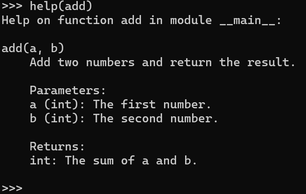

函数对任何编程语言都是极其重要的部分，这篇笔记包括自定义函数、参数传递、参数分类、匿名函数、封包与解包，以及高阶函数和递归函数

## 自定义函数

在Python中，可以使用`def`关键字定义自己的函数

函数定义包括函数名、参数列表和函数体

```python
def greet(name):
    return f"Hello, {name}!"
```

:::note

`return`用法

- 可以返回单个对象
- 返回多个对象，作为一个元组返回，`return res,` ，这也是元组 `(res,)`
- 什么也不跟，相当于`return None`，所以打印输出`None`
- return 把后面跟的值返回给调用方，并结束对应的函数

:::


## 文档注释

在Python中，文档注释（Docstrings）是一种特殊的注释，用于描述函数、模块或类的功能和用法。

文档注释通常使用三引号`"""`括起来，并且位于函数、模块或类的定义之下。

例如，以下是一个带有文档注释的函数：

```python
def add(a, b):
    """Add two numbers and return the result.

    Parameters:
    a (int): The first number.
    b (int): The second number.

    Returns:
    int: The sum of a and b.
    """
    return a + b
```

文档注释的好处是，它们不仅为开发者提供了有关代码的详细信息，还可以被各种工具使用，例如自动生成文档的工具或内置的`help()`函数。

```python
print(add.__doc__)
help(add)
```

执行上面的`__doc__`或者`help()`函数将会打印出`add`函数的文档注释，为用户提供关于函数的详细说明



:::info[函数信息]

help([object])

- 启动内置的帮助系统
- 如果没有实参，解释器控制台里会启动交互式帮助系统
- 如果实参是一个字符串，则在模块、函数、类、方法、关键字或文档主题中搜索该字符串，并在控制台上打印帮助信息
- 如果实参是其他任意对象，则会生成该对象的帮助页

```python
help() # 启动交互式帮助系统
help("keywords") # 查看关键字
help(list) # 生成list的帮助页
```

:::


## 类型标注

Python 3.5引入了类型提示（Type Hints），这是一种为函数和变量添加类型标注的方式。

类型标注有助于代码的可读性和可维护性，同时可以被一些工具用于类型检查，提高代码质量。

标注以字典的形式存放在函数的 `__annotations__` 属性中，不会影响函数的任何其他部分

### 函数类型标注

```python
def add(a: int, b: int) -> int:
    return a + b
```

在这个例子中，`a`和`b`被标注为整型（`int`），函数的返回类型被标注为整型（`int`）。

### 变量类型标注

```python
age: int = 25
```

在这个例子中，变量`age`被标注为整型（`int`）

### Union类型

在Python中，可以使用`Union`类型来标注一个变量或函数参数可以是多种类型之一

```python
from typing import Union

def greet(name: Union[str, int]) -> str:
    return f"Hello, {name}!"
```

这个例子中的`greet`函数可以接受字符串或整数作为参数

### Callable类型

`Callable`类型用于标注可调用对象，例如函数

```python
from typing import Callable

# Callable 建议参数为函数，且只有一个 int 类型的参数，返回 str 类型
def execute(func: Callable[[int], str], value: int) -> str:
    return func(value)

def square(n: int) -> str:
    return f"Square of {n} is {n*n}"

result = execute(square, 4)
print(result)  # 输出: Square of 4 is 16
```

这个例子中的`execute`函数接受一个函数作为参数，这个函数接受一个整数参数并返回一个字符串。`square`函数符合这个要求，所以可以作为`execute`的参数传入。

类型标注是可选的，它们不会影响代码的运行，但可以作为一种文档形式，帮助开发者理解代码。

可以使用`mypy`等工具进行类型检查，以确保代码中的类型使用符合预期。


## 函数参数

### 参数分类

在 Python 中参数分为

- 必须参数：必须传参，否则报错（实参按照形参的对应位置顺序传入，所以通常也叫：位置参数）
- 关键字参数：允许实参和形参顺序不一致，通过关键字确定传入的值（位置参数不能放在关键字参数的后面）
- 默认参数：不能写在必需参数的前面，不能写在`**kwargs`参数的后面，调用函数时，如果该参数没有指定实参，则会使用默认值
- 不定长参数
  - `*args`：将参数打包成元组给函数体调用，没有值传给它，就是个空元组
  - `**kwargs`：将参数打包成字典给函数体调用，没有值传给它，就是个空字典
- 特殊参数
  - `/` 为仅限位置参数，限制在它之前的形参必须以位置参数的形式传入
  - `*`为仅限关键字参数，限制在它之后的形参必须以关键字参数的形式传入
  - 这两个特殊参数只是为了限制参数的传递形式，不需要为它们传入实参


Python 的参数顺序也是固定的：必需参数 -> `*arg`参数 -> `**kwargs`参数，当这三个参数**同时存在**时，它们的顺序是固定的，否则报错，除非必需参数在传参的时候使用了关键字参数


### 参数传递

在 Python 中，实际上是按对象传递参数。即函数的形参会获取到实参的引用（内存地址），而不是实参对象的副本。因此，在函数内部对形参的修改可能会影响到实参。

需要注意的是，这个行**为取决于参数的类型**有关。

对于**可变类型**的参数，**修改形参可能会影响到实参**

而对于**不可变类型**的参数，**修改形参不会影响到实参**

```python
def change_dict(d):
    d['key'] = 'value'

my_dict = {'old_key': 'old_value'}
change_dict(my_dict)
print(my_dict)  # 输出: {'old_key': 'old_value', 'key': 'value'}
```

```python
def change_int(x):
    x += 1

a = 1
change_int(a)
print(a)  # 输出: 1
```


## 匿名函数

Lambda函数，是Python中一个强大的特性，允许你定义简洁的单行函数

- 基本语法：`lambda [arg1 [, arg2, ... argN]] : expression`
- 参数可以有多个，但是后面的表达式只能有一个
- 返回值就是 `expression` 的结果，而不需要 `return` 语句

```python
# 根据姓名排序列表中的元组
people = [('Alice', 25), ('Bob', 30), ('Charlie', 20)]
people.sort(key=lambda person: person[0])
print(people)  # 输出: [('Alice', 25), ('Bob', 30), ('Charlie', 20)]

# 使用map()函数对列表中的每个元素求平方
numbers = [1, 2, 3, 4, 5]
squared_numbers = list(map(lambda x: x**2, numbers))
print(squared_numbers)  # 输出: [1, 4, 9, 16, 25]

# 使用filter()函数过滤列表中的偶数
numbers = [1, 2, 3, 4, 5]
even_numbers = list(filter(lambda x: x % 2 == 0, numbers))
print(even_numbers)  # 输出: [2, 4]
```


## 常用高阶函数

高阶函数是接受函数作为参数或返回函数作为结果的函数

### `filter(function, iterable)`

- `function`：函数（`function` 必需能够接受1个实参），也可以为 `None`
- `iterable`：可迭代对象
- 将 `iterable` 中每个元素作为参数传递给函数，根据函数的返回结果进行判断 `True` 或 `False`，将判断为 `True` 的 `iterable` 中的元素构建新的迭代器并返回
- 如果 `function` 为 `None`，直接判断 `iterable` 中元素 `True` 或 `False`，再返回为 `True` 的元素构建的新的迭代器

```python
numbers = range(-5, 5)
positive_numbers = list(filter(lambda x: x > 0, numbers))
print(positive_numbers)  # 输出: [1, 2, 3, 4]
```

### `map(function, *iterables)`

- `function`：函数（`function` 必需能够接受`iterable`个实参）
- `iterable`：可迭代对象
- 用 `iterables` 中的每个元素作为函数的参数来调用函数，以迭代器形式返回所有结果
- 当有多个 `iterables` 对象时，类似于`zip`的取元素方式，最短的 iterables 耗尽则函数停止

```python
numbers = [1, 2, 3, 4]
squared = list(map(lambda x: x ** 2, numbers))
print(squared)  # 输出: [1, 4, 9, 16]

# 当有多个 iterables 对象
result = list(map(lambda x, y, z: x + y + z, [1, 2, 3], [3,
                                                         2, 1], [1, 3]))
print(result)  # [5, 7]
```

### `reduce(function, iterable[, initial])`

- 在`functools`模块中，使用的时候需要先导入
- `function`：函数（`function` 必需能够接收`两个实参`）
- `initial`：初始值
- 没有指定 `initial` 参数时，先把 `iterable` 的前两个元素作为参数调用函数，把这次函数的结果以及`iterable` 的下一个元素又作为参数再调用函数，以此类推
- 指定 `initial` 参数时，先把 `initial` 值和 `iterable` 的第一个元素作为参数调用函数
- 如果 `iterable` 为空，返回 `initial` ，此时如果没有指定 `initial`，则报错
- 如果 `iterable` 只有一个元素且没有指定 `initial`，返回该元素

```python
from functools import reduce

# 示例列表
numbers = [1, 2, 3, 4]

# 没有初始值的情况，累加列表中的元素
result_no_initial = reduce(lambda x, y: x + y, numbers)
print(result_no_initial)  # 输出: 10

# 有初始值的情况，初始值加列表中的元素
result_with_initial = reduce(lambda x, y: x + y, numbers, 10)
print(result_with_initial)  # 输出: 20

# 列表为空，指定初始值
empty_list = []
result_empty_list = reduce(lambda x, y: x + y, empty_list, 10)
print(result_empty_list)  # 输出: 10

# 列表只有一个元素，没有指定初始值
single_element_list = [5]
result_single_element = reduce(lambda x, y: x + y, single_element_list)
print(result_single_element)  # 输出: 5
```


## 递归函数

递归函数是调用自身的函数，用于解决可以分解为更小相似问题的任务

包括一个或多个基准情况，以防止无限递归，和一个递归步骤，通过该步骤函数调用自己来解决更小的问题。

递归函数需要谨慎设计以确保每次递归调用都逐步接近基准情况，并且最终能够停止递归。

递归函数在算法设计中非常有用，特别是对于**树形结构**和**分治策略**的问题

```python
# 计算阶乘
def factorial(n):
    if n == 0:
        return 1
    else:
        return n * factorial(n-1)
```

Python默认的最大递归深度是较小的（通常是**1000**），可以通过`sys`模块的`setrecursionlimit()`函数修改

在使用递归时有时会出现重复计算的问题，通常是因为递归函数在处理大问题时会分解成许多小问题，这些小问题中有很多是重叠的，即相同的计算被执行多次。

这种情况在斐波那契数列等问题中尤为常见。例如，计算`fib(5)`会分别计算`fib(4)`和`fib(3)`，而计算`fib(4)`又会计算`fib(3)`和`fib(2)`，这里`fib(3)`就被计算了两次。这导致了大量不必要的计算，严重降低了效率。

使用备忘录（memoization）或动态规划（Dynamic Programming）技术可以有效避免重复计算，通过存储已计算的结果来重用。

```python
from functools import lru_cache

@lru_cache(maxsize=None)
def factorial(n):
    if n == 0:
        return 1
    else:
        return n * factorial(n-1)
```

:::info

`@lru_cache(maxsize=None)`是Python中`functools`模块提供的一个装饰器，用于实现缓存。

它可以帮助自动缓存函数的调用结果，并在后续的相同调用中直接返回缓存的结果，从而避免重复计算。`maxsize`参数用于指定缓存的最大容量，如果设置为`None`，则缓存大小无限制。

这个装饰器非常适合用于优化递归函数，减少计算时间。

:::