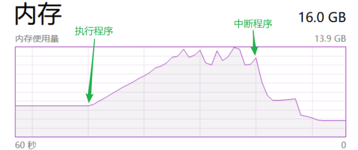
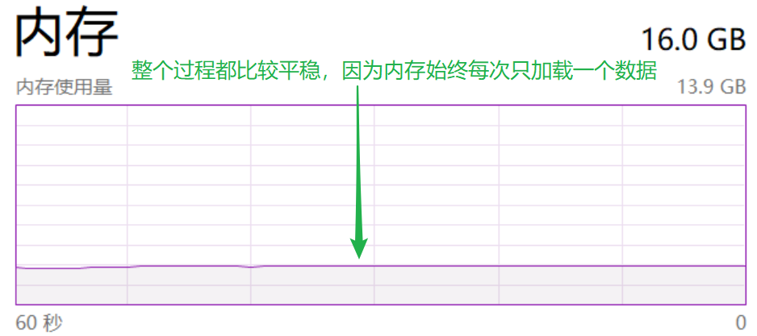

## 可迭代对象

满足以下条件之一即为可迭代对象

- 支持迭代协议，有`__iter()__`方法
- 支持序列协议，有`__getitem()__`方法，且数字参数从 0 开始


### 类型

- 列表（List）
- 元组（Tuple）
- 字符串（String）
- 字典（Dictionary）
- 集合（Set）
- range


### 自定义可迭代对象

要创建一个自定义的可迭代对象，实现`__iter__()`方法或`__getitem__()`方法其中之一即可，这取决于想如何构建迭代逻辑

1. **通过`__iter__()`和`__next__()`方法**：

   - `__iter__()`方法需要返回迭代器对象本身
   - `__next__()`方法则用于一次返回一个元素，在没有更多元素时抛出`StopIteration`异常

   - `__iter__()`方法返回一个迭代器，该迭代器需要有一个`__next__()`方法来获取下一个元素
   - 这种方式更常见于**生成复杂的或无限的序列**
   - 示例：

     ```python
     class CountDown:
         def __init__(self, start):
             self.current = start
     
         def __iter__(self):
             return self
     
         def __next__(self):
             if self.current > 0:
                 num = self.current
                 self.current -= 1
                 return num
             raise StopIteration
     
     # 使用自定义的可迭代对象
     for number in CountDown(5):
         print(number)
     ```

     在这个例子中，`CountDown` 类是一个从给定数字倒数到 1 的迭代器。初始化时设置倒数开始的数字，`__iter__()` 返回迭代器实例自身，`__next__()` 方法依次返回从开始数字到 1 的数，直到 0 时，通过抛出 `StopIteration` 来停止迭代。这使得 `CountDown` 实例可以直接在 for 循环中使用。

2. **通过`__getitem__()`方法**：

   - 可以仅实现`__getitem__()`方法，并使用索引从0开始递增来访问元素
   - 当索引超出范围时，必须抛出`IndexError`，这样Python就知道迭代何时结束
   - 这种方式适用于可以通过索引访问元素的数据结构，如列表
   - 示例：

     ```python
     class IndexIterable:
         def __init__(self, data):
             self.data = data
     
         def __getitem__(self, index):
             if index < len(self.data):
                 return self.data[index]
             else:
                 raise IndexError('index out of range')
     
     # 使用自定义的可迭代对象
     my_iterable = IndexIterable([1, 2, 3, 4])
     for item in my_iterable:
         print(item)
     ```

     这个例子中，`IndexIterable`类实现了`__getitem__()`方法，使得实例可以在for循环中直接使用。当迭代索引超出数据范围时，抛出`IndexError`，迭代停止。这种方法的好处是实现简单，**适用于基于索引的数据访问**。


## 迭代器

迭代器是实现了迭代器协议的对象，即要满足下面两个条件

- `__iter__()`方法返回迭代器本身
- `__next__()`方法返回容器的下一个元素，如果容器中没有更多元素，则`__next__()`方法需要抛出`StopIteration`异常来通知迭代的结束


### 类型

- **文件迭代器**：打开的文件对象可以迭代，每次迭代返回文件中的一行
- **生成器**：使用`yield`关键字的函数返回的生成器，它也是一种迭代器
- **列表、字典、集合的视图迭代器**：例如，字典的`.keys()`, `.values()`, 和`.items()`方法返回的都是迭代器
- **`zip`, `map`, `filter`, `enumerate`函数返回的对象**：这些内置函数返回的都是迭代器，用于懒加载处理元素


### 自定义迭代器

实现迭代器协议即可，满足：

- `__iter__()`方法
- `__next__()`方法

```python
class EvenNumbers:
    def __init__(self, start, end):
        self.current = start
        self.end = end

    def __iter__(self):
        return self

    def __next__(self):
        while self.current <= self.end:
            if self.current % 2 == 0:
                num = self.current
                self.current += 1
                return num
            self.current += 1
        raise StopIteration

# 使用迭代器
evens = EvenNumbers(1, 10)
for num in evens:
    print(num)  # 输出 2, 4, 6, 8, 10
```

在这个示例中，`EvenNumbers`类定义了一个迭代器，它从`start`开始到`end`结束，只返回偶数。迭代器的核心是`__next__()`方法，它检查当前数字是否为偶数，如果是，则返回该数字，否则继续到下一个数字。当超出`end`值时，通过抛出`StopIteration`异常来结束迭代

这种方式使得使用迭代器可以精确地控制迭代过程，提高**数据处理的灵活性和效率**


### 特性

在 Python 中，迭代器被设计为**只能向前移动**

如果通过索引访问，对象找不到`__iter__`方法，会去寻找`__getitem__`方法

:::note

迭代器主要是用来遍历数据集合中的元素的。迭代器维护一个内部状态，用来记录当前的位置，以便在每次调用`__next__()`方法时返回集合中的下一个元素。一旦`__next__()`方法被调用，迭代器就会向前移动，更新其内部到下一个元素的指针。

:::

如果使用相同的迭代器对象连续两次进行完整迭代，第二次迭代将不会输出任何元素，要再次迭代同一数据集，需要重新创建迭代器实例

```python
numbers = [1, 2, 3]
iterator = iter(numbers)

# 第一次迭代
for num in iterator:
    print(num)  # 输出 1, 2, 3

# 尝试再次迭代
for num in iterator:
    print(num)  # 不会输出任何内容

# 重新创建迭代器进行迭代
iterator = iter(numbers)
for num in iterator:
    print(num)  # 再次输出 1, 2, 3
```

:::info[函数信息]

`iter(object[,sentinel])`

- 单参数`iter(iterable)`：

  - 传入一个可迭代对象，返回一个迭代器对象
  - 该迭代器对象可以使用`next()`函数来依次访问集合中的元素

- 双参数`iter(callable, sentinel)`：

  -  `callable` 是一个无参数的可调用对象， `sentinel` 是哨兵值
  - 函数将重复调用 `callable`，直到返回值等于哨兵值，此时迭代停止

- ```python
  # 单参数使用
  my_list = [1, 2, 3]
  my_iter = iter(my_list)
  print(next(my_iter))  # 输出: 1
  
  # 双参数使用
  import random
  def generate():
      return random.randint(0, 5)
      
  stop_iter = iter(generate, 3)
  for num in stop_iter:
      print(num)  # 输出直到生成的随机数为3时停止
  ```

  

`next(iterator[, default])`

- 用于从迭代器中获取下一个元素

- 如果迭代器耗尽，而没有提供 `default` 值，则会抛出 `StopIteration` 异常

- 如果提供了 `default`，当迭代器耗尽时，则返回 `default` 值

- ```python
  my_iter = iter([1, 2, 3])
  print(next(my_iter))       # 输出: 1
  print(next(my_iter, 'end'))  # 输出: 2
  print(next(my_iter, 'end'))  # 输出: 3
  print(next(my_iter, 'end'))  # 输出: 'end'（因为迭代器已耗尽）
  ```

这两个函数常用于处理自定义迭代行为，特别是在处理不确定结束条件或不直接支持迭代的对象时

:::


## 生成器

生成器是一种特殊的迭代器，用于按需生成值，而不是一次性生成所有值并存储在内存中。

生成器可以通过两种方式实现：

- 生成器函数
- 生成器表达式


### 生成器函数

生成器函数是一种使用`yield`关键字的特殊函数，可以**暂停函数的执行并返回一个值**，然后在需要的时候从上次暂停的位置继续执行。

这种机制使得生成器函数非常适合创建迭代器，尤其是在处理大数据集或复杂的计算时，因为它们不需要一次性生成所有数据，从而节省内存。


生成器函数的特点：

1. **状态保持**：生成器函数调用 `yield` 后，其状态被保留，包括局部变量和指针信息，使得函数可以在下次调用时恢复状态。
2. **按需计算**：生成器函数只有在请求下一个元素时才计算，支持惰性求值，尤其适合于无法或不想一次性加载所有数据的情况
3. **自动实现迭代器协议**：生成器自动支持 `__iter__()` 和 `__next__()` 方法，因此可以直接在循环中使用。


::: info

与普通函数的不同

- 生成器用 `yield` 语句返回数据，而标准函数用 `return` 语句返回数据
- `yield` 语句返回数据之后会挂起函数的状态，并会记住上次执行语句时的所有数据值，方便每次在生成器调用`__next__()`方法时，从上次挂起的位置恢复继续执行，而 `return` 语句返回一次数据之后，函数就结束了

:::


```python
def fibonacci(n):
    a, b = 0, 1
    while n > 0:
        yield b
        a, b = b, a + b
        n -= 1

# 使用生成器函数
for num in fibonacci(5):
    print(num)  # 依次输出斐波那契数列的前5项：1, 1, 2, 3, 5
```

上述代码`fibonacci` 函数生成了一个斐波那契数列，每次调用 `yield` 时，函数会输出当前的斐波那契数值，并暂停执行，直到下次迭代请求时再继续从停止的位置执行


### 生成器表达式

生成器表达式提供了一种构建生成器的简便方法，类似于列表推导式（用`()`替换`[]`）用于创建生成器

生成器表达式适合于简单的迭代情况，特别是当你需要一个迭代器而不是完整列表时，可以节省内存


生成器表达式的特点：

1. **内存高效**：生成器表达式不会一次性生成所有元素，而是按需生成，这意味着它们不会占用与输出数据等量的内存
2. **即用即抛**：生成的元素在被访问后不会再存储在内存中


```python
# 生成器表达式实例
squares = (x*x for x in range(5))
for num in squares:
    print(num)  # 依次输出 0, 1, 4, 9, 16
```

上述生成器表达式计算从0到4的整数的平方，并且它在迭代时才计算每个数的平方，有效管理了内存使用。


## 迭代器优缺点

### 优点

- 提供一种不依赖索引的迭代取值方式

- 节省内存，迭代器在内存中相当于只占一个数据的空间：因为每次取值上一条数据都会在内存释放，再加载当前的此条数据，而不需要一次性把所有数据加载到内存当中

- 例：

  - 执行列表推导式：`sum([i for i in range(10000000000)])` 的内存使用情况

    

  - 执行生成器表达式：`sum(i for i in range(10000000000))` 的内存使用情况

    

### 缺点

- 取值不如按照索引的方式灵活，不能取指定的某一个值，只能往后取，不能往前取
- 除非取尽，否则无法获取迭代器的长度

